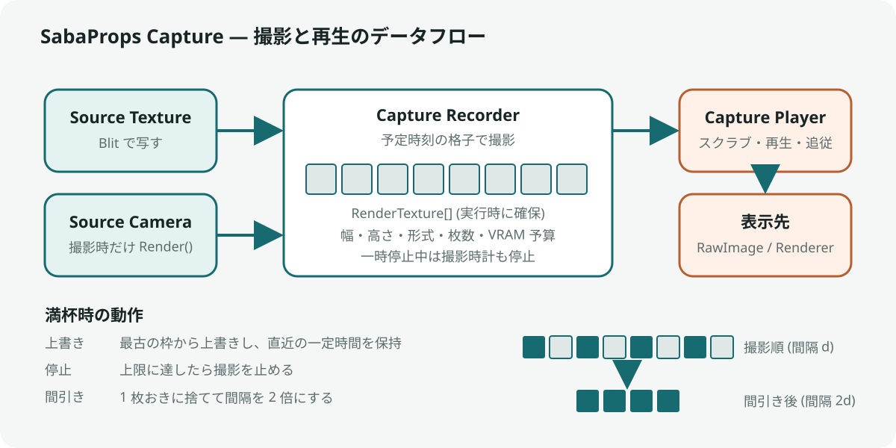

# SabaProps Capture

RenderTexture または Camera から一定間隔で画像を撮り、有限枚数を VRAM 上に保持する Udon の Recorder と、保持した画像をタイムラインで見返す再生パネルです。

- 撮影間隔、解像度、画素形式、最大枚数、VRAM の予算を用途に合わせて指定できます
- 満杯時の動作は、上書き (リングバッファ)、停止、間引きの 3 種類から選べます
- 間引きでは、枚数の上限を守ったまま撮影開始から現在までを均等な間隔で覆います。撮影時間が事前に決まらないタイムラプスに向きます
- 再生パネルでは、スクラブ、コマ送り、再生速度の変更、最新画像への追従ができます
- 入力は RenderTexture でも Camera でも構いません。[Stage Cam](../io.github.sabas0ba.sabaprops.stagecam/README.md) の RenderTexture をそのまま入力にできます

Recorder が入力を一定間隔で撮影して RenderTexture の配列に保持し、Player がその画像を参照して表示します。

0.1.0 はローカル専用です。画像は各クライアントの VRAM にだけ存在し、他のプレイヤーとは共有されず、インスタンスを出ると消えます。Udon からディスクへ書き出す手段はありません。

---

## 導入

VCC でこのパッケージを追加すると、依存する VRChat Worlds SDK も一緒に解決されます。Stage Cam への依存はありません。

## 使い方

### 配置

`GameObject > SabaProps > Capture Recorder with Playback Panel` で、Recorder と再生パネルをまとめて配置します。Recorder だけを置く場合は `GameObject > SabaProps > Capture Recorder`、既存の Recorder に再生パネルを足す場合は `GameObject > SabaProps > Capture Playback Panel` を使います。

配置後、Recorder の入力を次のどちらかで指定します。

| 入力 | 用途 | 動作 |
| --- | --- | --- |
| `Source Texture` | 既にスクリーンへ出している映像を記録する | 撮影時に `VRCGraphics.Blit` で保存枠へ写します |
| `Source Camera` | タイムラプス専用のカメラで撮る | 撮影時にだけ `Camera.Render()` します。Camera 自体は無効にしておくと、撮影間隔の間は描画しません |

両方を指定した場合は `Source Camera` を使います。

### 撮影の設定

| 項目 | 既定値 | 内容 |
| --- | --- | --- |
| `Interval` | 10 s | 撮影間隔。0.1 s 未満は 0.1 s に丸めます |
| `Record On Start` | オフ | 起動時に撮影を始めます |
| `Frame Width` / `Frame Height` | 384 x 216 | 保存する画像の解像度。入力の解像度とは独立です |
| `Pixel Format` | 0 (ARGB32) | 1 (RGB565) にすると VRAM が半分になり、階調が粗くなります |
| `Max Frames` | 360 | 保持する最大枚数。上限は 4096 です |
| `Memory Budget Megabytes` | 0 | 0 より大きければ、`Max Frames` と予算から求めた枚数の小さい方を使います |
| `Full Policy` | 2 (間引き) | 0: 上書き、1: 停止、2: 間引き |

解像度、画素形式、枚数の変更は、保持中の画像が無いとき (`CLEAR` の後か、最初の撮影前) に反映されます。

### 満杯時の動作

| 値 | 名前 | 動作 | 用途 |
| --- | --- | --- | --- |
| 0 | 上書き | 最古の画像から上書きします | 直近の一定時間を常に見返せるようにする |
| 1 | 停止 | 撮影を止めます | 決まった時間だけ記録する |
| 2 | 間引き | 1 枚おきに捨て、撮影間隔を 2 倍にします | 終わりの決まっていないタイムラプス |

停止モードでは、最後の枠を埋めた時点で撮影を止めます。間引きでは最古の 1 枚を必ず残すため、タイムラインの起点は変わりません。保持できる枚数が 1 枚の場合は間引けないため、停止として扱います。枚数を偶数にしておくと、間引きの前後で撮影時刻の格子がそのまま続きます。

### VRAM の目安

保存枠 1 枚の VRAM は `幅 x 高さ x 4 byte` (RGB565 では 2 byte) です。この文書と `Memory Budget Megabytes` の MB は 1,048,576 byte を指します。Camera 入力の場合は、これとは別に深度付きの中間バッファを 1 枚確保します。

| 撮影時間 | 間隔 | 枚数 | 256 x 144 | 384 x 216 | 512 x 288 |
| --- | --- | --- | --- | --- | --- |
| 30 分 | 5 s | 360 | 51 MB | 114 MB | 203 MB |
| 3 時間 | 10 s | 1080 | 152 MB | 342 MB | 608 MB |

保存枠は撮影で必要になった時点で 1 枚ずつ確保します。撮り始めに全枚数分を確保することはありません。`RELEASE VRAM` で保存内容を消し、確保した RenderTexture をすべて破棄します。`CLEAR` は内容だけを消し、RenderTexture は次の撮影で再利用します。

Quest など VRAM の少ない環境では、`Memory Budget Megabytes` で上限を決めておくことを推奨します。

### 再生パネル

| 操作 | 動作 |
| --- | --- |
| タイムライン | ドラッグで任意の時点の画像を表示します |
| `FIRST` | 最古の画像へ移ります |
| `LATEST` | 最新の画像へ移り、以後は新しい画像が撮られるたびに追従します |
| `<` / `>` | 1 枚ずつ送ります |
| `PLAY / PAUSE` | 再生と一時停止を切り替えます |
| `SLOWER` / `FASTER` | 再生速度を半分または 2 倍にします (0.5〜60 枚/s) |
| `REC / PAUSE` | 撮影の開始と一時停止を切り替えます。一時停止中は撮影時計も止まります |
| `SHOT` | 予定と無関係に 1 枚撮ります |
| `CLEAR` | 保存内容を消して止めます |
| `RELEASE VRAM` | 保存内容を消し、RenderTexture を破棄します |

追従を解除している間に上書きや間引きで画像の順番が変わった場合、表示中の画像と同じ時刻に最も近い画像へ移ります。

再生パネルの表示先は `Display` (RawImage) と `Display Renderer` (任意の Renderer) のどちらでも構いません。Renderer へは `MaterialPropertyBlock` で `Texture Property Name` に渡すため、共有マテリアルは書き換えません。

### 他の Udon から操作する

Recorder は次のイベントを受け付けます。いずれもアンダースコアで始まるため、ネットワークイベントとしては呼べません。

`_StartRecording`、`_StopRecording`、`_ToggleRecording`、`_CaptureNow`、`_Clear`、`_ReleaseFrames`

保持している画像は `GetFrameCount()`、`GetFrame(int)`、`GetFrameTime(int)`、`FindFrameAt(double)` で読めます。順番は古い方から数えます。

## 制限

- 同期しません。各クライアントが自分の Recorder で撮ります。
- 画像はワールドの外へ保存できません。残したい場合は、再生パネルを VRChat のカメラで撮影してください。
- Camera 入力で、そのカメラが普段から別の RenderTexture へ描いている場合は、撮影時にだけ書き込み先を差し替えて元に戻します。
- 撮影時計は Recorder の `Update` で進みます。GameObject を無効にしている間は撮影も時計も止まります。

## 検証

| 層 | 確かめること |
| --- | --- |
| `.github/verify/verify.sh` | Runtime と Editor が実物の VRChat SDK に対してコンパイルできること。撮影周期、枚数の計算、リングバッファ、間引き、再生位置の計算を実行して検査すること |
| `.github/verify/vrchat/` | UdonSharp が 2 つの挙動を Udon へコンパイルできること。再生パネルの UI イベントが UdonBehaviour へ接続されていること |

`VRCGraphics.Blit`、`Camera.Render()`、実行時の `RenderTexture` 生成が VRChat クライアント上で想定どおり動くことは、自動では確かめられません。Build & Test で確認してください。

設計の判断は [Documentation~/design.md](Documentation~/design.md) にまとめています。
