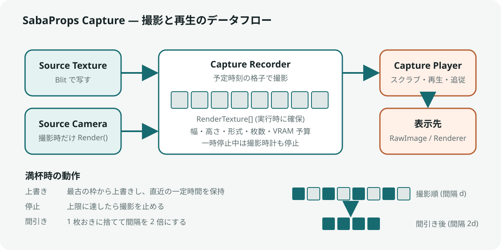

# SabaProps Capture

RenderTexture または Camera から一定間隔で画像を撮り、有限枚数を VRAM 上に保持する Udon の Recorder と、保持した画像をタイムラインで見返す再生パネルです。

- 撮影間隔、解像度、画素形式、最大枚数、VRAM の予算を用途に合わせて指定できます
- 満杯時の動作は、上書き (リングバッファ)、停止、間引きの 3 種類から選べます
- 間引きでは、枚数の上限を守ったまま撮影開始から現在までを均等な間隔で覆います。撮影時間が事前に決まらないタイムラプスに向きます
- 再生パネルでは、スクラブ、コマ送り、再生速度の変更、最新画像への追従ができます
- 入力は RenderTexture でも Camera でも構いません。[Stage Cam](../io.github.sabas0ba.sabaprops.stagecam/README.md) の RenderTexture をそのまま入力にできます

Recorder が入力を一定間隔で撮影して RenderTexture の配列に保持し、Player がその画像を参照して表示します。

0.1.0 はローカル専用です。画像は各クライアントの VRAM にだけ存在し、他のプレイヤーとは共有されず、インスタンスを出ると消えます。Udon からディスクへ書き出す手段はありません。

---

## 導入

VCC でこのパッケージを追加すると、依存する VRChat Worlds SDK も一緒に解決されます。Stage Cam への依存はありません。

## 使い方

### サンプルシーン

`Tools > SabaProps > Capture > Create Sample Scene` で、被写体、2 台のカメラ、2 つの Recorder とその再生パネル、VRChat の Spawn を生成します。保存先は `Assets/SabaProps/Capture/Samples/CaptureDemo.unity` です。RenderTexture、マテリアル、アニメーションも同じフォルダに生成します。

| Recorder | 入力 | 満杯時の動作 |
| --- | --- | --- |
| `Texture Recorder` | `Live Camera` が常時描画している RenderTexture。同じ映像を奥のスクリーンにも表示します | 間引き |
| `Camera Recorder` | 無効にした `Timelapse Camera`。撮影時にだけ描画します | 上書き |

どちらも起動時に撮影を始め、1 秒間隔で 8 枚まで保持します。約 8 秒で満杯になるため、間引きと上書きの違いを 2 枚のパネルで見比べられます。被写体の球は 20 秒で 1 周します。

撮影と再生は Unity Editor の Play (ClientSim) でも動作します。VRChat クライアント上での確認は [Build & Test での確認手順](Documentation~/build-and-test.md) を参照してください。

生成し直すと同名のシーンを上書きします。編集を残す場合は別名で保存してください。

### 配置

`GameObject > SabaProps > Capture Recorder with Playback Panel` で、Recorder と再生パネルをまとめて配置します。Recorder だけを置く場合は `GameObject > SabaProps > Capture Recorder`、既存の Recorder に再生パネルを足す場合は `GameObject > SabaProps > Capture Playback Panel` を使います。

配置後、Recorder の入力を次のどちらかで指定します。

| 入力 | 用途 | 動作 |
| --- | --- | --- |
| `Source Texture` | 既にスクリーンへ出している映像を記録する | 撮影時に `VRCGraphics.Blit` で保存枠へ写します |
| `Source Camera` | タイムラプス専用のカメラで撮る | 撮影時にだけ `Camera.Render()` します。Camera 自体は無効にしておくと、撮影間隔の間は描画しません |

両方を指定した場合は `Source Camera` を使います。

`Capture Playback Panel` は、シーン内の Recorder を 1 つ探して再生パネルへ接続します。Recorder が無い状態で実行すると、撮影を操作する 4 つのボタン (`REC / PAUSE`、`SHOT`、`CLEAR`、`RELEASE VRAM`) は生成されません。先に Recorder を置いてください。

再生パネルは Water レイヤー (4) に置かれます。Stage Cam のスクリーンと同じレイヤーです。`Source Camera` の `Culling Mask` から Water を外すと、撮影した画像に再生パネルが映り込みません。

### Stage Cam の映像を記録する

1. Stage Cam の Camera が `Target Texture` に使っている RenderTexture を確認します。Stage Cam のデモシーンでは `Assets/SabaProps/StageCam/Samples/` の `FaceCam.renderTexture` と `CraneCam.renderTexture` です
2. Recorder の `Source Texture` にその RenderTexture を割り当てます。`Source Camera` は空のままにします
3. `Frame Width` と `Frame Height` を、入力の RenderTexture と同じ縦横比にします

`Source Texture` からの撮影は、入力の全体を保存枠の全体へ写します。縦横比が違うと画像が引き伸ばされます。`Source Camera` からの撮影は保存枠の縦横比で描画するため、引き伸ばしは起きません。

この構成では Recorder はカメラを追加で描画しません。Stage Cam が描いた結果を、撮影時に複製するだけです。

### 撮影の設定

| 項目 | 既定値 | 内容 |
| --- | --- | --- |
| `Interval` | 10 s | 撮影間隔。0.1 s 未満は 0.1 s に丸めます |
| `Record On Start` | オフ | 起動時に撮影を始めます |
| `Frame Width` / `Frame Height` | 384 x 216 | 保存する画像の解像度。入力の解像度とは独立です |
| `Pixel Format` | 0 (ARGB32) | 1 (RGB565) にすると VRAM が半分になり、階調が粗くなります |
| `Max Frames` | 360 | 保持する最大枚数。上限は 4096 です |
| `Memory Budget Megabytes` | 0 | 0 より大きければ、`Max Frames` と予算から求めた枚数の小さい方を使います |
| `Full Policy` | 2 (間引き) | 0: 上書き、1: 停止、2: 間引き |

解像度、画素形式、枚数の変更は、保持中の画像が無いとき (`CLEAR` の後か、最初の撮影前) に反映されます。

### 満杯時の動作

| 値 | 名前 | 動作 | 用途 |
| --- | --- | --- | --- |
| 0 | 上書き | 最古の画像から上書きします | 直近の一定時間を常に見返せるようにする |
| 1 | 停止 | 撮影を止めます | 決まった時間だけ記録する |
| 2 | 間引き | 1 枚おきに捨て、撮影間隔を 2 倍にします | 終わりの決まっていないタイムラプス |

停止モードでは、最後の枠を埋めた時点で撮影を止めます。間引きでは最古の 1 枚を必ず残すため、タイムラインの起点は変わりません。保持できる枚数が 1 枚の場合は間引けないため、停止として扱います。枚数を偶数にしておくと、間引きの前後で撮影時刻の格子がそのまま続きます。

### VRAM の目安

保存枠 1 枚の VRAM は `幅 x 高さ x 4 byte` (RGB565 では 2 byte) です。この文書と `Memory Budget Megabytes` の MB は 1,048,576 byte を指します。Camera 入力の場合は、これとは別に深度付きの中間バッファを 1 枚確保します。

| 撮影時間 | 間隔 | 枚数 | 256 x 144 | 384 x 216 | 512 x 288 |
| --- | --- | --- | --- | --- | --- |
| 30 分 | 5 s | 360 | 51 MB | 114 MB | 203 MB |
| 3 時間 | 10 s | 1080 | 152 MB | 342 MB | 608 MB |

保存枠は撮影で必要になった時点で 1 枚ずつ確保します。撮り始めに全枚数分を確保することはありません。`RELEASE VRAM` で保存内容を消し、確保した RenderTexture をすべて破棄します。`CLEAR` は内容だけを消し、RenderTexture は次の撮影で再利用します。

Quest など VRAM の少ない環境では、`Memory Budget Megabytes` で上限を決めておくことを推奨します。

### 再生パネル

| 操作 | 動作 |
| --- | --- |
| タイムライン | ドラッグで任意の時点の画像を表示します |
| `FIRST` | 最古の画像へ移ります |
| `LATEST` | 最新の画像へ移り、以後は新しい画像が撮られるたびに追従します |
| `<` / `>` | 1 枚ずつ送ります |
| `PLAY / PAUSE` | 再生と一時停止を切り替えます |
| `SLOWER` / `FASTER` | 再生速度を半分または 2 倍にします (0.5〜60 枚/s) |
| `REC / PAUSE` | 撮影の開始と一時停止を切り替えます。一時停止中は撮影時計も止まります |
| `SHOT` | 予定と無関係に 1 枚撮ります |
| `CLEAR` | 保存内容を消して止めます |
| `RELEASE VRAM` | 保存内容を消し、RenderTexture を破棄します |

追従を解除している間に上書きや間引きで画像の順番が変わった場合、表示中の画像と同じ時刻に最も近い画像へ移ります。

`SHOT` は撮影時計の現在値を画像の時刻として記録します。一時停止中は撮影時計が止まっているため、その間に複数回撮った画像は同じ時刻になります。間引きモードで満杯のときに `SHOT` を押すと、先に間引きが行われ、撮影間隔が 2 倍になります。停止モードで満杯のときは撮りません。

パネル右上の状態表示は 0.5 秒ごとに更新されます。

| 表示 | 内容 |
| --- | --- |
| `REC` / `PAUSED` / `FULL` | 撮影中、一時停止中、満杯の状態で停止中 |
| 時刻 | 撮影開始からの経過時間。一時停止中は進みません |
| `n / m frames` | 保持している枚数と、保持できる枚数 |
| `every x s` | 現在の撮影間隔。間引きのたびに 2 倍になります |
| `x MB` | 確保済みの保存枠の VRAM。Camera 入力の中間バッファは含みません |
| `LATEST` / `PLAY x8` / `HOLD` | 最新へ追従中、再生中とその速度 (枚/s)、特定の画像を表示中 |

その下の表示は、表示中の画像の番号、保持枚数、撮影時刻です。画像が無い間は `NO FRAMES` を表示します。

#### Player の設定

| 項目 | 既定値 | 内容 |
| --- | --- | --- |
| `Recorder` | メニューが設定 | 画像を読む Recorder |
| `Display` | メニューが設定 | 画像を表示する RawImage |
| `Display Renderer` | なし | 画像を表示する Renderer。ワールドに置いたスクリーンへ出す場合に使います |
| `Texture Property Name` | `_MainTex` | `Display Renderer` のマテリアルで画像を受け取るプロパティ名 |
| `Thumbnails` | メニューが 8 枚設定 | タイムラインに並べる RawImage。枚数がこれより多い場合は、最古と最新を両端に含む等間隔で選びます |
| `Timeline` | メニューが設定 | 0 から 1 の Slider。`On Value Changed` から `_OnScrub` を呼びます |
| `Playback Rate` | 8 | 再生速度 (枚/s)。`SLOWER` / `FASTER` で 0.5〜60 の範囲で変わります |
| `Loop` | オン | 最後まで再生したら先頭へ戻ります。コマ送りも端で反対側へ回ります。オフにすると端で止まります |

`Display` と `Display Renderer` は両方を指定できます。Renderer へは `MaterialPropertyBlock` で渡すため、共有マテリアルは書き換えません。保存内容が空になった場合、Renderer には直前の画像が残ります。

### 他の Udon から操作する

Recorder と Player は次のイベントを受け付けます。いずれもアンダースコアで始まるため、ネットワークイベントとしては呼べません。

| 対象 | イベント |
| --- | --- |
| Recorder | `_StartRecording`、`_StopRecording`、`_ToggleRecording`、`_CaptureNow`、`_Clear`、`_ReleaseFrames` |
| Player | `_Play`、`_Pause`、`_TogglePlay`、`_StepForward`、`_StepBackward`、`_First`、`_Latest`、`_Faster`、`_Slower`、`_OnScrub` |

Recorder の状態は次のメソッドで読めます。画像の順番は古い方から数え、0 が最古です。

| メソッド | 戻り値 |
| --- | --- |
| `GetFrameCount()` | 保持している枚数 |
| `GetCapacity()` | 保持できる枚数。`Max Frames` と `Memory Budget Megabytes` から決まります |
| `GetFrame(int)` | 指定した順番の RenderTexture。範囲外は `null` |
| `GetFrameTime(int)` | 指定した順番の画像を撮った時刻 (撮影開始からの秒)。範囲外は -1 |
| `FindFrameAt(double)` | 指定した時刻に最も近い画像の順番。空なら -1 |
| `IsRecording()` | 撮影中かどうか |
| `IsFull()` | 保持枚数が上限に達しているかどうか |
| `GetCurrentInterval()` | 現在の撮影間隔 (s) |
| `GetElapsed()` | 撮影開始からの経過時間 (s) |
| `GetAllocatedMegabytes()` | 確保済みの保存枠の VRAM (MB) |
| `GetRevision()` | 保存内容か撮影状態が変わるたびに増える番号 |

`GetFrame` が返す RenderTexture は Recorder の保存枠そのものです。上書きや間引きで、同じ RenderTexture が別の画像を指すようになります。保持する側は `GetRevision()` の変化を見て取得し直してください。

## 制限

- 同期しません。各クライアントが自分の Recorder で撮ります。
- 画像はワールドの外へ保存できません。残したい場合は、再生パネルを VRChat のカメラで撮影してください。
- Camera 入力で、そのカメラが普段から別の RenderTexture へ描いている場合は、撮影時にだけ書き込み先を差し替えて元に戻します。
- 撮影時計は Recorder の `Update` で進みます。GameObject を無効にしている間は撮影も時計も止まります。

## 検証

| 層 | 確かめること |
| --- | --- |
| `.github/verify/verify.sh` | Runtime と Editor が実物の VRChat SDK に対してコンパイルできること。撮影周期、枚数の計算、リングバッファ、間引き、再生位置の計算を実行して検査すること |
| `.github/verify/vrchat/` | UdonSharp が 2 つの挙動を Udon へコンパイルできること。再生パネルの UI イベントが UdonBehaviour へ接続されていること |

`.github/verify/vrchat/` の層は、Recorder を Unity Editor 上で実物の RenderTexture に対して動かし、`VRCGraphics.Blit` による複製と満杯時の 3 種類の動作も確かめます。

`VRCGraphics.Blit`、`Camera.Render()`、実行時の `RenderTexture` 生成が VRChat クライアント上で想定どおり動くことは、自動では確かめられません。[Build & Test での確認手順](Documentation~/build-and-test.md) に従って確認してください。

設計の判断は [Documentation~/design.md](Documentation~/design.md) にまとめています。

## ライセンス

本パッケージは Apache License 2.0 で提供します。全文は [LICENSE.md](LICENSE.md) を参照してください。外部依存・モデル・素材には、それぞれの配布元のライセンスが適用されます。
