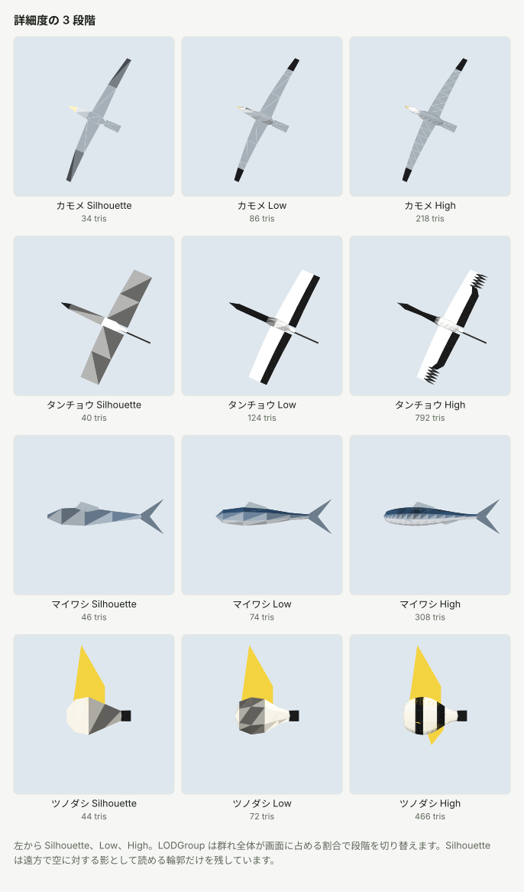

# 設計詳細

## 構成

| 場所 | 内容 |
| --- | --- |
| `Runtime/FlockSpecies.cs` | 種のパラメータ (形状、配色、動き、既定の群れ) |
| `Runtime/FlockSpeciesCatalog.cs` | 収録種のプリセット |
| `Runtime/FlockMotion.cs` | 群れの運動の C# 版。Shader の運動の基準 |
| `Runtime/FlockShaderContract.cs` | 頂点チャンネルの割り当て |
| `Runtime/Shaders/SabaFlockMotion.cginc` | 群れの運動と体の動作の HLSL 版 |
| `Runtime/Shaders/SabaFlock.shader` | `SabaProps/Flock/Swarm`。ForwardBase と ForwardAdd |
| `Runtime/Shaders/SabaFlockRendering.cginc` | 両 pass 共通の頂点変形、照明、距離色、fog |
| `Runtime/FlockSwarm.cs` | 群れの authoring コンポーネント。ビルドには含まれない |
| `Editor/FlockBodyBuilder.cs`, `FlockBirdBody.cs`, `FlockFishBody.cs` | 1 個体の形状の生成 |
| `Editor/FlockSpecialBody.cs` | 触腕、傘、殻、棘、歩行鳥などの形状の生成 |
| `Editor/FlockSwarmMeshBuilder.cs` | 個体数分の複製と頂点チャンネルの書き込み |
| `Editor/FlockSwarmBuilder.cs` | Mesh asset、Renderer、LODGroup の生成 |

## VRChat World の実行構成

`FlockSwarm` は Inspector から Mesh を生成するための authoring component です。`HideFlags.DontSaveInBuild` を設定し、ビルド後の prefab には MeshFilter、MeshRenderer、LODGroup と Mesh / Material が残ります。移動と体の動作は Shader が計算するため、独自 MonoBehaviour を VRChat クライアントで実行する必要はありません。[Unity の DontSaveInBuild](https://docs.unity3d.com/2022.3/Documentation/ScriptReference/HideFlags.DontSaveInBuild.html)、[VRChat の許可された World component](https://creators.vrchat.com/worlds/whitelisted-world-components/) を参照してください。

Unity EditMode の実 AssetBundle 検査では、保存した群れの prefab を Windows 向けにビルドし、ロードした prefab に MonoBehaviour と Missing Script がなく、Mesh、Material、LODGroup の参照が残ることを確認します。VRChat SDK での World upload、クライアント上の描画と負荷は別途確認が必要です。Sample は配置例であり、アップロード用の Scene Descriptor は含みません。

## 照明

ForwardBase は主光源、Light Probe / 環境光の SH、vertex light を計算します。ForwardAdd は追加の pixel light を加算します。Directional / Point / Spot Light の減衰、cookie、受ける影の座標は、頂点 Shader で移動した後の位置から計算します。ShadowCaster pass はなく、個体自身は影を落としません。

遠景の Silhouette Color と Medium Color にも照明を掛けるため、暗い World で距離色だけが発光することを防ぎます。Light Probe は Renderer 単位の SH を使うため、広い群れの各個体で異なる Probe を補間する機能はありません。照明領域をまたぐ場合は群れを分割してください。VRChat Light Volumes への対応は含みません。

## 頂点チャンネル

群れの動きに必要な値はすべて Mesh に入れます。Material は見た目の設定だけを持つため、種や群れが異なっても同じ Material を共有できます。MaterialPropertyBlock は Scene に保存されないため使いません。

| チャンネル | x | y | z | w |
| --- | --- | --- | --- | --- |
| POSITION | 体の局所座標 (m)。+Z が前、+Y が上 | | | |
| NORMAL | 体の局所法線 | | | |
| COLOR | 色 R | 色 G | 色 B | 鱗の反射の強さ |
| UV0 | 翼と胸鰭の翼幅方向の座標 (-1 左端、+1 右端) | 体軸方向の座標 (0 頭、1 尾) | 部位 (体、翼、尾、鰭、脚) | 翼の付け根の体軸からの距離 |
| UV1 | 個体番号 | 乱数 | 乱数 | 乱数 |
| UV2 | 群れの動き | 速度 (m/s) | 時刻のずれ (s) | 群れの半径 (m) |
| UV3 | 範囲の半径 X | 範囲の半径 Y | 範囲の半径 Z | 体長 (m) |
| UV4 | 動作の種類 (羽ばたき、くねり、エイの波) | 周波数 (Hz) | 振幅 | 滑空の割合 |
| UV5 | 個体数 | 傾きの係数 | 上昇角の上限 | 大きさのばらつき |

UV4 と UV5 を使うため、surface shader ではなく vertex / fragment shader で書いています。surface shader の頂点入力は texcoord3 までです。

## 個体の運動

時刻 `t` (`_Time.y × Time Scale + 時刻のずれ`) における個体の位置は、群れの中心 `C(t)` と個体ごとの変位 `O(t)` の和です。

- `C(t)` は範囲内の 8 の字の経路です。x と z の振幅は `範囲 − 群れの半径 − 体長` です。
- `O(t)` は群れの動きごとに決まり、大きさは群れの半径以下です。

したがって個体は、範囲の壁から体長 1 つ分内側に収まります。Wander だけは群れの中心を持たず、個体ごとの楕円軌道と、ゆっくり動く軌道の中心で表します。

個体の向きは、`t ± 0.05 s` の位置の差 (中心差分) から求めます。傾きは同じ 3 点から求めた横方向の加速度に比例させます。上昇角には上限があり、魚が真上を向くことはありません。

周回する動き (Thermal、BaitBall、Tornado) と Wander では、次のように速度を制限しています。

- 群れの中心の移動速度を、周回の接線速度の 3 割以下に抑える。中心の移動が個体自身の運動を打ち消して向きが反転するのを防ぐため。
- 周回の角速度を 2.5 rad/s 以下に抑える。

## 体の動作

体の動作は、個体の向きを適用する前に体の局所座標で行います。

- 羽ばたき: 翼の頂点を付け根の周りに回転させます。翼端ほど大きく回り、翼がしなって見えます。滑空の割合に応じて羽ばたきを止め、浅い上反角で保持します。
- くねり: 体軸方向に進む横波です。振幅は尾に向かって大きくなります。
- エイの波: 胸鰭を前から後ろへ進む上下の波で動かします。

## 形状の生成

形状は種のパラメータから Editor で生成します。外部の model や texture は使いません。

- 胴体は、断面が楕円の管として生成します。
- 翼、尾、鰭は、上下または左右の 2 面からなる板として生成します。Shader は裏面を描画しないため、翼の上面と下面で異なる色を持てます。
- 配色は頂点色で表します。色の境界の両側に近接した 2 つの頂点列を置くことで、texture を使わずに境界をはっきりさせています。

| 段階 | 内容 |
| --- | --- |
| Silhouette | 鳥は胴体の水平の板と翼と尾。魚は十字に組んだ板と尾鰭と背鰭 |
| Low | 4〜6 角形断面の胴体、翼、尾、背鰭 |
| High | 6〜10 角形断面の胴体、指状に分かれた翼端、全ての鰭、模様の境界 |

## 検証

Unity を使わない検証 (`.github/verify/verify.sh`) で次を確認します。

| 項目 | 内容 |
| --- | --- |
| コンパイル | Runtime と Editor を実物の UnityEngine 参照アセンブリに対してコンパイル |
| Shader | `SabaFlock.shader` を glslang で型検査 |
| 形状 | 全種、全段階で NaN、範囲外 index、法線の長さ、色の範囲、三角形数の上限、左右の翼の面積の一致 |
| チャンネル | Mesh から読み戻した値で C# の運動を計算し、生成時の値と一致すること |
| 運動 | 全ての動きで、個体が範囲と bounds の内側に収まること、1 フレームの向きの変化が 20 度以下であること、姿勢が正規直交であること |
| 同期 | C# 版と HLSL 版の同名関数で、数値定数の集合が一致すること |
| 文書 | 要素別リファレンスの種の一覧がカタログと一致すること、文書の図が生成器の出力と一致すること |

実物の Unity を使う検証 (`.github/workflows/unity.yml`) では、Shader のコンパイル、Renderer と LODGroup の生成、再生成で Mesh asset の GUID が変わらないことを確認します。

HLSL 版が C# 版と数値として一致するかは、実行しないと確かめられません。定数の集合の比較で検出できるのは、定数の片側だけの変更と、項の片側だけの追加・削除です。演算子の取り違えは検出できないため、Shader の運動を変更したときは Unity 上で目視確認してください。
