# 要素別リファレンス

収録している種と群れの動きの一覧です。体長、翼や鰭の比率、羽ばたきや泳ぎの周波数は、成体の代表的な値を丸めたものです。配色は中景から遠景で見分けられる領域に単純化しています。

表の ID は `FlockSpeciesCatalog.Create(id)` で使う識別子です。既定の動きと個体数は、Inspector でプリセットを選んだときに適用される値です。

## 群れの動き

| 名前 | 値 | 内容 | 向いている種 |
| --- | --- | --- | --- |
| Cruise | 0 | 範囲内を 8 の字に巡る、まばらな群れ | 小鳥、ハト、水槽の小型魚 |
| Murmuration | 1 | 密集した群れの外形が伸び縮みし、波が通り抜ける | ムクドリ |
| VFormation | 2 | 先頭の個体の後方に V 字に並ぶ | ガン、ハクチョウ、ツル、ウ |
| Thermal | 3 | 上昇気流の柱の周りを旋回し、高度がゆっくり上下する | トビ、ワシ、コウノトリ、カモメ |
| Stream | 4 | 進行方向に長く伸びた列で回遊する | アジ、サバ、カツオ、フラミンゴ |
| BaitBall | 5 | 傾いた軌道で中心の周りを回り、球状に固まる | イワシ |
| Tornado | 6 | 縦軸の周りを段状に回る | ギンガメアジ、オオカマス、コウモリ |
| Wander | 7 | 個体ごとに旋回方向、半径、中心、速度がゆっくり変わる軌道を巡る | 水槽の魚、エイ、サメ |
| Anchored | 8 | 位置を固定する。触腕や傘の動きは個別に続く | チンアナゴ、イソギンチャク、ウニ、カキ |
| Jet | 9 | 外套の収縮に合わせて加速し、膨張中は減速する | イカ |
| Float | 10 | 長周期の seed 付き経由点を滑らかにつなぎ、上下にも漂う。姿勢は直立 | クラゲ |
| FreeFlight | 11 | 独立した広い旋回軌道。半径、中心、速度、高度がゆっくり変化する | まばらに飛ぶ鳥 |
| OctopusDrift | 12 | 上下を含む俊敏な浮遊。向きと腕の動作を移動方向から独立させる | タコ |
| FloorGlide | 13 | 底付近を巡り、範囲の端で上昇して腹側を外へ向けながら旋回する | マンタ |

## 空

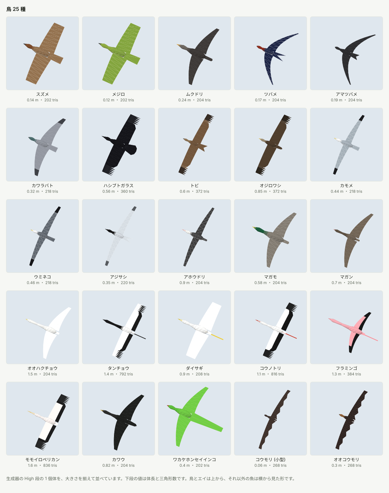

| 名前 | ID | 体長 | 既定の動き | 既定の個体数 | 形状と配色の要点 |
| --- | --- | --- | --- | --- | --- |
| スズメ | `sparrow` | 0.14 m | Cruise | 40 | 丸い翼、茶色の頭 |
| メジロ | `white-eye` | 0.12 m | Cruise | 20 | 丸い翼、黄緑 |
| ムクドリ | `starling` | 0.24 m | Murmuration | 300 | 三角形の翼、橙色の嘴 |
| ツバメ | `swallow` | 0.17 m | Cruise | 25 | 鎌形の翼、深い燕尾、白い腹 |
| アマツバメ | `swift` | 0.19 m | Cruise | 30 | 細く後退した鎌形の翼 |
| カワラバト | `pigeon` | 0.32 m | Cruise | 40 | 灰色、暗色の翼端 |
| ハシブトガラス | `crow` | 0.56 m | Cruise | 12 | 指状に分かれた翼端、扇形の尾 |
| トビ | `black-kite` | 0.60 m | Thermal | 8 | 幅広い翼、浅い燕尾 |
| オジロワシ | `sea-eagle` | 0.85 m | Thermal | 3 | 大きな指状の翼端、くさび形の尾 |
| カモメ | `gull` | 0.44 m | Thermal | 20 | 細長い翼、灰色の背、黒い翼端 |
| ウミネコ | `black-tailed-gull` | 0.46 m | Cruise | 30 | 濃い灰色の背、黒い翼端 |
| アジサシ | `tern` | 0.35 m | Cruise | 20 | 細長い翼、黒い頭、燕尾 |
| アホウドリ | `albatross` | 0.90 m | Wander | 3 | 非常に細長い翼、ほぼ滑空のみ |
| マガモ | `mallard` | 0.58 m | VFormation | 12 | 緑の頭、速い羽ばたき |
| マガン | `goose` | 0.70 m | VFormation | 25 | 長めの首、褐色 |
| オオハクチョウ | `swan` | 1.50 m | VFormation | 9 | 長い首、白 |
| タンチョウ | `crane` | 1.40 m | VFormation | 9 | 長い首、後方へ伸ばした脚、黒い風切羽 |
| ダイサギ | `egret` | 0.90 m | Cruise | 6 | 白、後方へ伸ばした脚 |
| コウノトリ | `stork` | 1.10 m | Thermal | 12 | 白、黒い風切羽、赤い脚 |
| フラミンゴ | `flamingo` | 1.30 m | Stream | 40 | 桃色、黒い風切羽、長い首と脚 |
| モモイロペリカン | `pelican` | 1.60 m | VFormation | 12 | 大きな嘴、黒い翼端 |
| カワウ | `cormorant` | 0.82 m | VFormation | 20 | 黒、くさび形の尾 |
| ワカケホンセイインコ | `parakeet` | 0.40 m | Cruise | 30 | 緑、長い尾、赤い嘴 |
| コウモリ (小型) | `bat` | 0.06 m | Tornado | 150 | 膜状の翼、縁が波打つ後縁 |
| オオコウモリ | `flying-fox` | 0.30 m | Cruise | 30 | 大きな膜状の翼 |

## 海

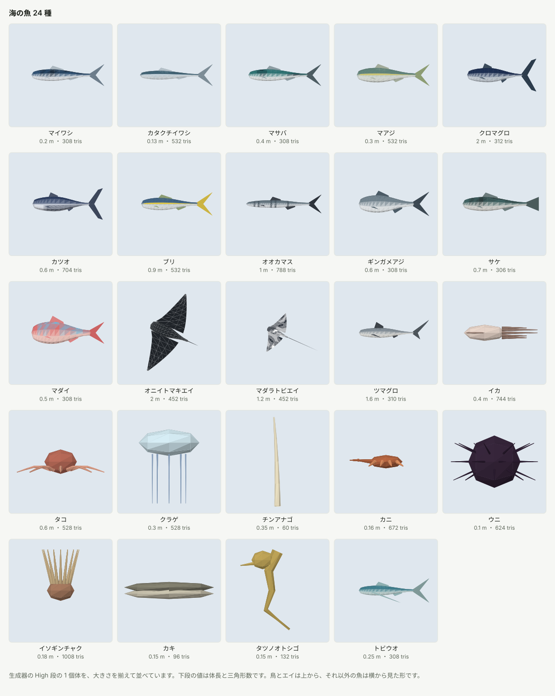

| 名前 | ID | 体長 | 既定の動き | 既定の個体数 | 形状と配色の要点 |
| --- | --- | --- | --- | --- | --- |
| マイワシ | `sardine` | 0.20 m | BaitBall | 300 | 青い背、銀色の腹、体側の斑点 |
| カタクチイワシ | `anchovy` | 0.13 m | Stream | 300 | 銀色の縦帯 |
| マサバ | `mackerel` | 0.40 m | Stream | 150 | 背の波状の横縞 |
| マアジ | `jack-mackerel` | 0.30 m | Stream | 150 | 黄色味のある側線 |
| クロマグロ | `bluefin-tuna` | 2.00 m | Stream | 20 | 紡錘形、三日月形の尾鰭 |
| カツオ | `skipjack` | 0.60 m | Stream | 60 | 腹の縦縞 |
| ブリ | `yellowtail` | 0.90 m | Stream | 60 | 黄色の縦帯と尾鰭 |
| オオカマス | `barracuda` | 1.00 m | Tornado | 120 | 細長い体、淡い横縞 |
| ギンガメアジ | `bigeye-trevally` | 0.60 m | Tornado | 250 | 銀色、深く切れ込んだ尾鰭 |
| サケ | `salmon` | 0.70 m | Stream | 40 | 背の斑点、截形の尾鰭 |
| マダイ | `red-seabream` | 0.50 m | Cruise | 30 | 赤、青い斑点 |
| オニイトマキエイ | `manta` | 2.00 m | FloorGlide | 3 | 幅の広い胸鰭、白い腹、壁際の上昇と旋回 |
| マダラトビエイ | `eagle-ray` | 1.20 m | Stream | 8 | 白い斑点、長い尾 |
| ツマグロ | `reef-shark` | 1.60 m | Wander | 5 | 上葉の長い尾鰭、大きな背鰭 |

## サンゴ礁

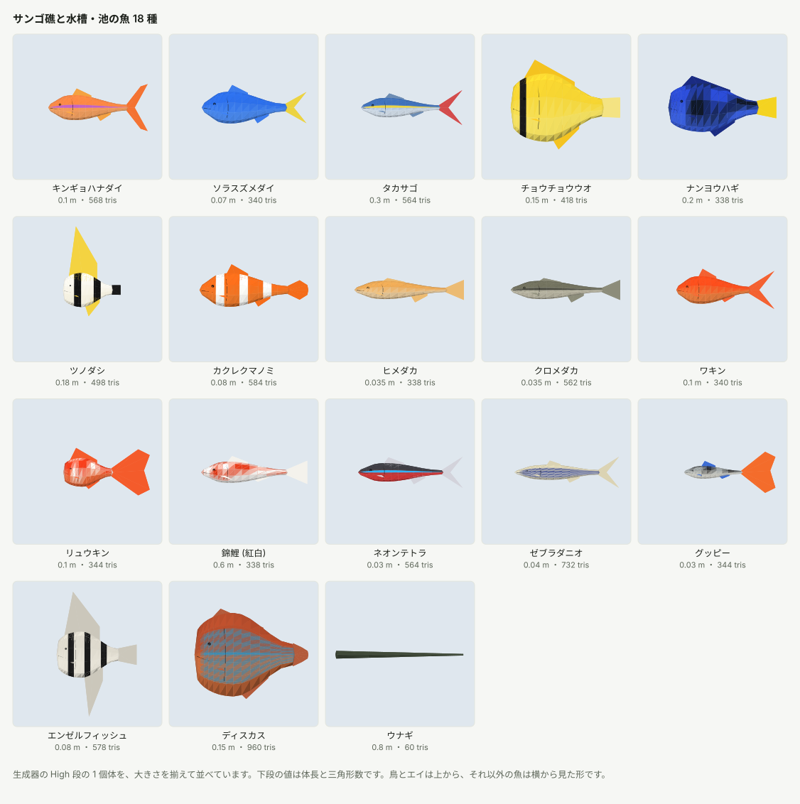

| 名前 | ID | 体長 | 既定の動き | 既定の個体数 | 形状と配色の要点 |
| --- | --- | --- | --- | --- | --- |
| キンギョハナダイ | `anthias` | 0.10 m | Cruise | 150 | 橙色、紫の帯 |
| ソラスズメダイ | `blue-damselfish` | 0.07 m | Cruise | 100 | 青、黄色の尾鰭 |
| タカサゴ | `fusilier` | 0.30 m | Stream | 200 | 青、黄色の縦帯 |
| チョウチョウウオ | `butterflyfish` | 0.15 m | Wander | 10 | 側扁した円盤形、黄色、目を通る黒帯 |
| ナンヨウハギ | `palette-tang` | 0.20 m | Cruise | 20 | 青、黒い模様、黄色の尾鰭 |
| ツノダシ | `moorish-idol` | 0.18 m | Wander | 6 | 長く伸びた背鰭、白黒の横帯 |
| カクレクマノミ | `clownfish` | 0.08 m | Wander | 6 | 橙色、白い横帯 3 本 |

## 水槽・池

| 名前 | ID | 体長 | 既定の動き | 既定の個体数 | 形状と配色の要点 |
| --- | --- | --- | --- | --- | --- |
| ヒメダカ | `medaka-orange` | 0.035 m | Cruise | 20 | 橙色、水面近くの薄い範囲 |
| クロメダカ | `medaka-wild` | 0.035 m | Cruise | 20 | 灰褐色、暗色の側線 |
| ワキン | `goldfish` | 0.10 m | Wander | 8 | 赤、フナ形 |
| リュウキン | `ryukin` | 0.10 m | Wander | 6 | 丸い体、長い尾鰭、紅白 |
| 錦鯉 (紅白) | `koi` | 0.60 m | Wander | 10 | 白地に赤い模様 |
| ネオンテトラ | `neon-tetra` | 0.03 m | Cruise | 40 | 青い縦帯、赤い腹 |
| ゼブラダニオ | `zebra-danio` | 0.04 m | Cruise | 25 | 青い縦縞 |
| グッピー | `guppy` | 0.03 m | Wander | 20 | 大きな色付きの尾鰭 |
| エンゼルフィッシュ | `angelfish` | 0.08 m | Wander | 6 | 高い背鰭と臀鰭、黒い横帯 |
| ディスカス | `discus` | 0.15 m | Wander | 6 | 円盤形、青い縦縞 |

水槽の魚は範囲を数十 cm に設定しています。水槽の内寸に合わせて `settings.area` を調整してください。範囲は GameObject の位置を中心とした半径で指定します。

## 追加の水生生物・地上の鳥

特殊形状は `bodyShape` で選びます。触腕、傘、脚、殻などを専用の形状から生成します。
形状と運動は配置確認用に単純化しており、体長はデザイン用の代表値です。
クラゲは不透明の傘、カキは固定した殻で表現します。トビウオは遊泳の例で、水面を離れる跳躍はありません。

| 名前 | ID | 体長 | 既定の動き | 既定の個体数 | 形状と配色の要点 |
| --- | --- | --- | --- | --- | --- |
| イカ | `squid` | 0.40 m | Jet | 5 | 外套、10 本の腕、側鰭、収縮と加速 |
| タコ | `octopus` | 0.60 m | OctopusDrift | 5 | 外套と 8 本の腕、三次元の浮遊と腕の動作 |
| クラゲ | `jellyfish` | 0.30 m | Float | 5 | 傘と触手、周期的な脈動と長周期の浮遊 |
| チンアナゴ | `garden-eel` | 0.35 m | Anchored | 1 | 直立した細い体、根元を固定した揺れ |
| カニ | `crab` | 0.16 m | Anchored | 1 | 甲羅、8 本の歩脚と 2 本の鋏脚 |
| ウナギ | `eel` | 0.80 m | Wander | 5 | 細長い体、体をくねらせる遊泳 |
| ウニ | `urchin` | 0.10 m | Anchored | 1 | 球形の殻と棘、静止 |
| イソギンチャク | `anemone` | 0.18 m | Anchored | 1 | 柱状の体と触手、根元を固定した揺れ |
| カキ | `oyster` | 0.15 m | Anchored | 1 | 扁平な 2 枚の殻、静止 |
| トビウオ | `flying-fish` | 0.25 m | Stream | 16 | 長く広がった胸鰭 |
| タツノオトシゴ | `seahorse` | 0.15 m | Wander | 5 | 直立した体、管状の吻、曲がった尾 |
| ニワトリ | `chicken` | 0.45 m | Wander | 4 | 畳んだ翼、鶏冠、脚の歩行動作 |
| ヒヨコ | `chick` | 0.08 m | Wander | 8 | 丸い体、黄色、脚の歩行動作 |

ニワトリとヒヨコは地上用です。上下の移動と旋回時の傾きを抑え、原点を足元に置きます。
地形への追従や衝突回避はないため、平らな地面に配置してください。

## 形状のパラメータ

### 追加種の Unity RenderImage

Unity 2022.3.22f1 の標準照明で High の Mesh を描画した画像です。Scene の標本は実寸ですが、以下の撮影は各個体の体長に合わせて Camera の距離を変えています。

| イカ | タコ | クラゲ |
| --- | --- | --- |
| 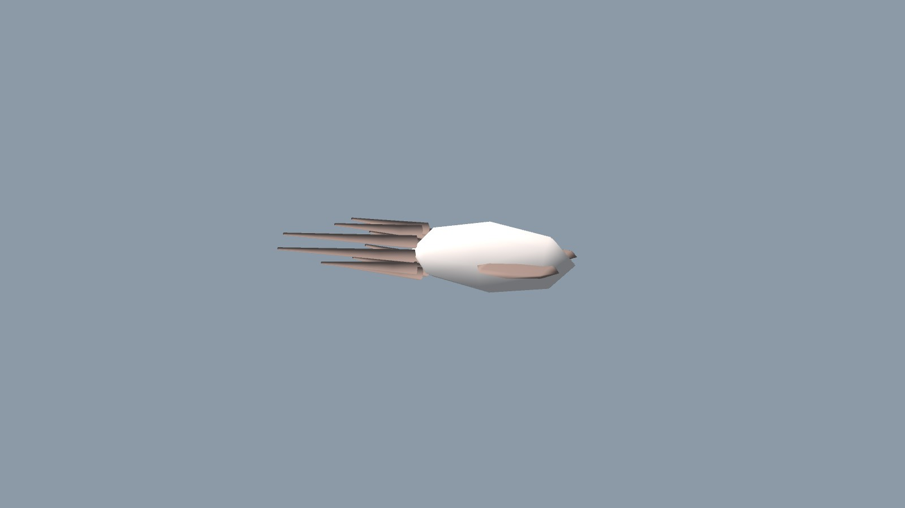 | 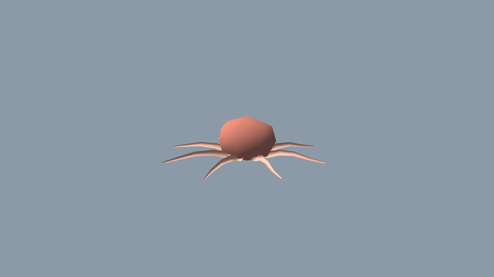 | 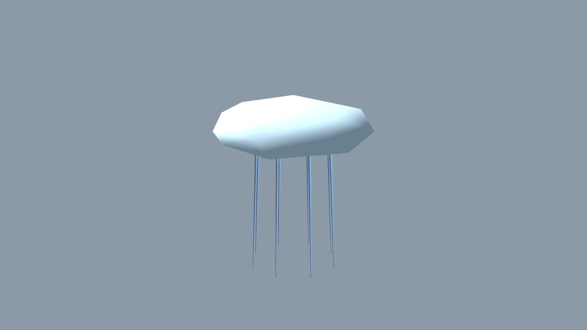 |

| チンアナゴ | カニ | ウナギ |
| --- | --- | --- |
| 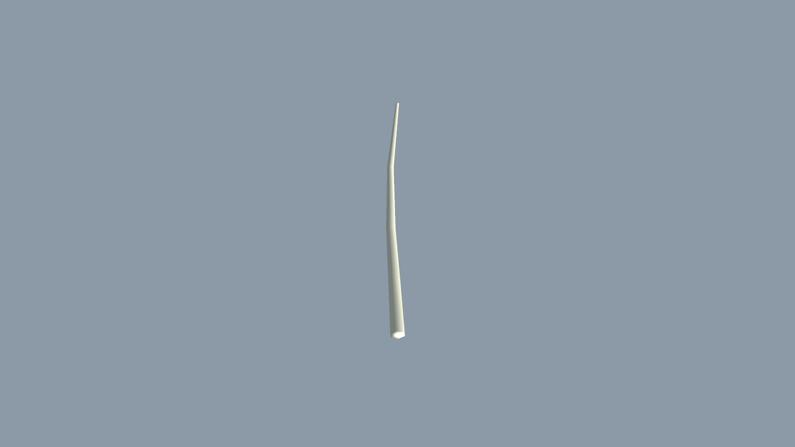 | 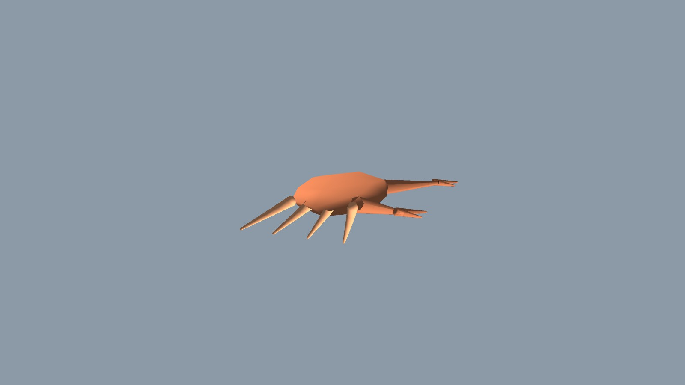 | 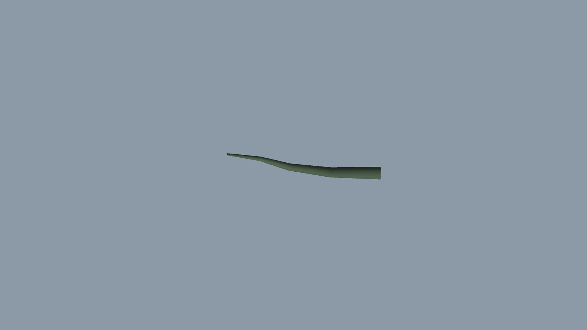 |

| ウニ | イソギンチャク | カキ |
| --- | --- | --- |
| 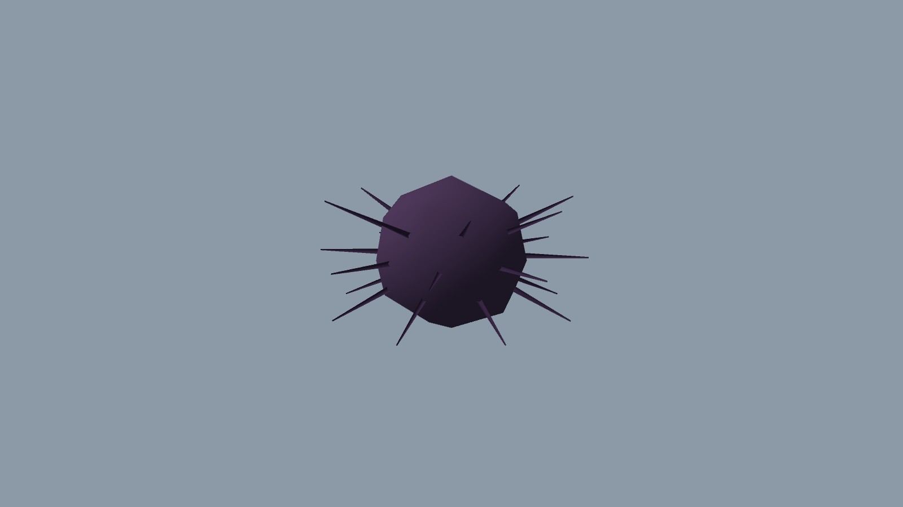 | 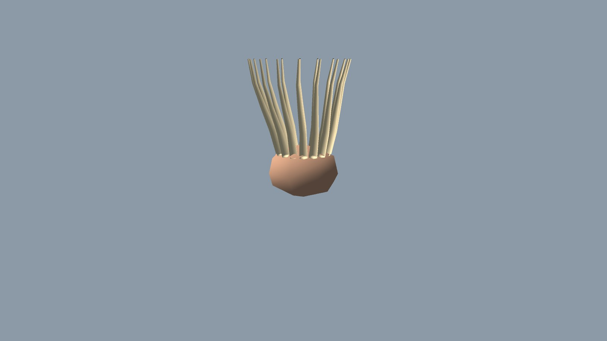 | 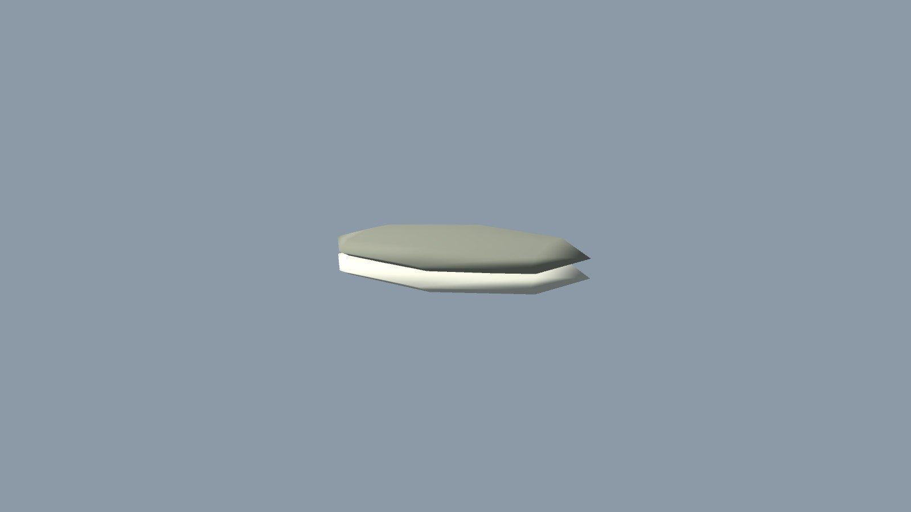 |

| トビウオ | タツノオトシゴ | ニワトリ | ヒヨコ |
| --- | --- | --- | --- |
| 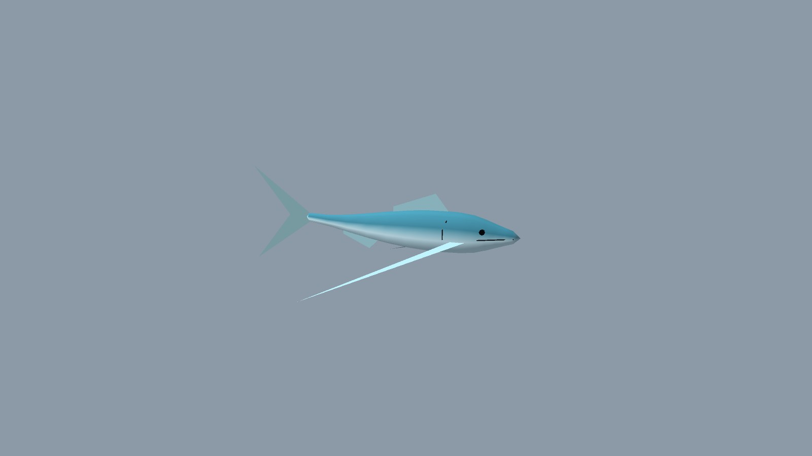 | 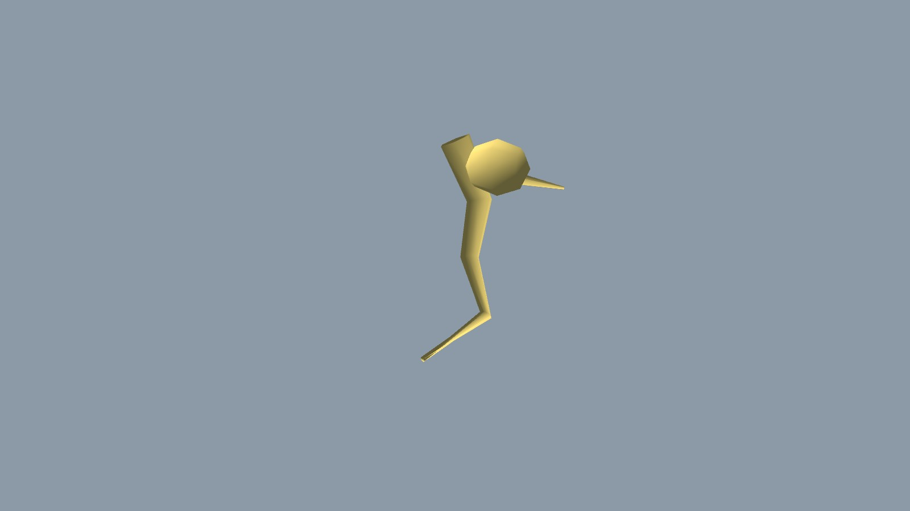 | 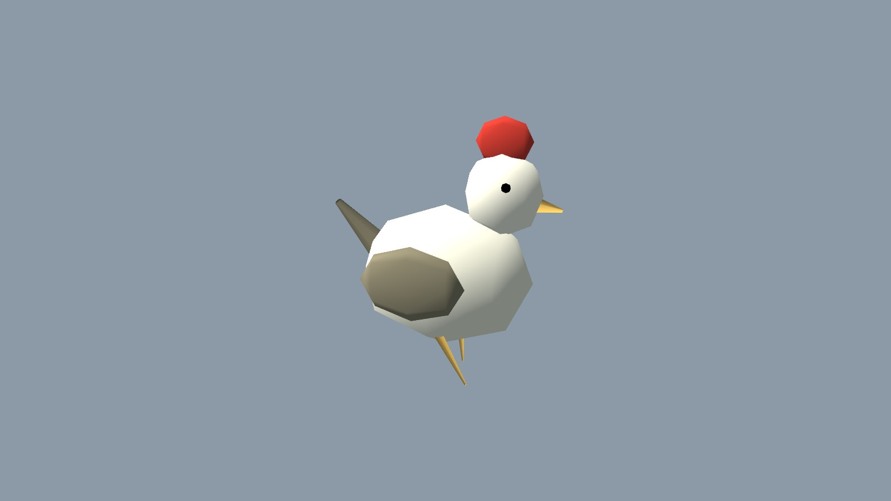 | 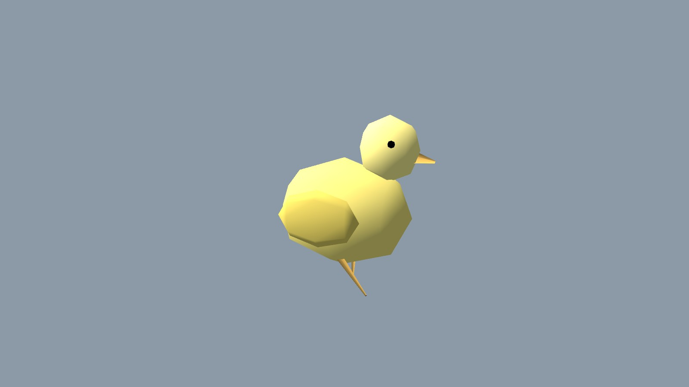 |

## パラメータの編集

Inspector の「種のパラメータ」から、プリセットをもとに独自の種を作れます。主なパラメータは次のとおりです。

| 分類 | パラメータ | 内容 |
| --- | --- | --- |
| 共通 | `bodyLength` | 体長 (m) |
| 共通 | `primary` から `extra` | 5 色。鳥は背、腹、頭、翼端と風切羽、嘴と脚。魚は背、腹、模様、鰭、尾鰭 |
| 共通 | `beatFrequency`, `beatAmplitude`, `glide` | 羽ばたきまたは泳ぎの周波数と振幅、滑空の割合 |
| 鳥 | `wingspan`, `wingShape`, `tailShape` | 翼開長の比、翼の平面形、尾の形 |
| 鳥 | `neckLength`, `beakLength`, `trailingLegs` | 首と嘴の長さ、脚を後方へ伸ばすか |
| 鳥 | `wingTipFraction`, `flightFeatherFraction` | 翼端色と風切羽の色の範囲 |
| 魚 | `fishBody`, `bodyDepth`, `bodyWidth` | 体形、体高、体幅 |
| 魚 | `caudalFin`, `caudalSize` | 尾鰭の形と大きさ |
| 魚 | `dorsalHeight`, `analHeight`, `pectoralSize` | 背鰭、臀鰭、胸鰭の大きさ。エイでは胸鰭が体盤の半幅 |
| 魚 | `pattern`, `patternCount` | 横帯、縦帯、斑点、斑などの模様と本数 |
