# Flock Sample Scene

最初に開く `FlockWorldScenarios.unity` は、全 69 種を空・地面、小型水槽、大型水槽、川、24 m 水槽に配置した Scene です。

空の大型鳥は 1 種あたり最大 3 羽を広い FreeFlight 軌道に配置しています。小型水槽では Wander で水槽内を巡り、ワキン、リュウキン、エンゼルフィッシュ、ディスカスには高さ 0.50 m・奥行き 0.45 m の水槽を使用します。水槽寸法から体の動作分の余白を一度だけ差し引きます。大型水槽のイカは Jet、タコは OctopusDrift、クラゲは Float です。24 m 水槽のマンタは FloorGlide で底付近と壁際を泳ぎます。クラゲの位置変化は数分から長時間の観察で確認してください。
1 Unity unit = 1 m とし、魚や鳥の体長はプリセットの実寸を使います。家具、水槽、川岸、橋、樹木を比較対象として配置しています。

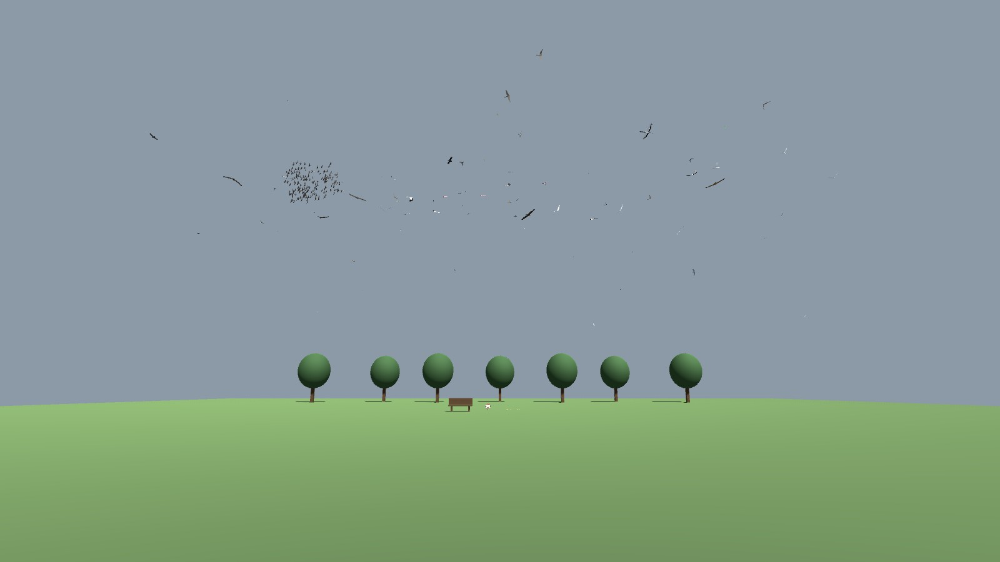

## World の状況別 Sample

Package Manager の `Samples > Flock Sample` を Import し、
`Assets/Samples/SabaProps Flock/0.1.0/Flock Sample/FlockWorldScenarios.unity` を開きます。
`Tools > SabaProps > Flock > Sample View` から状況を選ぶと、Game view の Camera と Scene view の視点が切り替わります。
Play Mode では飛翔と遊泳を確認できます。Scene view では自由に移動して距離と角度を変えてください。

| 区画 | 配置 | 確認すること |
| --- | --- | --- |
| 01 Open sky | 100 × 100 m の草地、樹木、ベンチ。飛ぶ鳥 25 種と地上のニワトリ・ヒヨコ | 地上の目線から見た密度、広がり、近距離と遠距離の LOD |
| 02 Small aquarium | 幅 0.60 × 高さ 0.36 × 奥行 0.30 m の水槽 9 台。メダカ 2 種、金魚 2 種、ネオンテトラ、ゼブラダニオ、グッピー、エンゼルフィッシュ、ディスカスを種別に配置 | 家具との寸法の関係、小魚の視認性、ガラス越しの配色、壁際の遊泳 |
| 03 Large aquarium | 幅 8 × 高さ 3 × 奥行 3 m の水槽、ベンチ。海・サンゴ礁の 24 種。魚群とイカ・タコ・クラゲ、砂床の生物 | 観覧距離での魚群の密度、形状と配色、砂床の固定配置、LOD |
| 04 River | 幅 8 × 長さ 28 m、川床まで約 1.7 m。川岸、歩道橋、石。錦鯉、クロメダカ、ウナギ、サケ | 川岸・橋から見下ろした魚の見え方、水面越しの色、浅瀬の小魚の視認性 |
| 05 Oceanarium | 幅 24 × 高さ 10 × 奥行 12 m。マグロ、ブリ、カマス、マンタ、トビエイ、サメ | 大型種の実寸、広い遊泳範囲、観覧距離と LOD |

各区画に 2 台ずつ Camera があり、通常の目線と近接・遠景・橋の視点を用意しています。地上の鳥を確認する Camera もあり、全 11 台です。`Sample View > Ground birds` / `Oceanarium` で追加の視点を選べます。
メニューは通常の目線を選択します。別の Camera を試すときは、既存 Camera の `Camera` コンポーネントを無効にして、選んだ Camera を有効にしてください。
空・大型水槽のマイワシ・川の錦鯉は `LodGroup`、小魚とキンギョハナダイは `Single / High` です。
LOD の距離は群れの中心から測るため、広い群れの近くへ入った場合も確認してください。

各区画の `Flock <種名>` をコピーすれば、その状況に合わせた設定を自作 World に持ち込めます。
コピー後は `area`、`count`、`clusterRadius`、`speedScale`、`seed` を変更し、`生成 / 更新` を押してください。
`area` は全幅ではなく各軸の半径です。水槽の内寸と個体の大きさを考慮して設定します。
Scene の Props は寸法比較用の簡易形状で、衝突回避や水との物理的相互作用はありません。
ガラスと水面は Standard Shader の半透明 Material です。屈折、波、カースティクスは含みません。
自作 World の水 Shader と組み合わせた表示、VRChat での負荷は別途確認してください。

全種を配置するため、小型水槽は種ごとに分け、大型水槽は比較展示として複数種を配置しています。生息域、捕食関係、飼育条件の共存を示すものではありません。個体数は種類を見分けやすい範囲に抑えています。
クロメダカは小型水槽と川の両方で例示しています。

### マンタの底付近・壁際の動き

24 m 水槽の `FloorGlide` を、同じ個体の三つの位相で撮影しています。個体位置に合わせて Camera を移動し、Shader の時刻を固定した Unity RenderImage です。設定範囲の端へ近づくと上昇し、腹側をガラス方向へ向けながら旋回します。

| 底付近の巡航 | 壁際の上昇 | 腹側を見せる旋回 |
| --- | --- | --- |
| 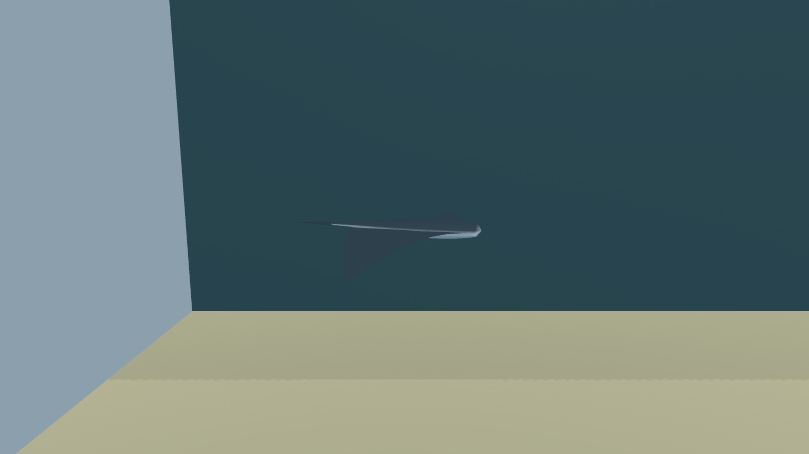 | 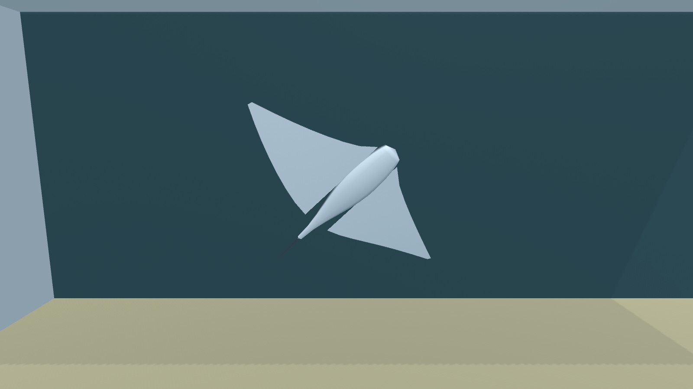 | 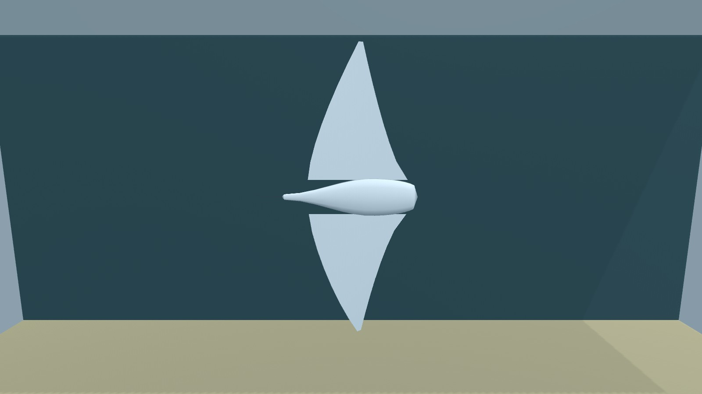 |

### 地上の鳥と大型種

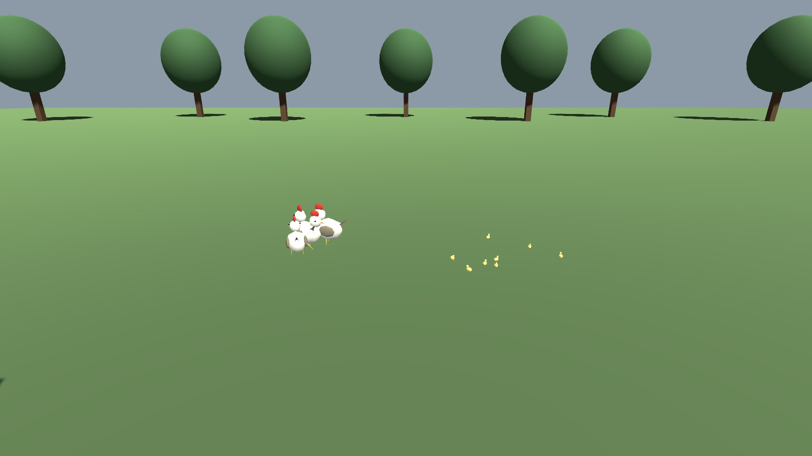

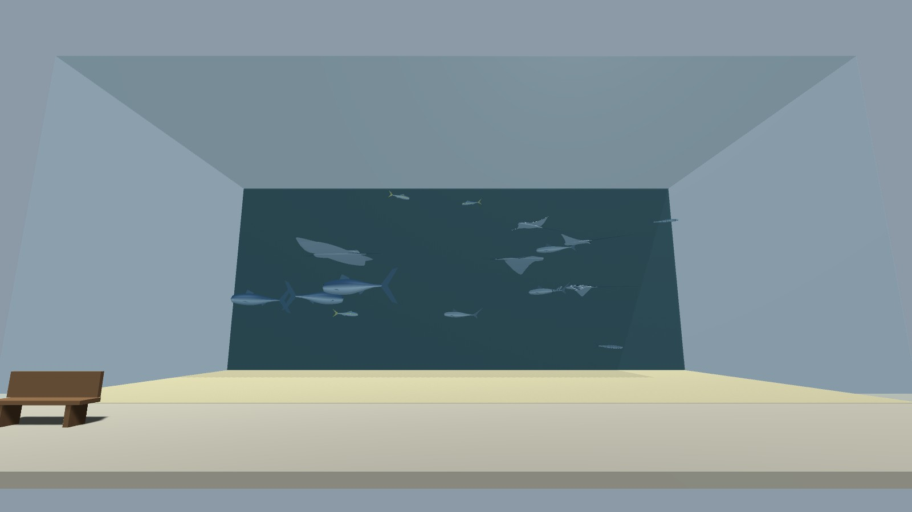

### 小型水槽

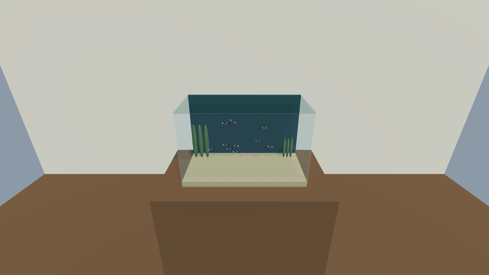

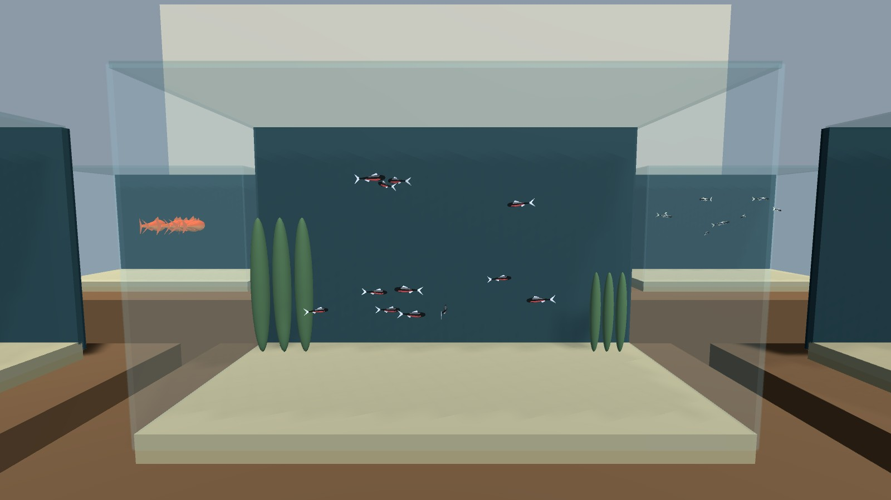

### 大型水槽

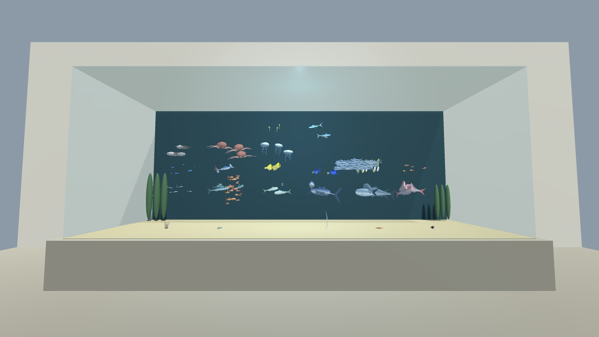

### 川

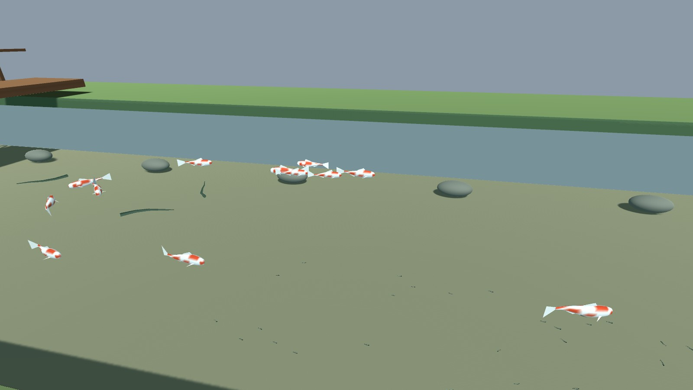

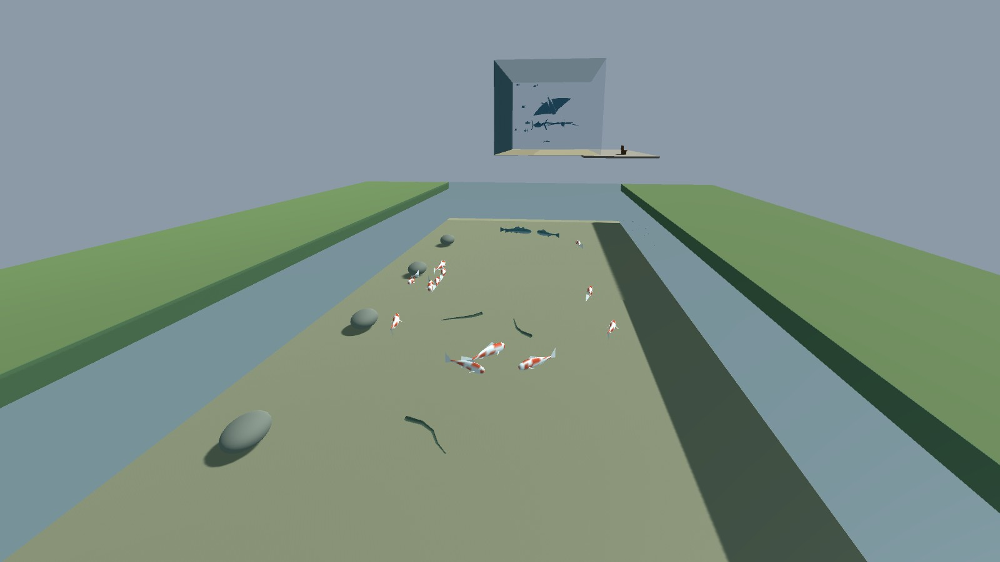

## 種と動作の比較 Scene

`FlockComparisons.unity` は全 69 種を実寸で 1 個体ずつ並べた Scene です。Hierarchy の `01 All species` から標本を選び、Scene view の `F` で注目してください。追加したイカ、タコ、クラゲ、チンアナゴ、カニ、ウナギ、ウニ、イソギンチャク、カキ、トビウオ、タツノオトシゴ、ニワトリ、ヒヨコも含みます。マグロ、サバ、タイ、クマノミと、ペリカン、スズメ、カラス、ハト、ハクチョウは既存プリセットを利用できます。

`02 Swimming comparison` はマイワシ 24 匹の Stream / BaitBall / Tornado / Wander、`03 Flying comparison` はムクドリ 24 羽の Cruise / Murmuration / VFormation / Thermal を並べています。種・個体数・seed・範囲・速度倍率を共通にし、群れの動きだけを変えています。`Sample View > Compare swimming` / `Compare flying` で Camera を切り替え、Play Mode で比較できます。標本と比較用の群れはコピーして再生成できます。

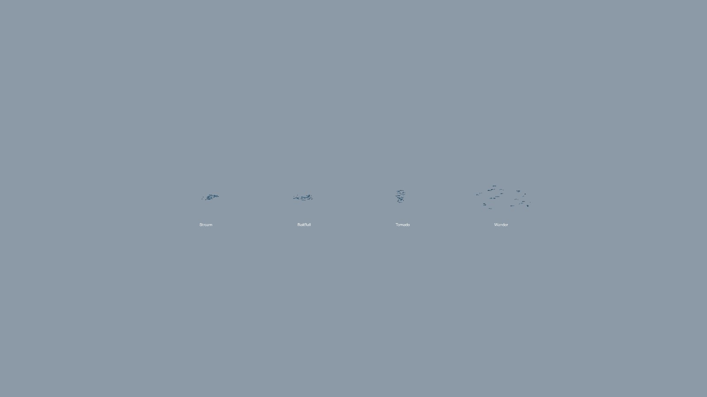

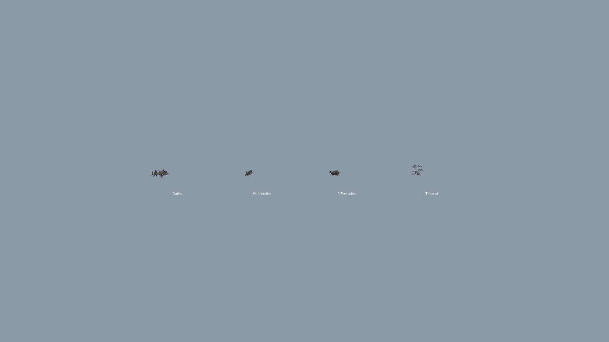

### 昼・夕方・夜

`Tools > SabaProps > Flock > Sample Lighting > Day / Evening / Night` は Sample の主光源、環境光、Camera 背景色を変更します。空の鳥と水槽の魚が夕方や夜の照明に馴染むか確認してください。大型水槽には Point Light を配置し、追加光源も確認できます。これは照明条件の切り替え例であり、時間帯の自動進行や Light Probe の bake は行いません。

| 状況 | 夕方 | 夜 |
| --- | --- | --- |
| 空 | 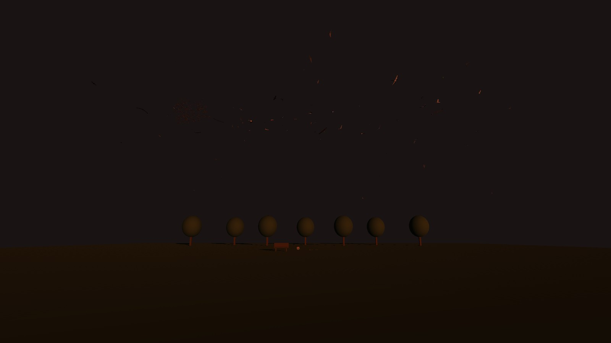 |  |
| 大型水槽 | 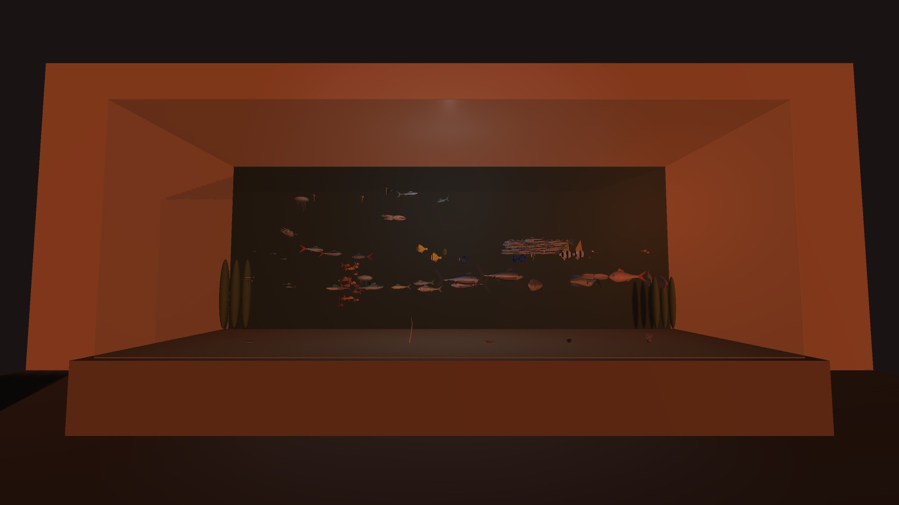 | 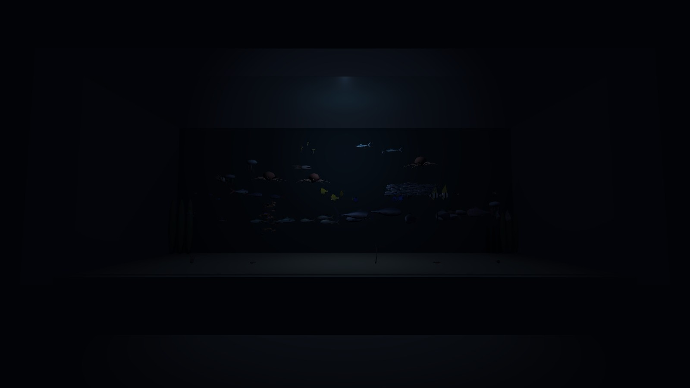 |

標準 Light / Light Probe に対応し、遠景のシルエット色・水の色にも照明を適用します。個体は影を受けますが、影は落としません。Probe は群れの Renderer 単位です。広い群れを異なる照明領域へ置く場合は分割してください。

`FlockSample.unity` は 8 種・全 8 動作を比較する Scene です。
背景とラベルは展示用で、群れの GameObject は個別にコピーできます。

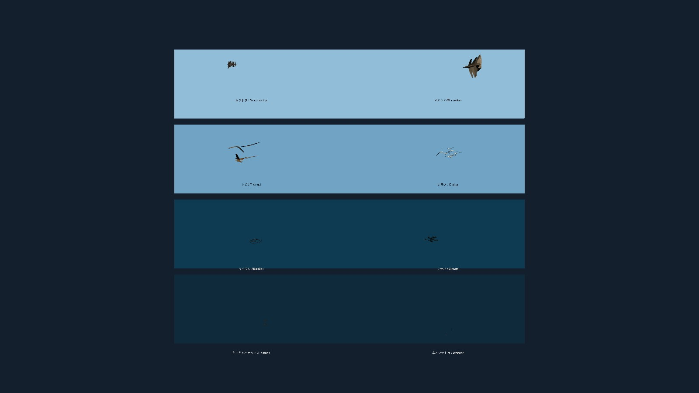

## Import と操作

1. Unity Package Manager で `SabaProps Flock` を選び、`Samples` から `Flock Sample` を Import します。
2. `Assets/Samples/SabaProps Flock/0.1.0/Flock Sample/FlockSample.unity` を開きます。
3. Hierarchy の `SabaProps Flock Sample > Copy These Swarms` にある各群れを選びます。
4. 群れの GameObject を対象 Scene にコピーして位置を変えます。複製した群れでは seed を変更すると、個体の配置と動きの位相が変わります。
5. Inspector で `pattern`、`count`、`area`、`speedScale`、`detail` を変更したら、`生成 / 更新` を押します。

`Presentation Only` には背景とラベルだけが入っています。自作 World へコピーする必要はありません。
Sample の Mesh は再生成時に保持され、編集した群れにはプロジェクト側の新しい Mesh asset が割り当てられます。
動きは Play Mode の Game view で確認できます。表示例は静止画です。

Sample は形状を比較しやすいよう、全群れを `Single / High` で生成しています。
LOD の切り替えを試す場合は `lodMode` を `LodGroup` に変更して再生成します。
小さな魚の近接確認は Scene view で群れを選び、`F` キーで注目してください。

| 展示 | 種 | 群れの動き |
| --- | --- | --- |
| Sky formations | ムクドリ、マガン | Murmuration、VFormation |
| Sky cruising | トビ、カモメ | Thermal、Cruise |
| Sea schools | マイワシ、マサバ | BaitBall、Stream |
| Reef and aquarium | キンギョハナダイ、ネオンテトラ | Tornado、Wander |

全 69 種は Inspector のプリセットから選べます。種ごとの形状比較は[要素別リファレンス](elements.md)を参照してください。

## Unity の描画例

以下は Sample Scene の Mesh と Shader を Unity 2022.3.22f1 で実際に描画した画像です。
背景色は見やすさのため Sample Scene の展示用パネルで設定しています。

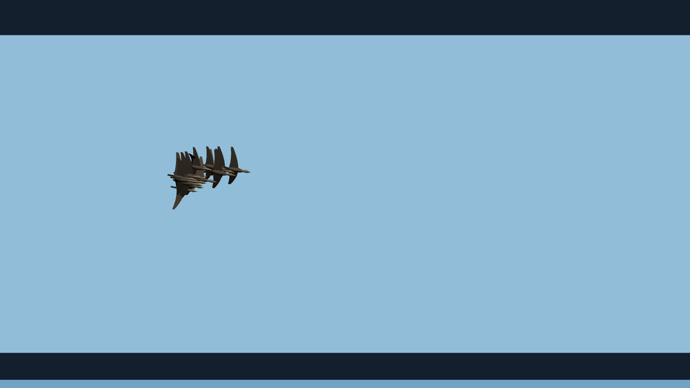

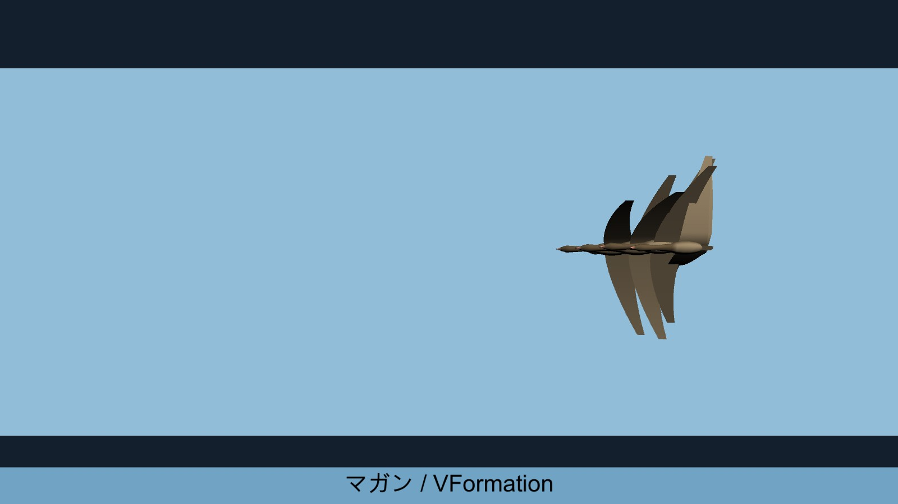

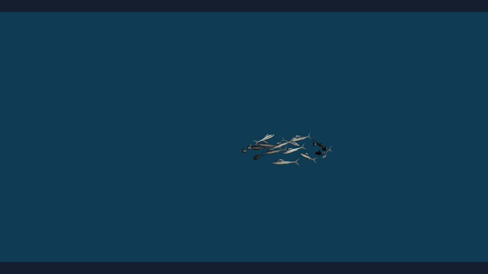

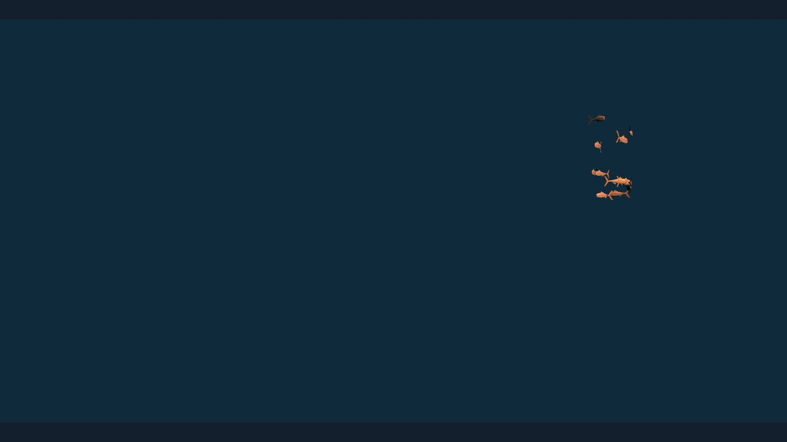

文書用画像の再生成手順はリポジトリの `.github/figures/capture/README.md` にあります。
