# パラメータと見た目の対応

Species の形状パラメータが実際にどう効くかを、生成されたメッシュそのもので並べた早見です。

図はすべて**このリポジトリの生成器の出力**です。`.github/figures/render.sh` がパッケージのメッシュ生成器を実行し、出てきた形状をそのまま描いています。手で描いた図ではないので、生成器を変えれば図も変わります（CI が committed の図と生成結果の一致を検査します）。

図の読み方は共通です。

- 1 つの図の中では**縮尺が共通**です。タイル間で背丈をそのまま比べられます。図ごとの縮尺は左下のスケールバーが示します
- 変えているのは見出しのパラメータ 1 つだけで、`meshSeed` を含む他はすべて既定値です
- 各タイルの下は、そのメッシュの**高さ (m)** と**三角形数**です
- 地面の楕円は y = 0 の面です

---

## Grass Clump

### Blade Count

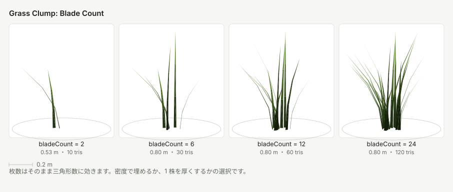

三角形数はブレード枚数にそのまま比例します。広い面積を埋めるときは、枚数を増やすより `Density` を上げた方が同じ三角形数でも見た目の密度が出ます。1 株が単体で見える近景では枚数が効きます。

### Height

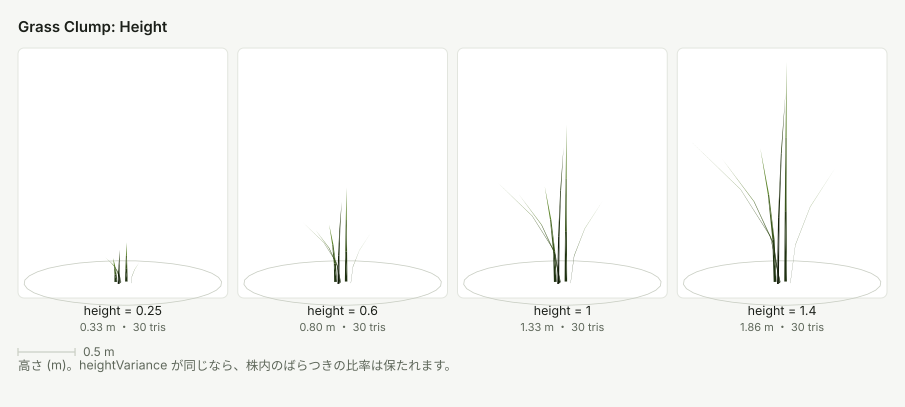

`heightVariance` は高さに対する比率なので、`height` を変えても株内のばらつきの割合は保たれます。

### Bend

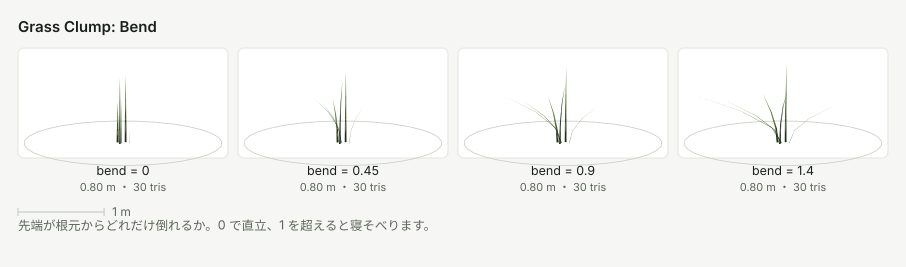

先端が根元からどれだけ倒れるかです。0 は直立した芝、1 を超えると寝そべった野草になります。倒すほど水平方向の投影面積が増えるため、同じ `Density` でも地面の被覆率は上がります。

### Clump Radius

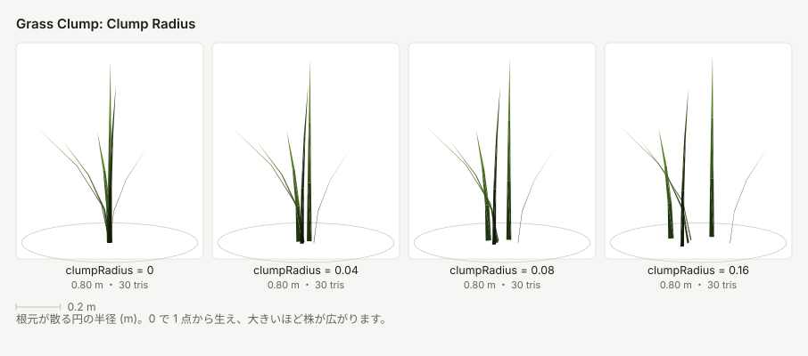

ブレードの根元が散る円の半径です。0 では 1 点から生えるので束に見えます。広げるほど 1 株の占有面積が増えるので、`Min Spacing` も併せて調整してください。

### Mesh Seed

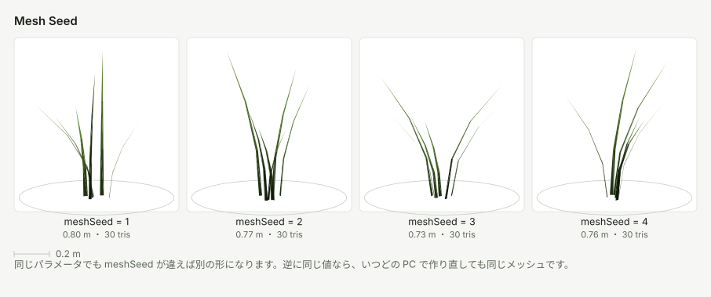

パラメータが同じでもシードが違えば別の形になります。逆に、同じシードなら別の PC で作り直しても同じメッシュです。種を複数用意して見た目を散らしたい場合は、パラメータではなくシードを変えるのが最も安全です（1 種 = 1 メッシュ = 1 インスタンシングバッチなので、種を増やせばバッチも増えます）。

---

## Clover

### Leaflet Count

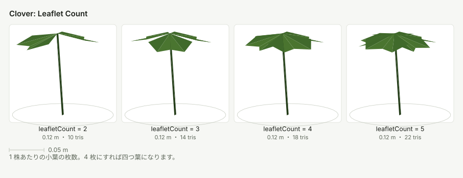

4 枚にすれば四つ葉です。三つ葉の中に混ぜたい場合は、四つ葉の Species を別に作り、 `Placement Weight` を小さくして混ぜてください。

### Notch

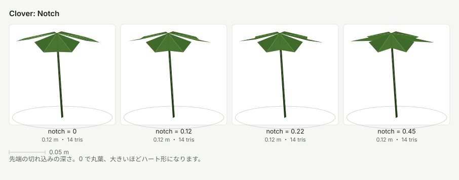

小葉の先端の切れ込みです。0 は丸葉で、深くするほどハート形になります。

---

## Sunflower

### Head Tilt

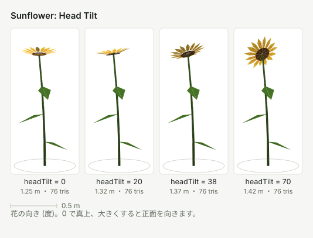

0 度で真上を向き、大きくすると正面を向きます。`Face Sun` と併せると畑全体の向きが揃います。

### Petal Count

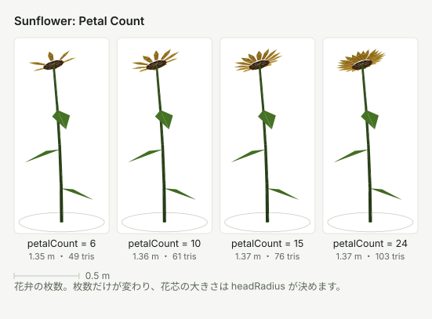

花弁の枚数だけが変わります。花芯の大きさは `headRadius` が決めるので、枚数を増やすと 1 枚あたりの間隔が詰まります。

### Lean

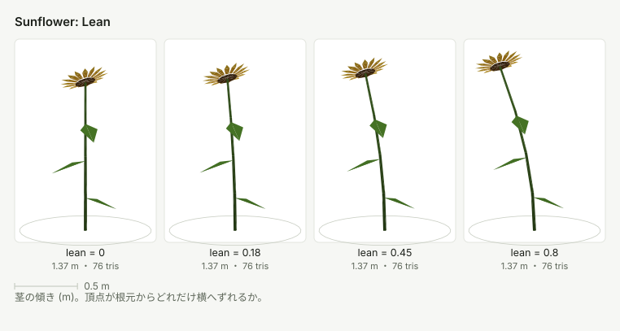

茎の頂点が根元からどれだけ横へずれるかです。個体ごとの傾きの向きはシードで決まるため、値を大きくすると畑全体がばらけた印象になります。

---

## Reed

### Spread

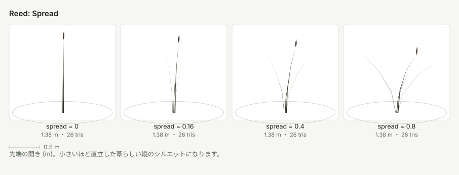

先端の開きです。小さいほど直立し、水辺の縦のシルエットになります。大きくすると草叢に近づきます。

### Spike

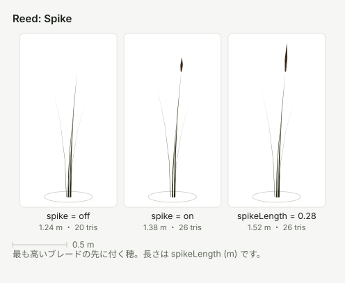

最も高いブレードの先に付く穂です。`spike` を OFF にすると穂の分の三角形が消えます。

---

## Vine

ツタは地面から上へ生える他の種と異なり、ローカル Y=0 の根から −Y 方向へ垂れます。
`Length` と `Length Variance` が垂れる距離、`Strand Count` が 1 個体に含む茎の本数、
`Lateral Sway` が壁面上での横方向の流れを決めます。`Leaves Per Strand` は三角形数に
ほぼ比例します。

壁の上端に沿って細い Foliage Field を作り、上面の Collider に吸着させてください。
`Align To Ground Normal` は既定で 0 のため、小さな法線差があっても鉛直下向きを保ちます。

### Surface Vine

`SurfaceVine` は Foliage Field の面積散布とは別の authoring component です。
`Target Surface` と必要な `Additional Surfaces`、ローカル空間の Guide Points を指定し、
`Build / Rebuild` で表面へ焼き込みます。床・壁・斜面のように接する Collider は、各 step で
最も近い投影先が選ばれるため1本の経路として横断できます。

| 分類 | パラメータ | 効果 |
|---|---|---|
| 経路 | `Mode` | `ProjectedSpline` はガイド曲線を優先し、`SurfaceCrawl` は接平面上をランダムに進みます |
| 投影先 | `Target Surface` / `Additional Surfaces` | 主対象と、同じ経路で横断する隣接 Collider です。重複と null は無視されます |
| 経路 | `Path Count` / `Coverage` | 主経路数と実際に使う割合。家全体の被覆率を決める最初の値です |
| 経路 | `Direction Jitter` / `Direction Persistence` | 進行方向の最大揺らぎと、同じ旋回傾向が続く長さです。Persistence を高くすると広い弧、低くすると短い不規則な折れになります |
| 経路 | `Guide Attraction` / `Root Spread` / `Path Length Variance` | ガイドへ戻る強さ、根元を散らす半径、個体ごとの長さ差です。固定的な平行線を崩す場合に先に調整します |
| 分岐 | `Branches Per Metre` / `Max Branch Depth` / `Branch Length` | 1 m あたりの側枝開始頻度、再帰深度、親経路に対する長さ比です。密度を上げる場合は Node Budget も確認します |
| 分岐 | `Branch Angle` / `Branch Angle Jitter` / `Branch Length Variance` | 親茎に対する側枝角、個々の角度差、長さ差です。角度を小さくすると主茎に沿い、大きくすると横へ広がります |
| 精度 | `Step Length` / `Projection Distance` | 表面追従の細かさと Collider を探索する距離です。角が細かいほど Step を短くします |
| 安全弁 | `Minimum Spacing` / `Node Budget` | 経路どうしの過密と、極端な設定による Node 数を制限します |
| 茎 | `Stem Width` / `Stem Stiffness` | 表面に固定された茎の幅と風への剛性です |
| 根元 | `Root Anchor Length` / `Root Collar Scale` | 最初の Edge と逆方向へ延ばすテーパーの長さと始端側の太さです。根元の切断面を隠します |
| 葉 | `Leaves Per Metre` / `Minimum/Maximum Leaf Length` | 経路長あたりの葉数とサイズ範囲です。最終数には `Coverage` も掛かります |
| 葉序 | `Leaf Arrangement` / `Leaf Spacing Jitter` / `Leaf Angle Jitter` | 互生・対生・輪生・ランダムと、節間隔・葉の向きのばらつきです |
| 葉形 | `Cordate` / `Lobed` / `Ovate` / `Orbicular` | 心形、掌状裂、卵形、円形の低ポリゴン輪郭です |
| 色 | `Young` / `Mature` / `Autumn` / `Dry` | 4 色の頂点カラーパレットです。`Autumn Amount` は葉全体が秋色になる確率です |
| 部分色 | `Pigment Pattern` / `Edge` / `Vein` / `Petiole` | 葉全体を塗らず、葉縁・主脈・葉柄へ暗い緑、紫褐色などを焼き込みます |
| 部分色 | `Edge Width` / `Pigment Amount` | 葉縁リングの幅と、基調色から部分色へ寄せる強さです |

Preset は `Creeping Fig`（小さい心形葉を高密度）、`English Ivy`（濃緑の裂葉）、
`Boston Ivy`（大きい裂葉、緑主体の葉身、紫褐色の葉縁・主脈・葉柄）です。Boston Ivy の
`Autumn Amount` は少数の葉だけを葉全体の秋色にし、赤紫色の面が支配的にならない値です。
Preset 適用後も各値を個別に編集できます。

### Rhizome Patch

`RhizomePatch` は同じ `SurfaceGrowthGraph` を地面上で生成し、地下茎上の間隔に応じて
地上茎を立てます。既定はドクダミを想定しています。

| パラメータ | 効果 |
|---|---|
| `Shoots Per Metre` | 地下茎 1 m あたりの地上茎数。`Coverage` と組み合わせて群落密度を決めます |
| `Shoot Height` | 各地上茎の高さ範囲です |
| `Leaves Per Shoot` / `Leaf Length` / `Leaf Width Ratio` | 1 本あたりの葉数、長さ範囲、葉の縦横比です |
| `Leaf Color` / `Leaf Accent Color` / `Accent Amount` | 緑葉に紫赤色の個体差を混ぜます |
| `Flower Chance` / `Flower Radius` | 4 枚の白い苞と中央の花序を付ける確率と大きさです |
| `Render Rhizomes` | 地下 Edge の構造確認用表示です。通常の完成表現では OFF にします |

Collider 間の隙間は `Projection Distance` 以下にし、境界の曲率が大きい場合は
`Step Length` を短くします。どちらの component も非一様 Scale は想定していません。
表面形状、ガイド点、または
パラメータを変えた後は再ビルドしてください。

---

## 関連

- 各パラメータの一覧と既定値は [README](../README.md) を参照してください
- 生えない・重いといった症状は [トラブルシューティング](troubleshooting.md) にまとめてあります
