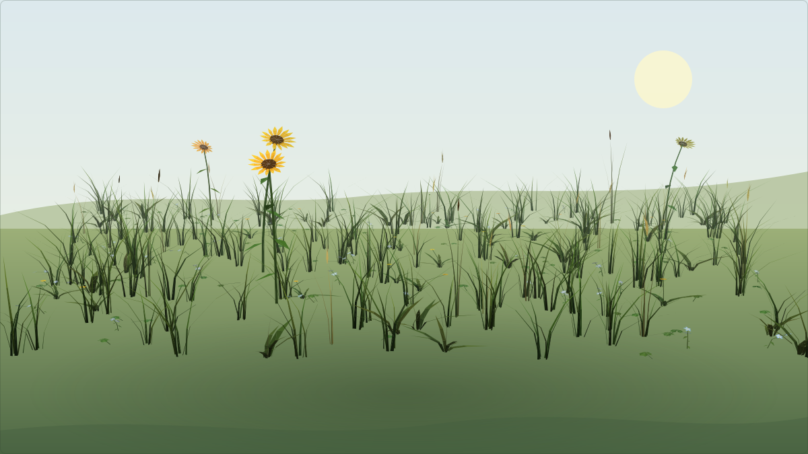
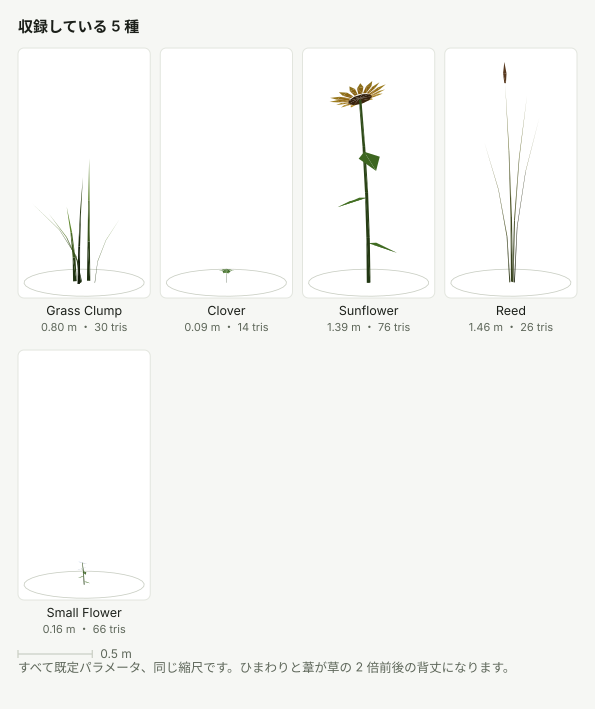
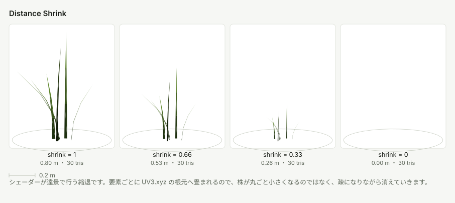
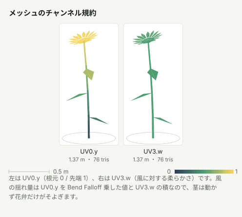

# SabaProps Foliage

GPU インスタンシング前提の、軽量な草木スキャッタリングツールです。
草叢・クローバー・ひまわり・葦・小花・雑草・穀物・たんぽぽ・ツタをプロシージャルに生成し、広い範囲に大量配置できます。Collider 表面を這うツタと、地下茎で連結したグラウンドカバーも Editor 時に焼き込めます。

- テクスチャ不要（頂点カラー駆動）。実装本体はバイナリアセット不要で、Package Manager から任意に導入する Demo Sample だけが生成済み Mesh を含みます
- ワールド座標ハッシュによる個体差なので、per-instance データの送信が一切不要です
- Built-in Render Pipeline / Unity 2022.3 / VRChat ワールド・アバターの両方で使えます

## 配置ツール

Trees package も導入した環境では、`Window > SabaProps > Placement` が
草地・ツタ・根茎・樹木をシーンへ配置するための共通入口になります。
Foliage 単体では次のウィンドウを直接開けます。

- `Window > SabaProps > Foliage Palette`: 種の配合、形状プレビュー、Scene View 上での草地配置
- `Window > SabaProps > Placement > Surface Growth`: 対象 Collider、隣接面、ツタの preset、初期成長方向を指定して Surface Vine / Rhizome Patch を配置
- `GameObject > SabaProps > Placement`: 選択中の GameObject を基準にした簡易配置

配置ウィンドウの表示言語は日本語が既定です。各ウィンドウ上部の `表示言語 / UI Language`
から英語へ切り替えられ、設定は配置ウィンドウ間で共有されます。

デモ生成は配置作業と分離し、`Tools > SabaProps > Debug` 以下にあります。

この図は実際のメッシュ生成器から作った 320 株を決定論的に配置し、シェーダーと同じ風の式を固定時刻で評価したものです。ライティングと地面は形状を読みやすくするためのオフライン近似で、Unity の画面を撮影したものではありません。

図はすべて実際の生成器の出力です。パラメータを変えると形状がどう動くかは [パラメータと見た目の対応](Documentation~/parameters.md) に一覧があります。

---

## 設計上の前提：VRChat で「GPU インスタンシング」を効かせるということ

VRChat のワールドとアバターでは、**実行時に C# が動きません**（動くのは Udon だけです）。
つまり `Graphics.DrawMeshInstanced` を毎フレーム呼ぶタイプの実装はアップロード後に何も描画しません。

そこでこのパッケージは、実際に VRChat で効く 2 つの方法だけを採用しています。

| モード | 仕組み | 向いている場面 |
| --- | --- | --- |
| **GPU Instanced** | 同一メッシュ＋同一マテリアルの Renderer を並べ、Unity の自動インスタンシングに任せる | 〜数千個体。個体ごとのカリングと距離縮退が効く |
| **Merged Chunks** | チャンク単位でメッシュを結合し、1 チャンク 1 ドローコールにする | 数千〜数万個体。CPU コストが最小 |

どちらのモードでも風揺れ・個体差・距離縮退は同じシェーダーが処理します。
配置計算はすべてエディタ時に完結し、シーンに残るのは MeshRenderer だけです。

---

## クイックスタート

### まず動くものを見る

Package Manager で `SabaProps Foliage` を選び、`Samples > Foliage Demo > Import` を
実行すると、床・壁・斜面を這う3パターンのツタと根茎パッチを含む
`FoliageDemo.unity`、ヒマワリを含む全9 Speciesを小群落で並べた
`FoliageSpeciesDemo.unity` が `Assets/Samples/` 以下へコピーされます。生成操作なしで開けます。

全 Species、地形、出力モード、季節を比較する大規模な検証用シーンは次のメニューから
プロジェクト内へ生成できます。

`Tools > SabaProps > Debug > Foliage > Create Sample Scene`

地面・起伏・傾斜・壁上のツタ・ライト・カメラと 29 の区画からなるデモシーンを生成し、
**ビルドまで済ませた状態**で開きます。保存先は `Assets/SabaProps/Foliage/Samples/FoliageDemo.unity` です。

シーンは 7 m 角の区画を並べた庭のような構成です。隣り合う区画は 1 つだけ条件が違うので、
歩いて見比べれば何がどう効くのかが分かります。Scene ビューでは各区画の名前がその場に表示されます。

| セクション | 区画 | 変えているもの |
| --- | --- | --- |
| 1 Single Species | Grass / Clover / Sunflower / Reed / Small Flower / Weed / Grain / Dandelion / Vine | 種のみ。Vine は壁上の細い区画から下へ垂らす |
| 2 Parameter Variants | Grass - Tall / Clover - Broad / Sunflower - Dwarf / Reed - Splayed / Grain - Rice | 同じ種の形状パラメータ |
| 3 Terrain | Mound / Ramp / Terrace / Skinned Mesh | 地面の形だけ。フィールド設定は共通 |
| 4 Combinations | Meadow / Waterside / Flowerbed / Flower Field | 種の組み合わせと比率 |
| 5 Output Modes | GPU Instanced / Merged Chunks | 出力モードのみ |
| 6 Seasons | Spring / Summer / Autumn / Winter Snow / Winter Bare | 季節のみ。種・比率・シードは共通 |

合計 11,524 個体、679 Renderer、376,966 三角形です。
Unity 2022.3.22f1 の検証環境では生成に約 3.2 秒かかりました（生成時間は環境に依存します）。

セクション 6 は同じシードなので、5 区画は同じ位置に生えています。違うのは季節だけです。
使う Species アセット（`GrassSeed_Autumn` など）は `Assets/SabaProps/Foliage/Species/` に作られます。

セクション 3 の Ramp は傾斜 28 度で、ひまわりの傾斜上限 25 度を超えるため草とクローバーだけが残ります。
Mound では地面法線への追従、Terrace では段差への吸着が見えます。いずれも追加設定はしていません。
Skinned Mesh はボーンで変形させた起伏地形で、**Collider を一切持ちません**（後述の Skinned Ground）。

Vine はローカル Y=0 を根として −Y 方向へ伸びます。壁の上端に細い
`FoliageField` を置き、上面 Collider を Ground Layers に含めて Generate すると、
通常の地面吸着経路だけで壁面へ垂らせます。壁表面を探索して這う配置は 0.6.0 の
第 2 段階です。

セクション 5 は同じ設定・同じシードの区画を 2 つ並べてあるので、
Inspector の統計で Renderer 数と推定ドローコールの差をそのまま比較できます。

セクション 2 が使う Species アセットは `Assets/SabaProps/Foliage/Samples/Species/` に別途作られます。
既定のプリセットは書き換えません。

**移動が遅いと感じたら**: `Tools > SabaProps > Debug > Foliage > Import VRChat Demo Movement` を一度実行し、
コンパイル後に Create Sample Scene をやり直してください。歩行 4 m/s・走行 9 m/s・ジャンプ可になります。

VRChat の既定は歩行 2 m/s、ジャンプ不可です。これらは `VRCSceneDescriptor` の項目ではなく
`VRCPlayerApi` を実行時に呼んで設定する仕様なので、変更には Udon が必要です。
そのためスクリプトは `Samples~` に置いてあり、取り込みは任意の操作にしています。
取り込まなければ、このパッケージが UdonSharp に依存することはありません。

VRChat Worlds SDK が入っているプロジェクトでは、`VRCSceneDescriptor` と Spawn を持つ `VRCWorld` も配置されます。
そのままアップロードして実機で確認できます。SDK が無いプロジェクトではこの部分だけスキップされ、通常の Unity シーンとして生成されます。
このパッケージ自体は VRChat SDK に依存しません。

現在開いているシーンは置き換えられます。未保存の変更があるときは確認ダイアログが出ます。

### Palette で調整して置く

`Window > SabaProps > Foliage Palette` は、配合、形状パラメータ、プレビュー、配置を
1 つにまとめたドッキング可能なウィンドウです。

1. Composition で使う Species を有効にし、Weight を決める
2. 種名を選び、Parameters を変更する。Preview は変更のたびに更新されます
3. スタンプ範囲の形状、寸法、Density、Output を決め、**Scene View でスタンプ配置**を押す
4. Scene View 上の地面をクリックする。配置中も形状、寸法、2 / 5 / 10 / 20 m のプリセットを変更できます
5. `Space` でプレビュー位置を固定すると、矩形の X/Z ハンドルまたは円形の半径ハンドルで範囲を調整できます。もう一度 `Space` を押すと地面追従へ戻り、`Esc` で配置モードを終了します

編集先は 2 つあります。

| Mode | 挙動 |
| --- | --- |
| `WorkingCopy` | ウィンドウ内の一時コピーを編集します。配置時に `Assets/SabaProps/Foliage/Species/Palette/` へ新しい Species アセットを書き出すため、既存フィールドは変わりません |
| `DirectAsset` | Composition で指定した既存 Species とその Mesh を直接更新します。同じアセットを参照するすべてのフィールドに変更が即時反映されます |

ウィンドウ内の編集とフィールド配置は Undo に対応します。ただし Unity の仕様上、
`AssetDatabase` が書き出した Species と Mesh アセット自体は Undo では削除されません。

### 自分のシーンに置く

1. 地面に Collider を付ける
   Terrain なら TerrainCollider、メッシュ地形なら MeshCollider。**これが無いと 1 本も生えません。**
2. `GameObject > SabaProps > Placement > Foliage Field...`
   ダイアログが開きます。配置する種と出現比率、エリア形状、密度、出力モードをここで決めます。
   必要な Species アセットとマテリアルは `Assets/SabaProps/Foliage/` に自動で作られます。
3. **Create**
   シーンビューの中心にフィールドが置かれ、Generate now が ON なら生成まで済ませます。

やり直したいときは Inspector の **Clear**、パラメータを変えたら **Generate** で作り直します。
`Seed` が同じなら何度ビルドしても同じ配置になるので、他の PC でも結果は一致します。

種の構成や比率は後から Inspector の **Species / Mix** でも変えられます。
Mix はフィールドごとの値で、Species アセットは書き換えません。0 にすると Species 側の `Placement Weight` に従います。

Species アセットだけ先に作りたい場合は `Tools > SabaProps > Foliage > Create Default Assets` で全種そろいます。

---

## 表面を這うツタと根茎パッチ

Hierarchy で Collider を持つ壁または地面を選び、次を実行します。

- `GameObject > SabaProps > Placement > Surface Vine`
- `GameObject > SabaProps > Placement > Rhizome Patch`

親の Collider は `Target Surface` へ自動設定されます。隣接する床・壁・斜面をまたぐ場合は
`Additional Surfaces` に Collider を追加します。各候補へ投影して最も近い hit を選ぶため、
ガイドを境界の先まで伸ばすと1本の経路として連続します。Collider 間の隙間は
`Projection Distance` 以下にし、鋭い角では `Step Length` を短くしてください。

Inspector のローカル Guide Points、経路密度、分岐、
葉形、葉数、サイズ、色を調整し、`Build / Rebuild` を押します。`ProjectedSpline` は
ガイド点列を Catmull–Rom 補間した流れへ各経路を引き寄せながら表面へ投影し、
`SurfaceCrawl` は表面の接平面上を
決定的な乱数で進みます。どちらも同じ `SurfaceGrowthGraph` を生成します。

Surface Vine には Creeping Fig / English Ivy / Boston Ivy の形態 preset があります。
根元の範囲、経路長、葉間隔、葉角度は Seed から個体ごとに変化します。葉色は葉全体の
季節色に加え、葉縁・主脈・葉柄だけへ別の頂点色を焼き込めます。
根元は最初の経路と逆方向へ短いテーパー付き collar を延ばします。`Root Anchor Length` が
長さ、`Root Collar Scale` が始端側の太さを決め、壁や床の途中で茎が切れて見える状態を防ぎます。
Rhizome Patch の既定形態はドクダミで、地下 Graph の Node から心形葉と花を立ち上げます。
生成結果は `Assets/SabaProps/Foliage/Generated/SurfaceGrowth/` の Mesh asset へ保存され、
実行時 C# を必要としません。

詳細は [パラメータと見た目の対応](Documentation~/parameters.md#surface-vine) と
[ロードマップの設計記録](Documentation~/roadmap.md#060-ツタ)を参照してください。

---

## Foliage Field の主な設定

### Area

| 項目 | 説明 |
| --- | --- |
| Shape | `Rectangle` / `Circle` |
| Size / Radius | エリアの大きさ (m)。シーンビューのハンドルでも変更できます |

### Density

| 項目 | 説明 |
| --- | --- |
| Density | 1 m² あたりの個体数。草原なら 6〜15 くらいが目安 |
| Seed | 配置の乱数シード。決定論的なので同じ値なら常に同じ結果 |
| Max Instances | 安全弁。到達するとその時点で打ち切り、警告を出します |

### Ground

地面へのレイキャストで配置高さを決めます。

| 項目 | 説明 |
| --- | --- |
| Ground Layers | 地面として扱うレイヤー |
| Require Ground Hit | OFF にすると地面が無い場所ではエリア平面に配置します |
| Raycast Height / Distance | レイの開始高さと到達距離。地形の起伏より大きく取ってください |
| Altitude Limits | 配置を許可するワールド Y の範囲。水面下を除外するときなどに |
| Ground Offset | 地面に少し埋める量。既定の `-0.01` で接地の隙間が消えます |
| Skinned Ground | 地面として使う `SkinnedMeshRenderer`（下記） |

**Skinned Ground** は、形状がスキン評価後にしか決まらない地面のための項目です。
`SkinnedMeshRenderer` には形に追従する Collider が無いため、通常のレイキャストでは貫通します。
ここに指定すると、生成時だけ現在のポーズを `BakeMesh` して一時的な `MeshCollider` を作り、
それに対してレイを飛ばします。Collider は生成が終わると破棄され、シーンにもプレハブにも残りません。

対象オブジェクトのレイヤーが `Ground Layers` に含まれている必要があります。
ポーズを変えたら **Generate をやり直してください**。配置はベイク時点の形状に対して行われます。

### Exclusion / Density Mask

- **Exclusion**: 指定レイヤーのコライダー付近には生やしません（道や建物の除外に）
- **Density Mask**: グレースケールテクスチャをエリアに投影します。
  しきい値以上でも値に応じて確率的に間引くので、グラデーションがそのまま密度勾配になります。
  テクスチャの **Read/Write Enabled を ON** にしてください。

### Output

| 項目 | 説明 |
| --- | --- |
| Output Mode | `GPU Instanced` / `Merged Chunks`（上の表を参照） |
| Chunk Size | チャンクの一辺 (m)。小さいほどカリングが効き、ドローコールは増えます |

---

## Species

Species は「1 つのメッシュ ＝ 1 つのインスタンシングバッチ」の単位です。
`Assets > Create > SabaProps > Foliage > Species` で追加できます。

共通の配置設定に加えて、種類ごとの形状パラメータを持ちます。

| 種類 | 形状パラメータ | 用途 |
| --- | --- | --- |
| **Grass Clump** | ブレード枚数、分割数、クランプ半径、高さ・幅とそのばらつき、倒れ具合、根元 AO、色 | 地面を埋める主役 |
| **Clover** | 小葉の枚数、茎の高さ、葉の長さ・幅、垂れ、先端の切れ込み、色 | 草の隙間を埋める低いグラウンドカバー |
| **Sunflower** | 茎の高さ・傾き、葉の枚数と垂れ、花芯の半径とチルト、花弁の枚数・長さ・反り、色 | まばらに置く背の高いアクセント |
| **Reed** | ブレード枚数、高さ、先端の開き、クランプ半径、穂の有無と長さ、色 | 直立した縦のシルエット |
| **Small Flower** | 草丈、葉の枚数、1 株あたりの花数、花弁の枚数・長さ・幅・丸み、花の傾き、花芯の半径、色 | 一面の花畑。ネモフィラやジャガイモの花など |
| **Weed** | 葉の枚数、長さ・幅とそのばらつき、寝かせ具合、花茎の本数と高さ、色 | 手入れされていない地面。草より不揃いで葉が広い |
| **Grain** | 葉の枚数、高さ、開き、穂の長さ・幅・段数、垂れ具合、芒の長さと本数、色 | 麦畑・稲田。垂れ具合と芒で麦と稲を作り分けます |
| **Dandelion** | 葉の枚数、鋸歯の深さ、寝かせ具合、花茎の本数と高さ、花／綿毛の切替、小花の枚数、色 | 芝地や道端。花と綿毛を切り替えられます |

主なパラメータが見た目にどう効くかは [パラメータと見た目の対応](Documentation~/parameters.md) に生成結果を並べてあります。値を決める前にそちらを見た方が早いはずです。

風で形が崩れないよう、1 株が 1 つの部品として動く種（Clover / Sunflower）は株全体で風の位相を共有し、
接合部では bend マスクと stiffness を一致させています。先端の追加の動きは、部位に沿った stiffness の勾配で表現します。

`Placement Weight` で複数種の混合比を決めます。既定は草 `1.0`、クローバー `0.5`、葦 `0.35`、ひまわり `0.06` で、
草にクローバーと葦が混ざり、ひまわりがぽつぽつ立つ比率です。

フィールド側の **Mix** に 0 より大きい値を入れると、そのフィールドではこちらが優先されます。
同じ Species アセットを使いながらフィールドごとに違う構成にできます。

`Face Sun` を ON にすると、個体の向きをランダムにせずシーンの Directional Light の方位へ揃えます。
ひまわりは既定で ON（`Face Sun Jitter` 16 度）なので、畑全体が同じ方を向きます。
太陽は `RenderSettings.sun`、未設定なら最も明るい Directional Light を使います。
シーンに Directional Light が無い、または真上を向いている場合は従来どおりランダムです。

`Min Spacing` は**同じ種どうし**の最小距離です。他の種との距離には影響しません。
種をまたいで判定すると、密なグラウンドカバーの平均間隔が背の高い種の `Min Spacing` を下回った時点で、
少数派の種がほぼ配置されなくなるためです。種どうしの粗密は `Density` と比率で決めてください。

### Season

`Season` を切り替えると、その季節の色がメッシュ生成時に頂点カラーへ焼き込まれます。
実行時のコストはゼロで、シェーダーにも設定にも季節という概念はありません。

| 季節 | 既定の寄せ方 |
| --- | --- |
| Spring | 若葉色へ 35 %。彩度を少し上げます |
| Summer | 何もしません。Species の色そのままです |
| Autumn | 枯れ茶へ 78 %。彩度と明度を落とします |
| Winter Snow | 雪明かりの枯草色へ 80 %。彩度を半分以下に落とします |
| Winter Bare | 濡れた枯れ木の暗い茶へ 85 %。明度を大きく落とします |

冬が 2 つあるのは、雪の下の枯野と、雪の無い寒い日の枯野が別物に見えるためです。
前者は白っぽく退色し、後者は黒に近い茶になります。

色と併せて、その季節の**姿**も季節ごとに指定できます。

| 姿 | 挙動 |
| --- | --- |
| `Full` | 株全体。色だけが変わります |
| `Dormant` | 一年で落ちる部位を生成しません。ひまわりなら花弁が落ち、茎・葉・種頭だけが残ります |
| `Absent` | その季節には配置されません。フィールドに混ぜてあっても 1 本も生えません |

枯草色に染めただけの満開のひまわりは実在しないため、ひまわりは既定で秋が `Dormant`、冬が `Absent` です。
秋は花弁を落として種頭だけになり、冬は一年草として姿を消します。草・クローバー・葦は落とす部位が無いので、
`Dormant` を指定しても `Full` と同じです。

色と姿に加えて、枯れ方を 2 つの値で表します。

| 設定 | 効果 |
| --- | --- |
| `Wind Scale` | 風の効き方の倍率。水分の抜けた株は硬くなり、青いときほどしなりません。秋で 0.45、冬で 0.3 |
| `Droop` | 根元を軸に先端ほど大きく倒れます。角度で効くので、背の高い植物ほど倒れ方が目立ちます。秋で 0.35、冬で 0.5 前後 |

`Droop` は横へずらすのではなく根元まわりの回転なので、茎の長さは変わりません。
法線も同じ回転を掛けるため、ライティングの計算し直しは不要です。
倒す量は風と同じ bend マスク（`UV0.y`）から決まるので、接合部の関係は崩れません。

`Wind Scale` は全頂点に同じ倍率を掛けます。風の接合規則は「剛に繋がった部分は同じ入力を共有する」なので、
一律の倍率だけがその関係を保ったまま硬さを変えられる唯一の操作です。

`Absent` は配置の重みを 0 として扱うので、他の種はその種が最初から指定されていなかったときと
同じ密度で生えます。フィールド全体の本数が減ることはありません。

寄せ方は Species ごとに持つので、同じ秋でも黄色くなる種と赤くなる種を作り分けられます。
Inspector には選択中の季節の設定だけが出ます。すべての季節を編集したいときは
「すべての季節の設定を表示」を ON にしてください。

明度は目標色へ補間するのではなく倍率で掛けます。根元から先端への明るさの勾配が形の見え方そのものなので、
全頂点を 1 つの目標値へ補間すると草がシルエットに潰れるためです。

花弁のように「季節が変わっても色を保つべき部位」は、生成側で効き方を弱めています
（ひまわりの花弁は 30 %、花芯と葦の穂は 50 〜 55 %）。秋のひまわりの種頭が枯草色に漂白されて
ひまわりに見えなくなるのを避けるためです。

季節ごとの Species アセットは、既定のプリセットとは別のファイルになります
（`GrassSeed` / `GrassSeed_Autumn` など）。夏だけは接尾辞が付かず、既存のアセットがそのまま夏として扱われます。

---

## 影

`SabaProps/Foliage` は `addshadow` 付きのサーフェスシェーダーなので、**影は風で揺れた後の形から落ちます**。
シャドウキャスタが頂点アニメーションを共有するため、揺れる草と静止した影がずれることはありません。

落とすかどうかは Species ごとの `Cast Shadows` です。既定は次のとおりです。

| 種類 | Cast Shadows | 理由 |
| --- | --- | --- |
| Grass Clump | OFF | 数千個体分のシャドウパスはフレームレートを落とす最大の要因 |
| Clover | OFF | 同上。かつ低いので影の寄与がほとんど無い |
| Sunflower | ON | まばらで背が高く、影の効果が大きい |
| Reed | ON | 同上 |

草にも影を付けたい場合、コストを抑える現実的な方法は **Merged Chunks モードにすることです**。
GPU Instanced モードでは 1 個体 1 シャドウキャスタになりますが、Merged Chunks なら 1 チャンク 1 つで済みます。
サンプルの Merged Chunks 区画は 486 個体が 8 Renderer なので、影を有効にしても追加されるドローコールは 8 です。

---

## シェーダー `SabaProps/Foliage`

Built-in RP のサーフェスシェーダーです。

- **個体差** — 要素の根元のワールド座標をハッシュして色相・彩度・明度をずらします。
  `MaterialPropertyBlock` はシーンに保存されないため使っていません。ハッシュならリロード後も同じ見た目です。
- **風** — ワールド空間を進行する波＋大きな突風＋先端のフラッター。
  揺れ量は頂点の高さ比 (`UV0.y`) を `Bend Falloff` 乗したものに、部位ごとの剛性 (`UV3.w`) を掛けた値です。
- **Distance Shrink** — `Shrink Start` から `Shrink End` にかけて、各要素をその根元へ縮退させます。
  遠景の頂点負荷とオーバードローが下がり、実質的な密度 LOD として働きます。
- **ライティング** — ラップディフューズ＋透過光。`noforwardadd` 指定なので、
  **追加のリアルタイムライトはピクセルライトではなく頂点ライトとして扱われます**。
  草原にポイントライトを大量に置いても描画が増えないための意図的な選択です。

縮退は株ごとではなく**要素ごと**に起きます。ブレードが 1 本ずつ根元へ畳まれるので、遠景では株が小さくなるのではなく疎になっていきます。

### メッシュのチャンネル規約

自作メッシュを差し替える場合は、この規約に合わせてください。

| チャンネル | 内容 |
| --- | --- |
| `COLOR.rgb` | ベースアルベド（根元→先端のグラデーションと AO を焼き込み済み） |
| `COLOR.a` | 要素ごとの乱数シード (0〜1) |
| `UV0.x` | 要素の幅方向 |
| `UV0.y` | 高さ比 0〜1。そのまま風の曲げマスクになります |
| `UV3.xyz` | 要素の根元（オブジェクト空間）。揺れと縮退のピボット |
| `UV3.w` | 風に対する柔らかさ 0〜1 |

`UV1` / `UV2` はライトマップ UV 用に Unity が予約しているため、意図的に避けて `UV3` を使っています。

---

## パフォーマンスの指針

- **草の影は落とさない。** 草とクローバーの `Cast Shadows` は既定で OFF です。
  数千の影投影は最も簡単にフレームレートを落とします。どうしても要るなら Merged Chunks モードで（[影](#影)）。
- **ライトマップではなくライトプローブ。** ライトマップは Batching Static を要求し、それはインスタンシングを潰します。
  生成された Renderer はライトプローブを使う設定になっています。
- **静的バッチングは無効。** シェーダー側で `DisableBatching = True` を指定しています。
  静的バッチングは頂点をワールド空間へ焼き込むため、風の計算に必要なオブジェクト行列が失われます。
- **モードの切り替えどき。** GPU Instanced で Renderer が 1 万を超えると警告が出ます。
  その規模なら Merged Chunks の方が総合的に軽くなります。
- **Distance Shrink を使う。** 遠景を縮退させるだけで頂点処理が大きく減ります。

---

## 生成物の置き場所

| パス | 内容 |
| --- | --- |
| `Assets/SabaProps/Foliage/Materials/` | 共有マテリアル |
| `Assets/SabaProps/Foliage/Species/` | Species プリセット |
| `Assets/SabaProps/Foliage/Generated/Species/` | Species ごとのメッシュ（再ビルドで上書き。GUID は維持されます） |
| `Assets/SabaProps/Foliage/Generated/Merged/<field>/` | Merged Chunks モードの結合メッシュ。Clear で削除されます |
| `Assets/SabaProps/Foliage/Generated/SurfaceGrowth/` | Surface Vine / Rhizome Patch の永続メッシュ |
| `Assets/SabaProps/Foliage/Samples/` | `Create Sample Scene` が作るデモシーンと地面マテリアル |
| `Assets/SabaProps/Foliage/Species/Palette/` | Palette の `WorkingCopy` モードで配置時に保存される Species のスナップショット |

生成物はパッケージフォルダの外に置かれます。VCC はアップグレード時にパッケージフォルダを丸ごと置き換えるためです。

---

## 制限事項

- Built-in Render Pipeline 専用です（URP / HDRP は未対応）
- ライトマップベイクには対応していません。ライトプローブを使ってください
- 配置はエディタ時のみです。ワールド内で動的に草を生やすことはできません

---

## ライセンス

Apache License 2.0. リポジトリの [LICENSE](https://github.com/sabas0ba/vrc_sabaprops/blob/main/LICENSE) を参照してください。
