# サンプルの導入とレビュー

## 開く

Package Manager の Samples から **Liquid Demo World** を取り込むと、`Assets/SabaProps/Liquid/Samples` に次の 4 つのシーンが入ります。どれも `VRCSceneDescriptor` とスポーン地点を含み、そのままアップロードできます。

| シーン | 内容 | 作り直すメニュー |
|---|---|---|
| `LiquidDemo.unity` | 自分で試す場所、服を着た人型、Source の比較、雨と雪 | `Tools > SabaProps > Liquid > Create Sample Scene` |
| `LiquidComparison.unity` | 液体、受け手の素材、体の色、液体の色の比較 | `Tools > SabaProps > Liquid > Create Comparison Scene` |
| `LiquidInteractive.unity` | 操作できるノズル、湿度、暗い部屋、Prefab、かけ合い | `Tools > SabaProps > Liquid > Create Interactive Scene` |
| `LiquidPainting.unity` | 壁と床への付着、ペン、スタンプ、消しゴム | `Tools > SabaProps > Liquid > Create Painting Scene` |

マネキンと Surface Canvas はそれぞれ RenderTexture を持つため、シーンを分けています。比較の列はサーバー時刻に合わせて自動で動き、操作しなくても変化が見え、全員に同じ様子が見えます。

どのシーンも、移動速度を VRChat の既定より上げ（歩行 4、走行 8、横移動 4 m/s）、ジャンプできるようにしています
（`VRCWorld` の `LiquidDemoMovement`）。自分のワールドに使う場合は、値を変えるか外してください。

各シーンのスポーンの横に、付着を消す操作盤（自分、マネキン、全員、壁と床）があります。

以下の画像は、テスト（`.github/verify/vrchat/Tests/Liquid`）が ClientSim でシーンを 20 秒動かした後に、Unity のカメラで撮ったものです。

## LiquidDemo

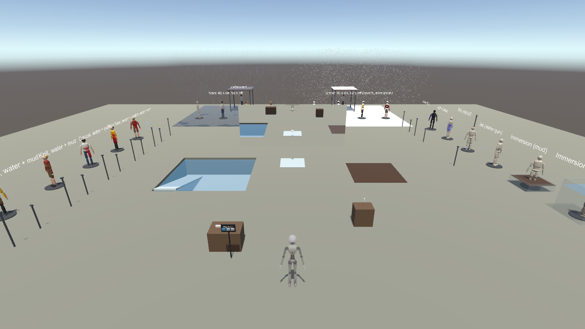

| 場所 | 内容 |
|---|---|
| 中央 | プール、泥沼、シャワー、水道、水鉄砲、鏡。自分のアバターで試します |
| 左の列 | 服を着た人型（Tシャツとジーンズ、雨合羽、ニットと短パン）に水と泥、水と塗料 |
| 右の列 | Source の比較（シャワー、水槽、泥の槽、水流、滴り、明るい体と暗い体） |
| 鏡の奥 | 雨の区画と雪の区画。屋根の下の人型には降りません |

### 服を着た人型

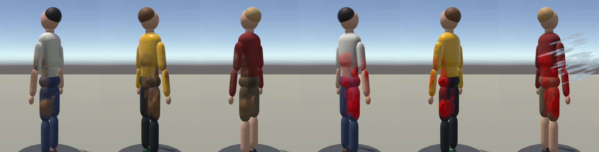

上着、ズボン、靴、髪、肌で付き方が変わります。部位は頭・手・足・腰の位置から推定し、部位ごとの素材（柔らかい布、硬い布、革、髪、肌、樹脂）で描きます。

### 雨と雪

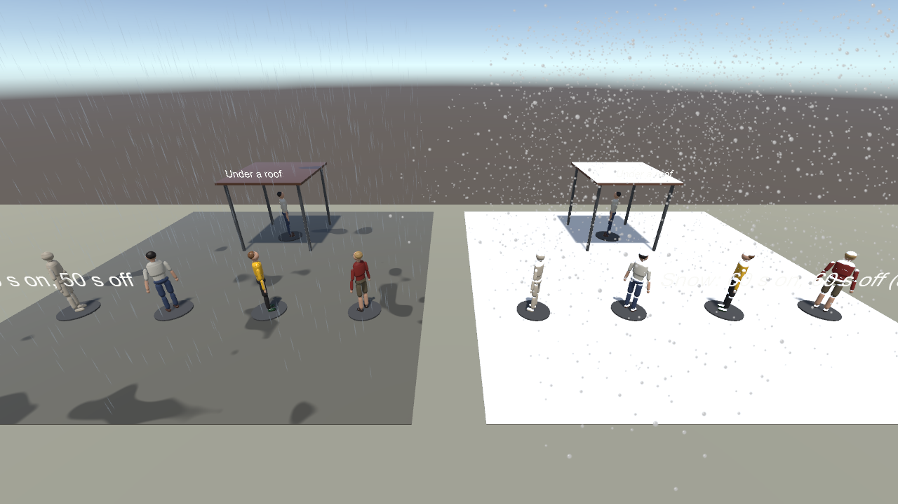

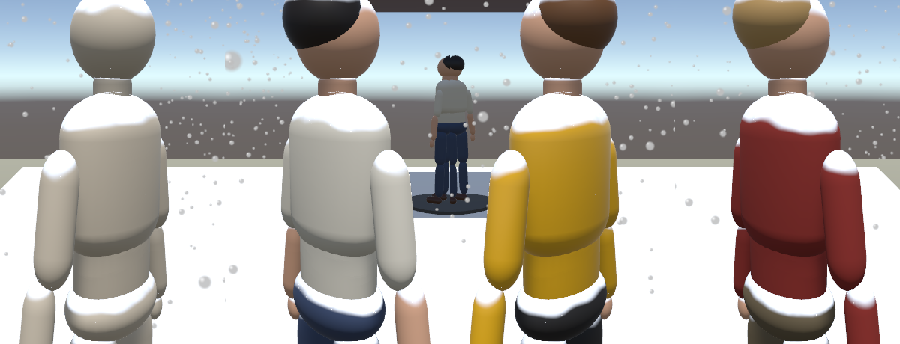

雨は 40 秒降って 50 秒止み、雪は 60 秒降って 60 秒止みます。雪は頭、肩、足先、屋根、地面など上を向いた面に積もり、止むと溶けて濡れ、乾きます。

## LiquidComparison

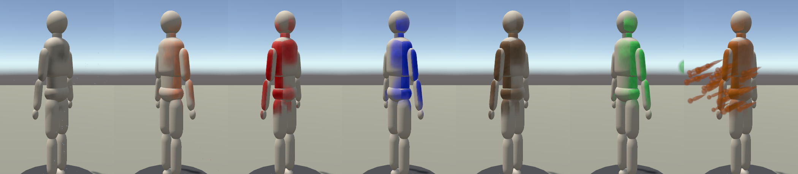

同じ設定の Sprayer で、水、ジュース、塗料、泥、スライム、シロップの付き方・垂れ方・乾き方を比べます。

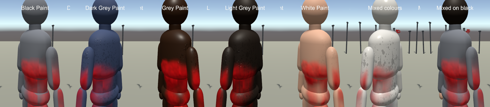

柔らかい布、硬い布、革、髪、肌、樹脂と、髪・肌・衣服を部位で分けた体に、同じ水と塗料をかけています。はじく素材では水滴になり、吸う素材では暗く湿ります。

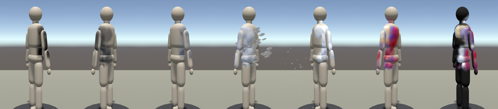

黒から白までの 5 段階の塗料と、赤・青・黄・白を同時にかけた明るい体と黒い体です。

## LiquidInteractive

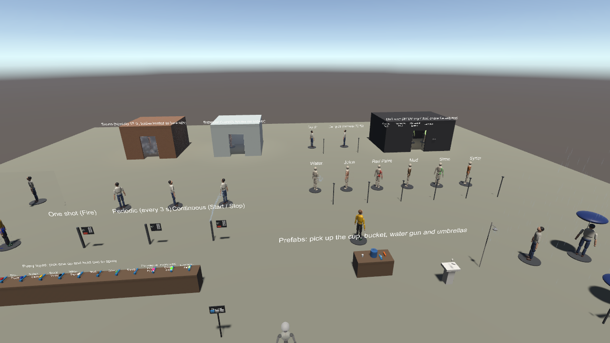

| 場所 | 内容 |
|---|---|
| スポーンのすぐ左前 | すべての液体の持ち運べるノズルの棚 |
| 左手前 | ノズル台（1 回、定期、連続）と、かけ合いの区画（持ち運べるノズル 3 種、標的、鏡） |
| 右手前 | 粘性ごとのパーティクルの比較 |
| 奥 | サウナ、浴室、湿った空気、暗い部屋 |
| 手前 | Prefab（コップ、バケツ、水鉄砲、水道、シャワー、ノズル台、傘） |

### ノズルの棚

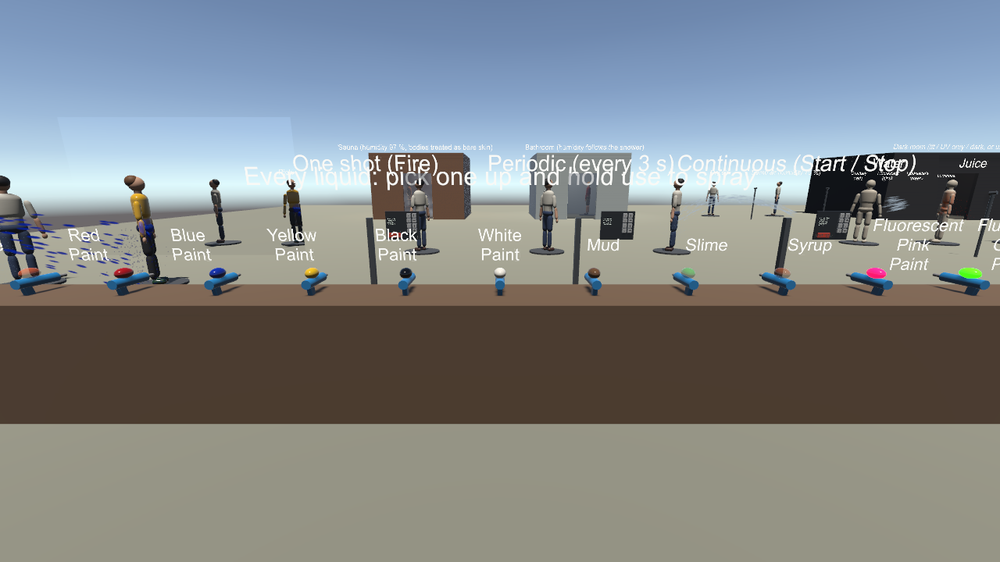

持って使用ボタンを押している間だけ噴射します。上のタンクが中身の色を示し、蛍光塗料は光り、蓄光塗料はほのかに光ります。噴射の状態は全員に同期され、互いにかけ合えます。

### ノズル台

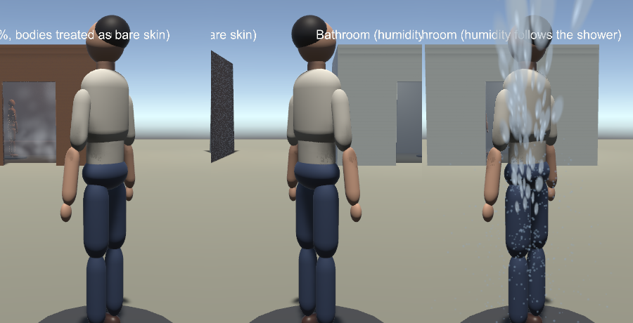

操作盤の +/- で量、距離、速さ、断面を変えられます。液は放物線で飛び、遅いほど手前に落ちます。

### サウナと浴室

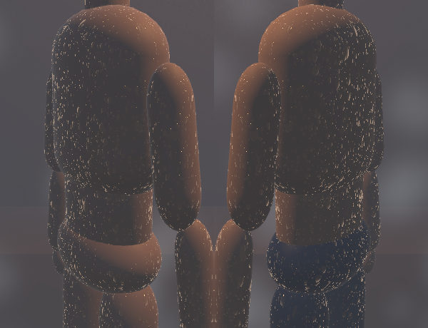

サウナは湿度 97 % で、範囲内の体は衣服を着ていないものとして扱います。表面の水が十分に溜まると、立った面ほど滴が離れやすく、加速しながら垂れ落ちます。浴室はシャワーが出ている間だけ湿度が上がり、鏡が曇ります。

### 暗い部屋

| 点灯 | 紫外線のみ | 消灯 |
|---|---|---|
| 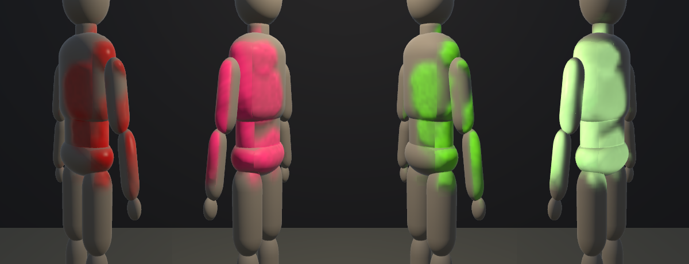 | 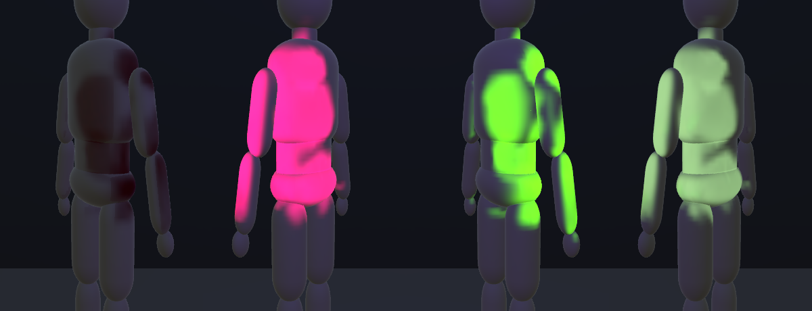 | 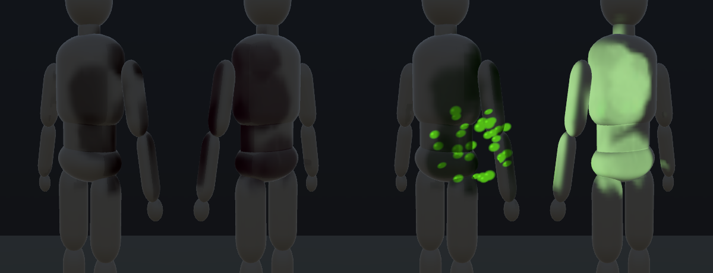 |

左から普通の塗料（赤）、蛍光塗料（桃、緑）、蓄光塗料です。普通の塗料は暗くなると見えなくなり、蛍光塗料は紫外線を受けている間だけ光り、蓄光塗料は明かりを消した後もしばらく光ります。入口の Lamp / UV / Auto で切り替えられます。

### 雨と傘

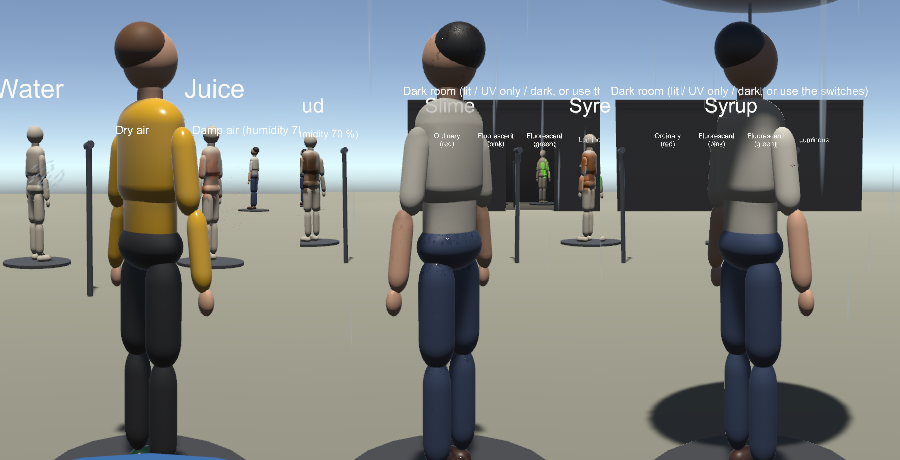

傘の下には雨と雪が降りません。傘は持ち運べます。

## LiquidPainting

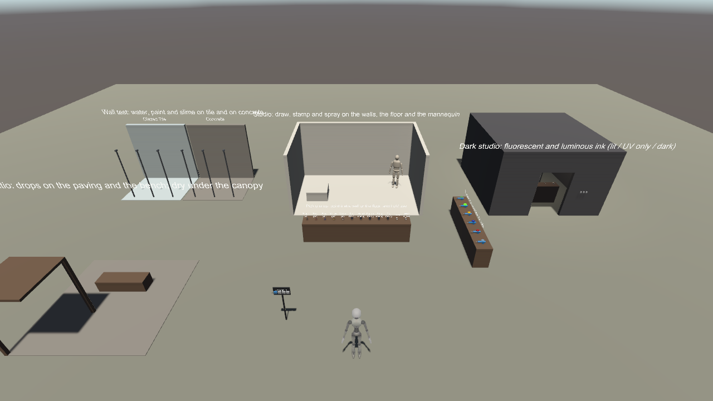

液体が体ではなく、ワールドの壁、床、家具に付くシーンです。どの区画も Surface Canvas の箱の中にあります。

| 場所 | 内容 |
|---|---|
| スポーンの前 | 道具の台。ペン 5 色、スタンプ 5 種、消しゴム 2 種 |
| 正面 | スタジオ。三方の壁、床、台、マネキン |
| 右 | 噴射器の棚（水、塗料 3 色、蛍光塗料、スライム） |
| 右奥 | 暗いスタジオ。蛍光と蓄光のインク |
| 左奥 | 壁の比較（タイルとコンクリート） |
| 左手前 | 雨の敷石 |

### ペン、スタンプ、消しゴム

道具を持って壁や床に向けると、当たっている所に付着の大きさの目印が出ます（持っている本人にだけ見えます）。

| 道具 | 使い方 |
|---|---|
| ペン | 使用ボタンを押している間、向けた先の動きに沿って線を引きます |
| スタンプ | 使用ボタンを押すたびに、星、ハート、四角、輪、円のいずれかを 1 つ置きます |
| 消しゴム | 使用ボタンを押している間、向けた先の顔料と液を消します |

画像は、テストが黒、赤、青のペンで線を引き、スタンプを 1 つずつ置いたものです。届く距離は 4 m で、
マネキンと他のプレイヤーにも描けます（自分の体には描けません）。インクは流れず、消すか水で洗うまで残ります。

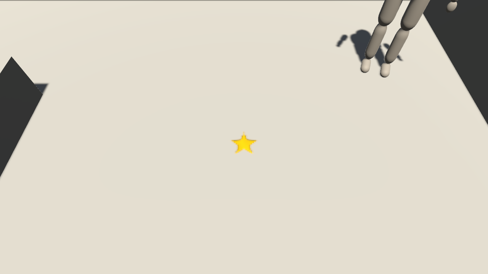

床では、形の上がツールの向く先になります。

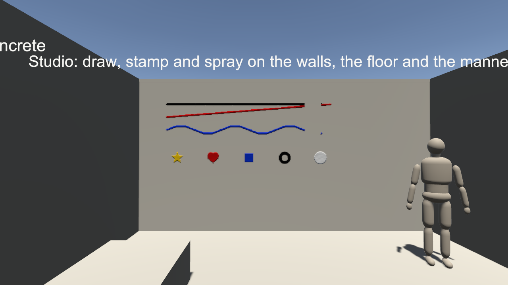

描いた線と形は全員に同期され、後から入った人にも直近 1000 件まで伝わります。それより古い描画は、
後から入った人にだけ見えません。噴射器でかけた液は、後から入った人には伝わりません。

### 暗いスタジオ

| 点灯 | 紫外線のみ | 消灯 |
|---|---|---|
| 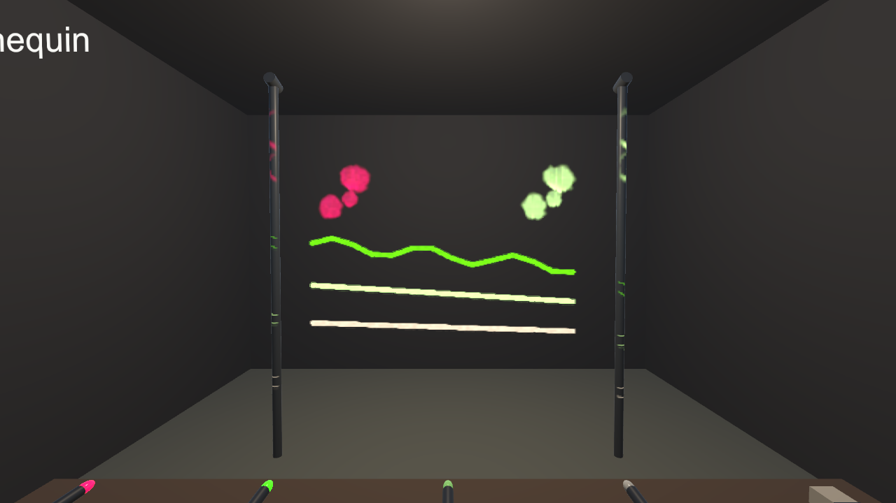 | 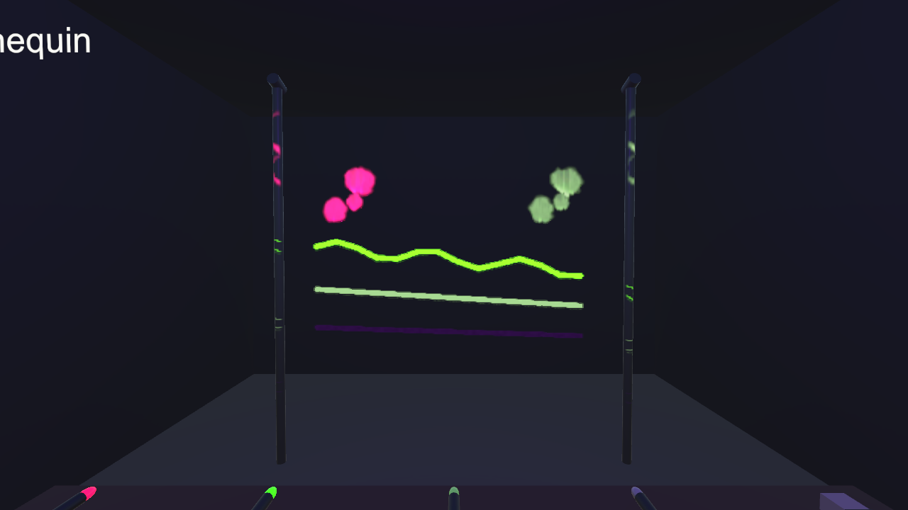 | 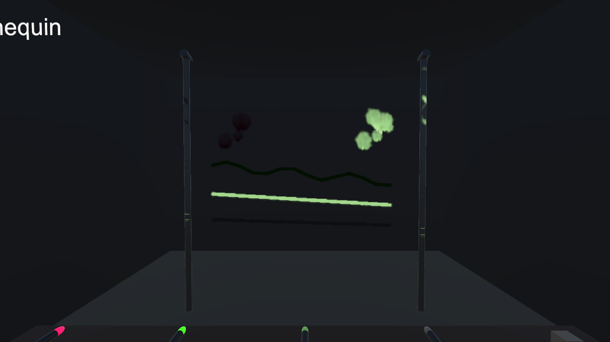 |

上から蛍光（緑）、蓄光、白のインクの線です。奥の壁の上部には、蛍光塗料と蓄光塗料が自動で吹き付けられています。
白のインクは暗くなると見えなくなり、蛍光は紫外線を受けている間だけ光り、蓄光は明かりを消した後もしばらく光ります。

### 壁の比較

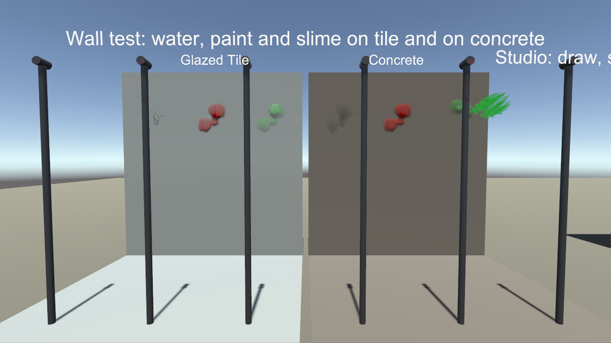

左がタイル、右がコンクリートです。同じ水、塗料、スライムを同じ高さに吹き付けています。
タイルは吸わずにはじくため、水は水滴になり、液は速く流れ落ちます。コンクリートは吸うため、
水は染みて暗くなり、液は流れにくくなります。

### 雨の敷石

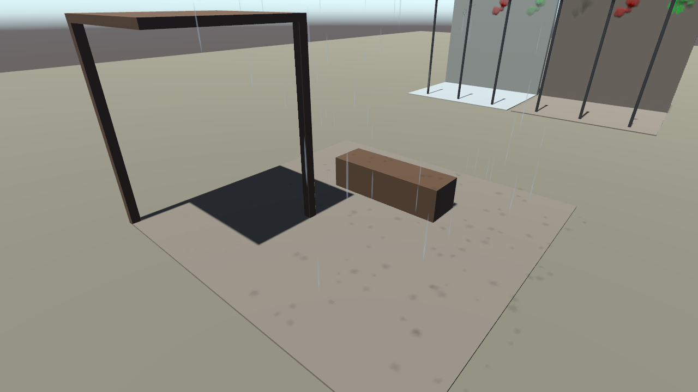

35 秒降って 40 秒止む雨です。雨粒が敷石と腰掛けに落ち、止むと乾きます。屋根の下の敷石には落ちません。

## レビュー項目

1. **自分の体**：LiquidDemo の鏡の前で、プールに入る、シャワーを浴びる、泥に沈むなどして、液面の高さまでの付着、流下、乾燥を確認します。
2. **かけ合い**：LiquidInteractive の棚のノズルを持ち、他の人とかけ合います。噴射の見た目と付着が相手の画面にも出ることを確認します。
3. **消去**：スポーン横の操作盤で、自分、マネキン、全員の付着が全員の画面で消えることを確認します。アバターを変えると自分の付着が消えます。
4. **暗い部屋**：点灯、紫外線のみ、消灯の 3 状態で、塗料の見え方の違いを確認します。
5. **壁と床に描く**：LiquidPainting の道具の台のペン、スタンプ、消しゴムで、壁、床、マネキンに描き、
   他の人の画面にも同じものが出ることを確認します。後から入った人に、それまでの描画が出ることを確認します。
6. **壁と床の消去**：操作盤の Walls で、壁と床の付着と描画が全員の画面で消えることを確認します。

ClientSim では、リモートプレイヤーへの付着、ネットワークイベントの遅延、VR 機器での操作、途中参加者への
同期変数の受け渡しは確認できません。テストは、道具を持たずに動かし、履歴の受け渡しを同じクライアントの中で
再現しています。複数人での最終確認は VRChat の Build & Test で行ってください。

## 制限

- 部位の推定は体の形からの近似で、長い髪、手袋、半袖の前腕の肌などとは一致しません。
- 付着を描く箱は固定寸法で、極端に大きい・小さいアバターでは箱の外に付着が描かれません。
- 付着の上に Unity の影は落ちません。暗い部屋や屋内では、明かりの範囲（`LiquidLightZone`）で照明を伝えます。
- Surface Canvas の 1 テクセルは「箱の辺の長さ ÷ 解像度」で、スタジオでは約 1.7 cm です。細い線は
  輪郭が階段状に見えます。箱を小さくするか解像度を上げると細かくなり、メモリは解像度の 2 乗で増えます。
- Surface Canvas の受け手の素材は箱ごとに 1 つです。
- 霧の体積はカメラの深度テクスチャを使います。リアルタイムの影を落とすライトが無いワールドでは、箱の奥まで霧が掛かって見えます。
