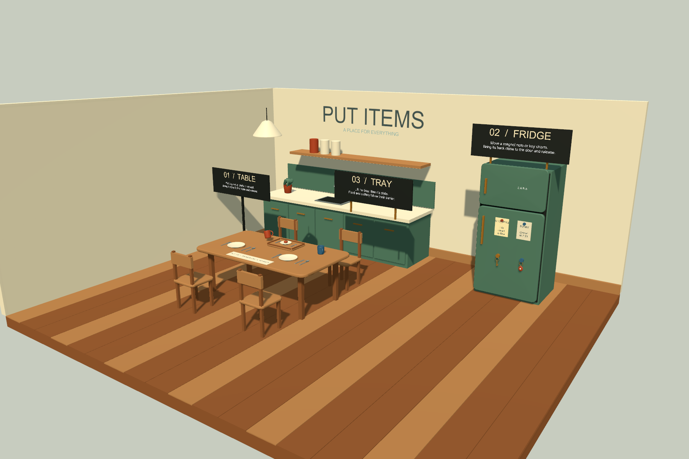
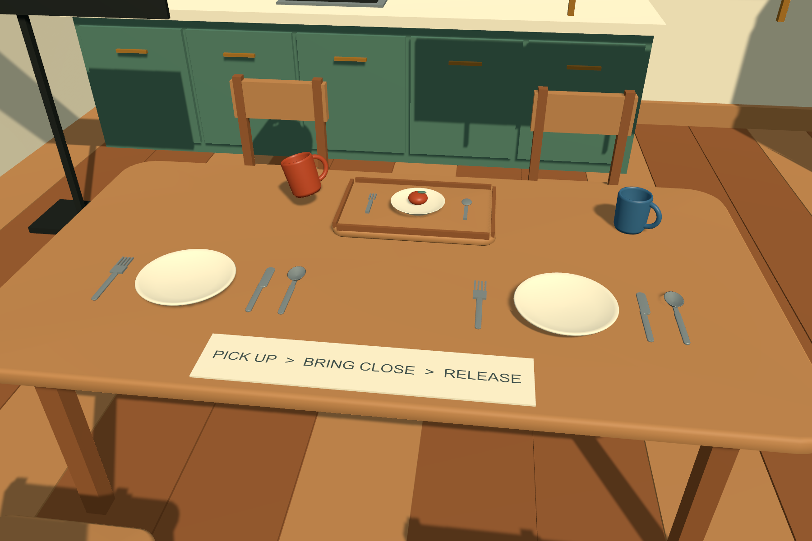
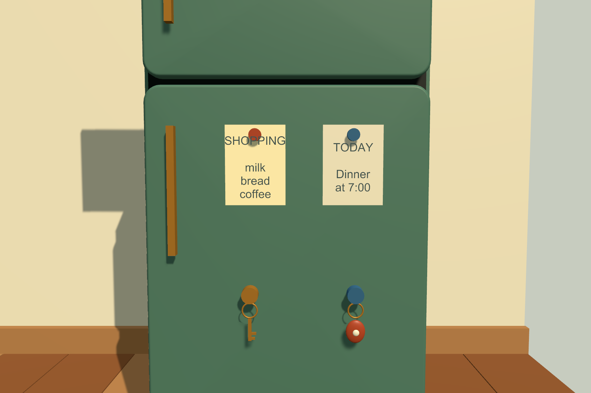

# Kitchen Demo の導入とレビュー

## Scene を開く

Unity 2022.3 / VRChat Worlds SDK 3.10.4 の World プロジェクトにパッケージを追加し、`Tools > SabaProps > Put Items > Open Demo Scene` を実行します。同梱の Scene と依存アセットを `Assets/SabaProps/PutItemsKitchenDemoV2` に導入して開きます。メッシュ生成器の実行や手動配置は不要です。既に導入した旧版の `PutItemsKitchenDemo` は残します。2 回目以降は導入済み Scene を開き、利用者の編集内容を上書きしません。

UdonSharp program は `Assets/SabaProps/PutItemsPrograms` の共有アセットを使用します。`Samples~` を手動でコピーすると program が重複するため、上記メニューから導入してください。

## Scene の構成

| 場所 | 内容 | 操作 |
| --- | --- | --- |
| 食卓 | コップ、皿、フォーク、ナイフ、スプーン | 天板へ近付けて離す |
| 食卓のおぼん | 皿、フォーク、スプーン、皿上の料理 | おぼん、皿、各 Prop を個別に持ち上げる |
| 冷蔵庫 | 買い物メモ、鍵、アクセサリーチャーム | 背面の磁石をドアへ近付けて離す |

机・椅子の Collider は VRChat の `Walkthrough` Layer にあり、プレイヤーが通り抜けられます。床の Collider は残してあります。Scene には照明、カメラ、`VRCSceneDescriptor`、Spawn を含みます。

## 動作確認

1. 傾いたテラコッタのコップを持ち、底を天板へ近付けて離します。底が天板にそろい、同じ水平位置に残ることを確認します。天板から離して落とした場合は吸着しません。
2. 冷蔵庫のメモとアクセサリーチャームを持ち、磁石側をドアへ近付けて離します。背面がドア面にそろい、机用の Prop がドアへ吸着しないことを確認します。
3. おぼんを持ち上げます。皿・フォーク・スプーン・料理がおぼんと一緒に移動します。
4. おぼんを置いた後、皿だけを持ち上げます。料理は皿へ追従し、フォークとスプーンはおぼんに残ります。
5. 皿を机へ置き直します。皿と料理はおぼんから独立して動きます。皿をおぼんへ戻すと、再びおぼんへ追従します。

`01 / TABLE`、`02 / FRIDGE`、`03 / TRAY` の看板は、Scene 内の操作対象を示します。吸着面は不可視の `PlacementSurface` で、物理 Collider とは独立しています。

## 複数クライアントで確認する項目

EditMode テストでは所有権移行や通信遅延を再現できません。VRChat の Build & Test で 2 クライアント以上を起動し、次を確認してください。

| 操作 | 確認する結果 |
| --- | --- |
| クライアント A が Prop を置き、B が見る | 位置・回転・静止状態が一致する |
| B が A の置いたおぼんを拾う | 接続中の皿・カトラリー・料理が B の操作へ追従する |
| A が料理を個別に拾う | 料理だけが皿から離れ、おぼんの移動で引き戻されない |
| 皿をおぼんから机へ移す | 皿と料理だけが机に残る |
| 新しいクライアントが途中参加する | 接続状態と相対姿勢が復元される |
| owner が退出する | 新 owner の操作後も追従が継続する |
| ドロップ直後に再取得する | 古い吸着補正が再適用されない |

2026-09-21 に Unity 2022.3.22f1 / Worlds SDK 3.10.4 で UdonSharp コンパイルと EditMode テスト 14 件を通過しました。同梱 Scene の参照、Walkthrough Layer、入れ子追従の姿勢計算を確認しています。上記の複数クライアント操作は実機未検証です。

## 動作しない場合

| 症状 | 確認する項目 |
| --- | --- |
| おぼんが見当たらない | `PutItemsKitchenDemoV2/PutItemsKitchen.unity` を開いているか確認する。旧 Scene は自動更新しない |
| Prop が吸着しない | 接触基準の +Y、面までの距離、傾き、category、面の矩形範囲を確認する |
| 子が親へ追従しない | 子の `PlacementFollowState.surfaceIndex`、対象面の `carrier`、親の `carriedItems` を確認する |
| Udon program が Missing になる | `Open Demo Scene` メニューから導入したか確認する。手動コピーした Sample は共有 program への参照変換を行わない |

自作 Prop の設定は[配置と同期の設定](authoring.md)、ローカル検証プロジェクトの再現手順は[Put Items の検証](../../../.github/verify/vrchat/PUT_ITEMS.md)を参照してください。
