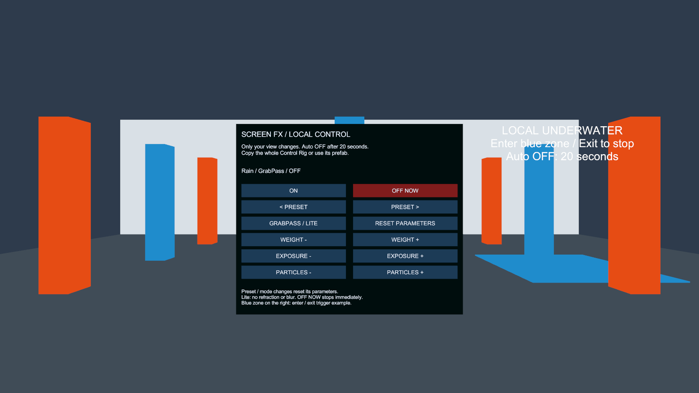

# Udon Demo の導入と再利用

## Scene を開く

1. Unity 2022.3.22f1 / VRChat Worlds SDK 3.10.4 の World プロジェクトに Screen FX パッケージを追加します。
2. Package Manager の Screen FX → Samples → **Udon Driver** を Import します。
3. インポート先の `Demo/ScreenFxUdonDemo.unity` を開きます。
4. ClientSim の Play Mode、または SDK の Build & Test で操作します。



2026-10-05 に Unity 2022.3.22f1 / Direct3D 11 で撮影した 1600×900 の Camera 描画です。効果は OFF の初期状態で、Editor での配置を示します。Play Mode ではパネルに Weight・Exposure・Particles の現在値も表示されます。VRChat クライアントのスクリーンショットではありません。効果を有効にした画像は[プリセット描画比較](rendering.md)を参照してください。

## 操作

| 操作対象 | 動作 |
| --- | --- |
| ON / OFF NOW | フェードイン / 即時停止 |
| PRESET の左右ボタン | 全 24 プリセットを順送り・逆送り |
| GRABPASS / LITE | 通常版と Lite 版の切替 |
| RESET PARAMETERS | 現在のプリセットの初期値へ戻す |
| WEIGHT − / ＋ | 全体の強さを 0.1 刻みで変更。範囲は 0～1 |
| EXPOSURE − / ＋ | 露出を 0.25 刻みで変更。範囲は −3～3 |
| PARTICLES − / ＋ | 粒子の強さを 0.1 刻みで変更。範囲は 0～1 |
| 右の青い領域 | 入ると水中効果、出るとフェードアウト |

プリセットと通常版・Lite 版の切替は、そのプリセットのパラメータへ戻します。Weight は維持します。Lite には屈折・ぼけなどがないため、通常版とは見え方が異なります。対応差は[パッケージ概要](../README.md)を参照してください。

操作は本人の画面だけに適用し、他の参加者へ同期しません。デモは ON から **20 秒で自動停止**します。暗転系の効果でパネルが見えなくなった場合も復帰できます。リスポーンでも即時停止します。Trigger 内で自動停止した場合は、領域を出て入り直してください。手動操作と Trigger は独立しており、同時に ON にすると効果が重なります。

## 自分の World へコピーする

| 用途 | 配置する Prefab | 調整箇所 |
| --- | --- | --- |
| パネルや他の Udon から操作 | `Demo/ScreenFxControlRig.prefab` | 子の `Control Panel` の位置・向き |
| 領域への出入りで操作 | `Demo/ScreenFxTriggerRig.prefab` | ルートの位置と BoxCollider の Size |

Scene 内の `Screen FX - Copyable Control Rig` または `Screen FX - Copyable Trigger Rig` をルートごとコピーしても使用できます。Driver・Volume・パネル・ボタンの Scene 内参照は各ルート内で完結します。各 Driver が実行時に専用 Material を生成するため、複数のコピーを独立して操作できます。

Trigger の範囲は BoxCollider の Size で変更してください。ルートの Scale を変更すると、頭に追従する Volume も拡大縮小されます。パネルを使用する World には EventSystem が一つ必要です。未配置なら `GameObject > UI > Event System` から追加します。Canvas の VRCUiShape は設定済みです。

同一プロジェクト内の別 Scene には Prefab だけを配置できます。別プロジェクトへ渡す際は、Screen FX パッケージとサンプル全体を導入してください。Hierarchy のコピーだけでは Material・スクリプト・Udon program asset・asmdef は移りません。サンプルの編集を維持する場合は、Unity の Project ウィンドウでサンプル全体を自分の管理フォルダーへ移動し、GUID を維持してください。

Driver の `Auto Off Seconds` はコピー後も 20 秒です。用途に合わせて変更でき、0 は無制限です。待機時は Renderer を無効化し、GrabPass の実行を止めます。

## 他の UdonSharp から操作する

呼び出し側に `using SabaProps.ScreenFx.Samples;` を追加し、Inspector で `effect` にコピーしたリグの Driver を設定します。独自 asmdef を使用する場合は `SabaProps.ScreenFx.Sample` を参照します。

```csharp
public ScreenFxDriver effect;

public void EnableEffect()
{
    effect.SelectPreset(0);
    effect._FadeIn();
    effect.SetWeight(0.7f);
    effect.SetFloat("_Exposure", -0.5f);
}

public void DisableEffect()
{
    effect._StopImmediately();
}
```

これは UdonSharpBehaviour 内に記述する抜粋です。プリセット選択後にパラメータを設定します。`SetFloat` は Material に存在する float property を変更し、`_Weight` は Weight の補間処理へ渡します。他の値の範囲は呼び出し側で制限してください。

Udon Graph や UI からは、Driver の backing UdonBehaviour へ `SendCustomEvent` で `_FadeIn`、`_FadeOut`、`_Toggle`、`_StopImmediately`、`_NextPreset`、`_PreviousPreset`、`_ResetPreset`、`_ToggleLite` を送れます。デモのボタンは同じイベント接続の例です。

## 再生成と問題の切り分け

`Tools > SabaProps > Screen FX > Create Udon Demo Scene` で、新しい Scene と Prefab を生成できます。`Assets/SabaProps/ScreenFx/UdonDemo` の空いている名前へ出力し、既存の編集内容を上書きしません。

| 症状 | 確認する箇所 |
| --- | --- |
| Scene が見当たらない | パッケージの Samples から Udon Driver を Import したか |
| パネルを操作できない | Play Mode / Build & Test で実行中か、EventSystem と VRCUiShape があるか |
| 効果が途中で止まる | Auto Off Seconds。デモの既定値は 20 秒 |
| 想定より効果が強い | 手動リグと Trigger、または複数の Volume が重なっていないか |
| Lite でぼけ・屈折が出ない | Lite の仕様。PC で必要な場合は GrabPass 版を使用 |
| コピー先で参照が Missing | サンプル全体とパッケージを導入し、元の .meta を維持したか |

## 検証範囲

2026-10-05 に Unity 2022.3.22f1 / Worlds SDK 3.10.4 で実 Udon コンパイルと 3 テストが成功しました。配布 Scene/Prefab の参照、サンプル外のプロジェクトアセット依存がないこと、ClientSim のボタン操作・Material の独立性・リセット・切替・自動停止・Trigger の入退場を確認しています。

同日に利用者が VR でデモを確認し、確認した範囲で問題なしとの報告を受けています。使用機器・確認した全プリセット・計測値の記録はないため、全環境での動作保証や性能検証とは区別します。鏡、複数参加者、Android の描画と負荷は個別の確認記録がありません。

自動検証の実行手順は[World 検証の README](../../../.github/verify/vrchat/README.md)を参照してください。
