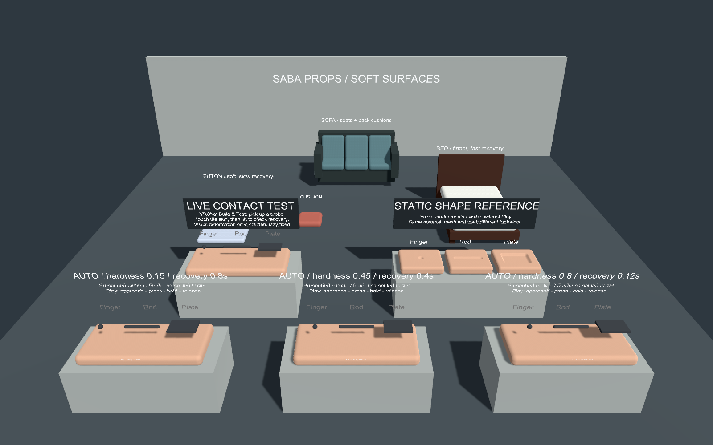
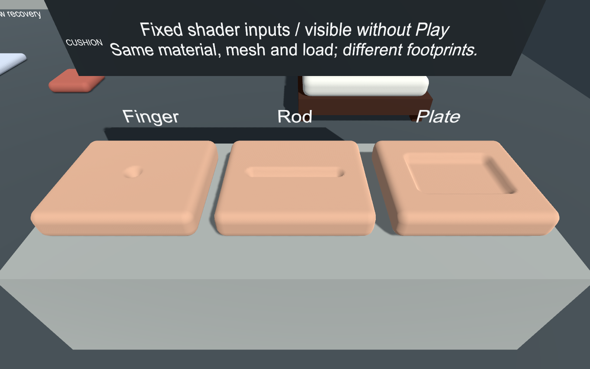
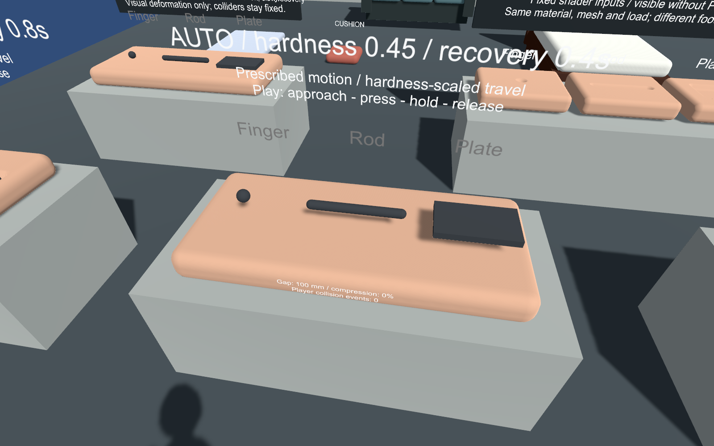
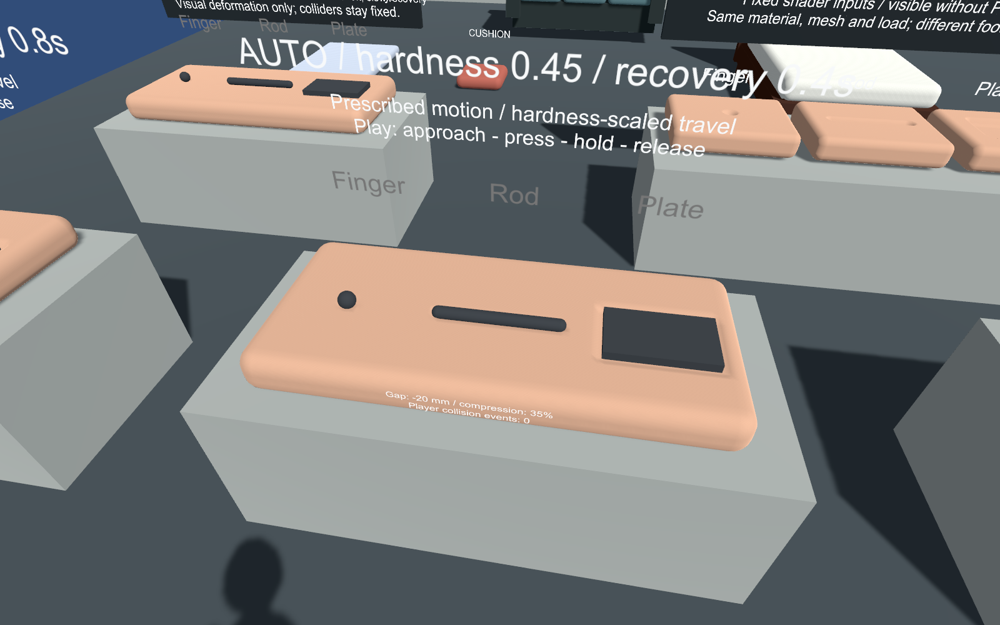

# デモの導入とレビュー

## 開く

PC用のVCC World projectへpackageを追加後、`Tools > SabaProps > Soft Props > Open Demo Scene`を選択します。変更中のsceneがある場合は保存確認が表示されます。

初回は同梱済みsampleを`Assets/SabaProps/SoftPropsDemoMotion`へimportし、`SoftPropsDemo.unity`を開きます。旧版の`SoftPropsDemo`は保存したまま別folderへ導入します。GUIDも導入時に再割当てし、旧版assetsと衝突させません。MeshやPrefabの事前生成、手動配置は不要です。2回目以降は導入済みsceneを開き、利用者の編集内容を上書きしません。

UdonSharpのprogram重複を避けるため、sampleの導入には上記メニューを使用します。既に家具を生成したprojectでは、そのcontroller programを共有します。`Samples~`の手動コピーによる重複導入は避けてください。

共有programはデモ外の`Assets/SabaProps/SoftPropsShared`に配置します。旧配置がある場合はメニュー実行時にGUIDを維持して移動します。これにより、デモを先に導入してから家具を生成した場合も、デモの削除・再導入で家具のUdon参照は失われません。

## シーンの内容

| 場所 | 内容 | 確認方法 |
| --- | --- | --- |
| 最前列 | AUTO比較台3台。各台にColliderを持つ指・棒・板 | Play / ClientSimで上下運動と凹み・復元を確認 |
| 中央左 | LIVE CONTACT TEST。肌Materialの試験面と指・棒・板のPickup | VRChatのBuild & Testで操作 |
| 中央右 | STATIC SHAPE REFERENCE。同一mesh・Material設定・荷重で3接触形状を比較 | Scene/GameビューでPlay前から確認可能 |
| 奥 | Futon、Bed、Sofa、Cushion | 外観・寸法・配置を確認し、VRChatで接触 |

床Collider、照明、overview camera、VRCSceneDescriptor、Spawnを含みます。シーン内の英語ラベルはUnity内蔵fontを使用し、外部fontの導入を必要としません。

## レビュー項目

1. **肌Material**: 中央右の3試験面で、光沢、肌色、微細grainを確認します。照明方向を変えた際の見た目も確認してください。
2. **接触形状**: 静的比較では、指が局所的な凹み、棒が細長い凹み、板が平坦な底を持つ広い凹みになることを確認します。これは固定shader入力による参照表示で、接触イベントの動作証明ではありません。
3. **自動接触**: Playで最前列を確認します。指・棒・板が接近→押下→保持→離脱を繰り返します。Gapが正のときは空隙、負のときは未変形面への侵入です。初回の接近時にGapが0になる前から新たな凹みが発生しないことを確認します。離脱後の残留変形は復元時定数に従います。
4. **手動接触**: VRChat SDKのBuild & Testで起動し、中央左のPickupを持って試験面へ近づけます。登録済みCollider底面の侵入から荷重を求め、凹みの深さを侵入量以下に制限します。
5. **離脱と復元**: Pickupを表面から離し、元の形へ戻ることを確認します。棒と板は表面と平行に当てて比較してください。大きく傾けた接触は厳密な接触面計算ではありません。
6. **家具**: ClientSimでFutonへ乗り、立位荷重による凹みを確認します。手・頭・胴体等はSenderが許可されたavatarを使いVRChat実clientで確認します。Sofaは座面と背面がそれぞれ変形します。

AUTOの左／中央／右はHardness=0.15／0.45／0.80、Recovery Seconds=0.8／0.4／0.12です。侵入距離は`Maximum Indent × lerp(1, 0.28, Hardness) × 0.65`に設定しています。同じ正規化荷重を想定した規定運動の比較であり、Colliderの質量から沈み込みを求める実験ではありません。各台の表示は指probeのGapと圧縮率です。

Unity Play Mode / ClientSimだけでは、VRChat実clientのWorld Contactsと同じ動作を保証しません。接触・Pickup・複数clientでの見え方の最終確認はBuild & Testで行ってください。

## 実行時の比較画像

以下はClientSim実行中の中央台です。テストからColliderを所定位置へ移動し、実際のUdon更新後にUnity cameraで描画しています。shader入力を直接書き換えた静的参照ではありません。

回帰テストは空隙、侵入、離脱後の復元、自動運動、ローカルプレイヤーの接地荷重を確認します。任意avatarの手・胴体のSender形状、VR機器での操作、リモートプレイヤーは自動テストの対象外です。

## 現段階の制限

- Colliderは固定です。物体を置くと、shaderの沈み込み面と物理的な支持面に差が生じます。
- 指・棒・板は簡易probeで、指の解剖学的modelではありません。
- 質量や圧力の測定に基づくsimulationではありません。標準avatar Senderの寸法を取得できないため部位別近似です。
- 寝転び・着座専用のStationやanimationは含みません。
- 静的参照3面は常に変形しています。実接触の開始距離は左のLIVE CONTACT TESTで確認してください。

## 動作しない場合の確認

| 症状 | 確認項目 |
| --- | --- |
| 自動比較台が見当たらない | 開いているsceneが`SoftPropsDemoMotion/SoftPropsDemo.unity`か確認する。旧版sceneは自動で置き換えない |
| AUTOの物体が動かない | Play状態、Consoleのcompile／Udon error、対象面の`Automatic Probe`と`Probe Colliders`を確認する |
| 物体を置いても凹まない | 固定支持Colliderに載っただけでは侵入量が0の場合がある。AUTOで確認するか、登録probeを未変形面へ押し込む |
| ClientSimで乗っても凹まない | `Player Standing Load`、支持Colliderとcontrollerが同じGameObjectにあること、面の高さ・範囲を確認する。立位補助はローカルプレイヤーが対象 |
| Player collision eventsが0のまま | この表示は衝突イベント数のみ。接地状態＋Raycastの補助経路では増えないため、0だけでは不具合と判断しない |
| 手・胴体で触れても凹まない | VRChat実clientでavatar SenderとContact permissionを確認する。ClientSimの立位テストは手・胴体のContact動作を保証しない |
| デモ整理後にUdon参照がMissingになる | [更新手順](upgrading.md)を確認する。旧配置の共有programを移行する前に削除した場合は、削除したassetsをバックアップから復元する |

## 検証記録

2026-09-07、Unity 2022.3.22f1 / Worlds SDK 3.10.4で、関連テスト5件が既存生成物あり・生成物なしの両条件で通過しました。対象はPrefab生成、デモ参照、ClientSim接触動作、program移行とデモ削除後の参照維持、slot再利用時のplayer所有情報解除です。

slot所有情報のテストは更新処理を直接検証する単体テストで、VRChat実clientの接触イベントを模擬するものではありません。実clientでのVR操作・複数人・任意avatarの手動確認は別途必要です。

## 配布シーンの再生成（開発者向け）

独立したUnity 2022.3.22f1 / VRCSDK 3.10.4検証projectで`SabaProps.SoftProps.Editors.SoftPropsDemo.GenerateSample`を`-executeMethod`として実行します。これは生成先の家具assetsを再生成する開発用APIです。

シーンと依存assetsを`Samples~/ReviewDemo`へ出力し、生成用assetsとは別のGUIDに変換します。package内のshader、script、SDK参照は元のGUIDを維持します。既存sampleのGUIDは再生成時も維持します。Unity実描画のPNGは検証projectの`ReviewCaptures`へ出力します。
