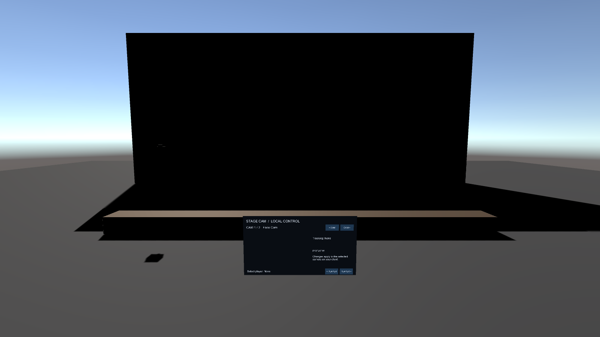

# Stage Cam Demo

この画像は同梱Sample SceneをUnity 2022.3.22f1で実際に描画したものです。

## Sampleを開く

Package Managerで`SabaProps Stage Cam`を選び、`Samples > Stage Camera World > Import`を実行します。`Assets/SabaProps/StageCam/Samples/StageCamDemo.unity`を開いてください。

## Scene構成

- `Face Cam`: 顔を追従し、身長に合わせて距離を調整
- `Crane Cam`: 胸を追従し、20秒周期で回り込み
- World Screen 2枚: 各CameraのRenderTextureを表示
- Stage Camera Control Panel: 対象、部位、距離、角度、カメラワークを操作

## 動作確認

追従とPickup補正はVRChatのBuild & Testで確認します。ClientSimは`PostLateUpdate`を呼ばないため、通常のPlay Modeだけでは追従しません。
