# 操作・設定・テーマの画像ガイド

Unity 2022.3.22f1 / VRChat Worlds SDK 3.10.4 のサンプルを掲載しています。
操作ページは Unity の実シーンから描画し、設定画面は実際の Editor ウィンドウを撮影しました。
Inspector は同じ Inspector GUI を専用ウィンドウに表示して撮影しています。
ページの画像は初期表示の説明用です。操作の検証には ClientSim と VRChat Build & Test を使用しています。

## 1. World デモを開く

`Tools > SabaProps > Tablet > Create Theme Gallery` で、通常のデモと 11 種の展示タブレットを生成します。
保存先は `Assets/SabaProps/Tablet/Samples/TabletThemeGallery.unity` です。
単一のタブレットだけを確認する場合は `Create Sample Scene` で `TabletDemo.unity` を生成してください。

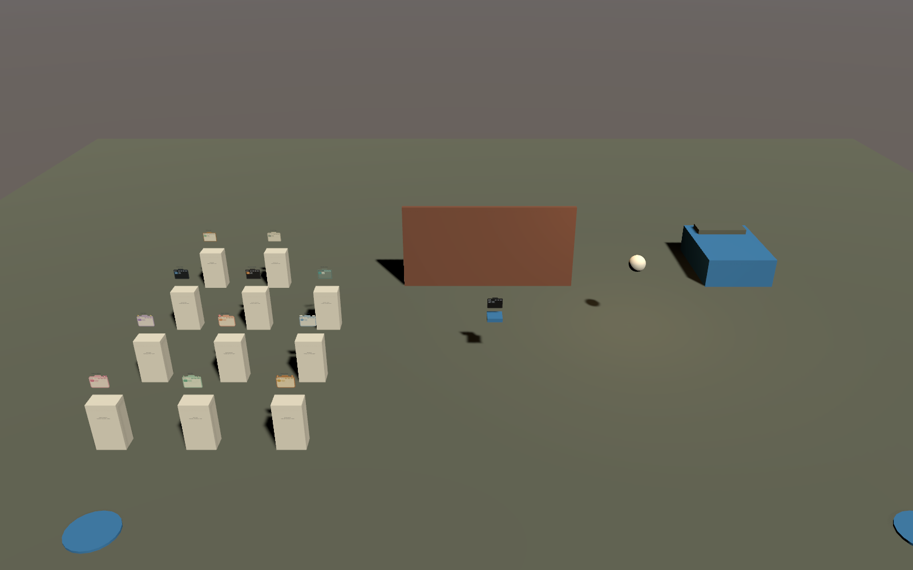

左側がテーマ展示、右側がベッド、奥が通常のミラーです。World Descriptor、Spawn、床、Reference Camera、
各タブレットの Udon を含み、ClientSim の Play と VRChat SDK の Build & Test で操作できます。

| 操作 | 対象と動作 |
| --- | --- |
| B キー | 通常のタブレットを召喚・収納 |
| 頭上で Grab | VR で通常のタブレットを手元へ召喚 |
| 台を Interact | その台のタブレットを召喚・収納 |
| 取っ手を Grab | 表示中のタブレットを持ち運ぶ |
| Prev / Next | ページを移動 |
| Close | 収納 |

展示品の自動収納は無効です。通常のタブレットは 4 m 以上離れると収納します。
指先押下と頭上 Grab は VRChat の VR 環境で確認してください。

## 2. 操作ページ

### Mirror

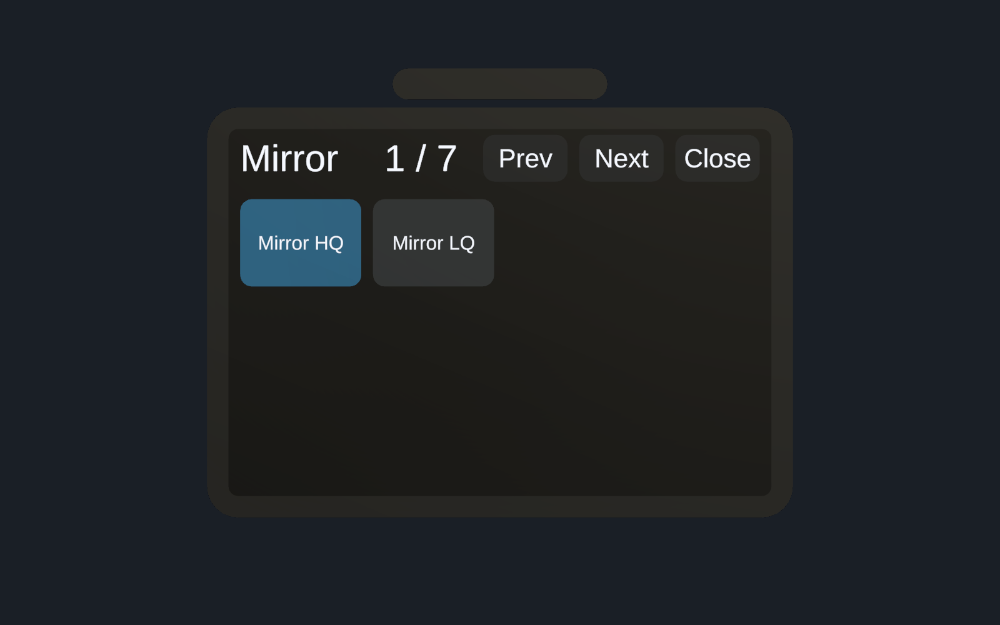

`Mirror HQ` と `Mirror LQ` は排他で、片方を ON にすると他方が OFF になります。
HQ は全レイヤー、LQ は PlayerLocal / MirrorReflection を対象にします。
初期状態は HQ が ON、LQ が OFF です。

### Collider / Objects

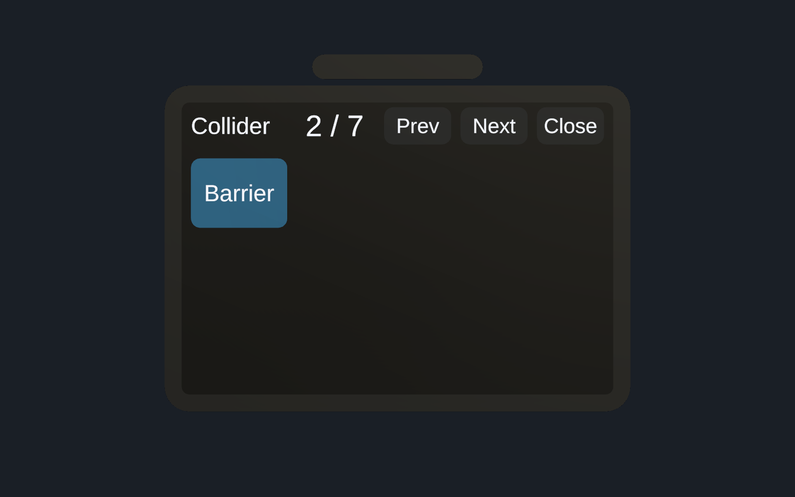

Collider は接触判定だけを切り替え、メッシュを表示したままにできます。
サンプルの `Barrier` は壁の Collider を操作します。

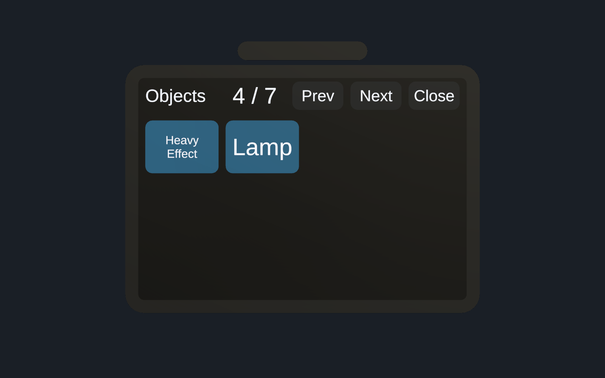

Objects では `Heavy Effect` の GameObject と `Lamp` の Light を操作します。
GameObject、Collider、Behaviour は Toggle の別々の登録先です。

### Teleport / Players

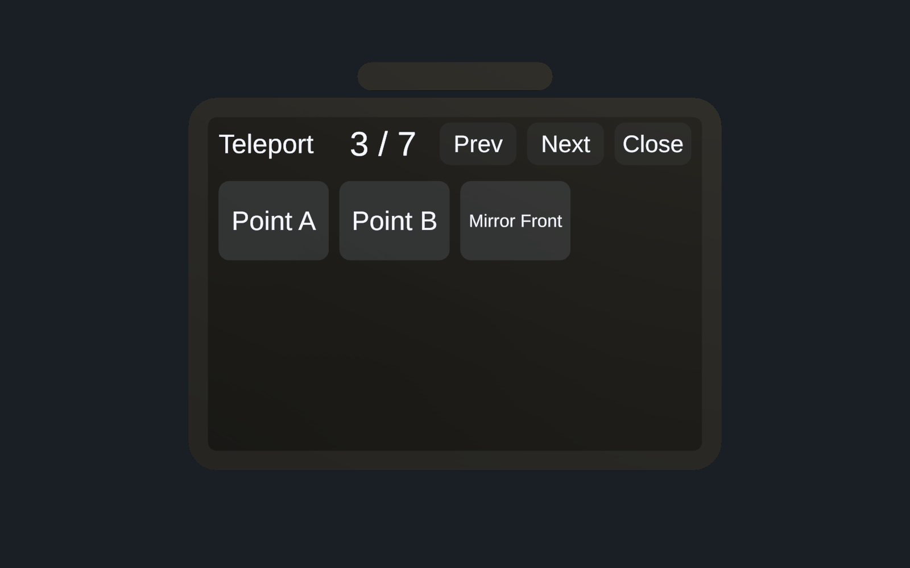

登録地点へ移動します。サンプルの Point A、Point B、Mirror Front は、シーン内の位置と向きを参照します。

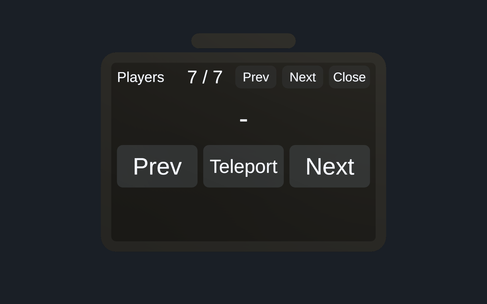

Prev / Next でプレイヤーを選び、中央のボタンで移動します。
画像の `−` は Editor でプレイヤーが接続していないときの初期表示です。
後方を優先し、壁や床などの条件を満たす別方向を探します。候補がない場合は移動しません。

### Bed Mirrors

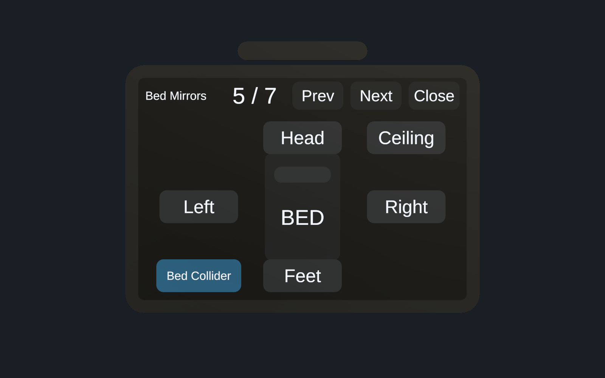

図の上が頭側、下が足側です。Head / Feet / Left / Right / Ceiling の 5 面を個別に操作します。
`Bed Collider` はベッドと枕の Collider を切り替え、表示を保持します。
初期状態はミラーが全 OFF、ベッド Collider が ON です。

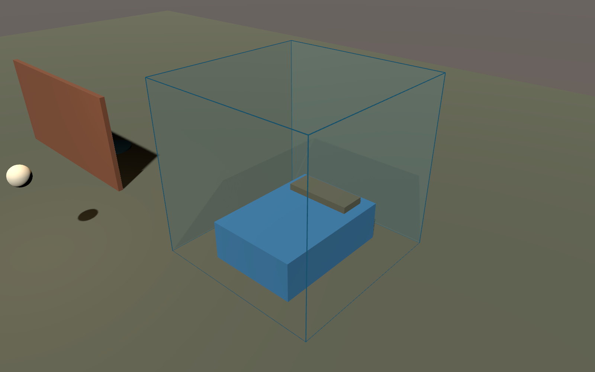

配置説明の画像では、各面を半透明の素材に置き換え、立方体の辺を追加しています。
動作用シーンは VRChat のミラー素材を使用し、説明用の素材や辺は保存しません。

| 項目 | サンプルの設定 |
| --- | --- |
| 立方体の一辺 | 3 m |
| 立方体の中心 | World 座標 (6, 1.5, 3) |
| 4 側面 | 縦横 3 m、高さ 0〜3 m、内向き |
| 天井 | 縦横 3 m、高さ 3 m、下向き |
| 床ミラー | なし |
| 切替・同期 | 各面が独立、ローカル |

側面と天井は立方体の境界で隙間なく接します。ミラーの Collider は生成しません。
複数面を ON にすると描画負荷が増えるため、必要な面だけ有効にしてください。

### Post Effects

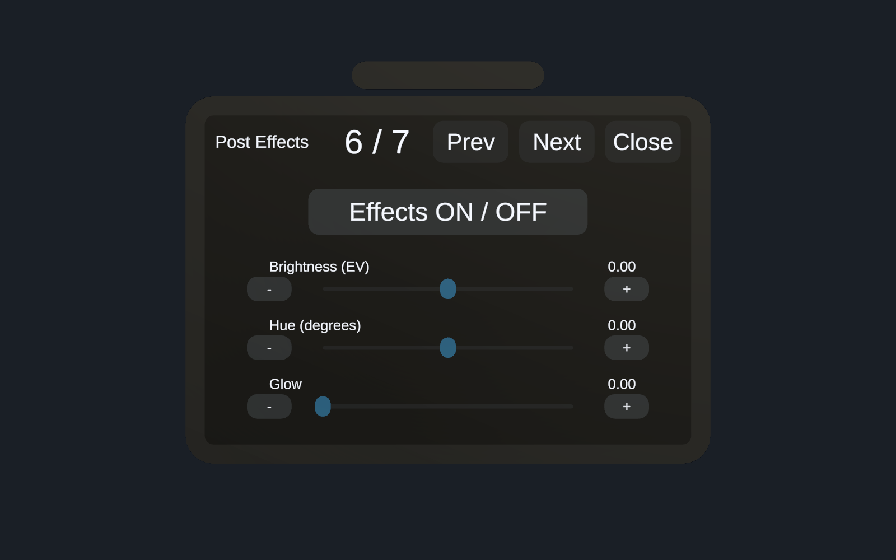

| 操作 | 範囲 | 初期値 |
| --- | --- | --- |
| Brightness (EV) | −2〜+2 EV | 0 |
| Hue (degrees) | −180〜+180 度 | 0 |
| Glow | Bloom Volume の weight 0〜1 | 0 |
| Effects ON / OFF | 全調整 Volume の有効・無効 | ON |

Desktop はトラック上を狙って Interact、または両端の − / ＋で操作します。
VR は指を前面へ入れ、横に動かして調整します。値と ON/OFF は利用者ごとに保持します。
Reference Camera の PostProcessLayer と、別オブジェクトの Animator / Volume を使います。
Volume は User Layer 22 です。既存ワールドではレイヤー用途、Volume Layer、Volume の優先度を確認してください。

## 3. Setup Window で対象を登録する

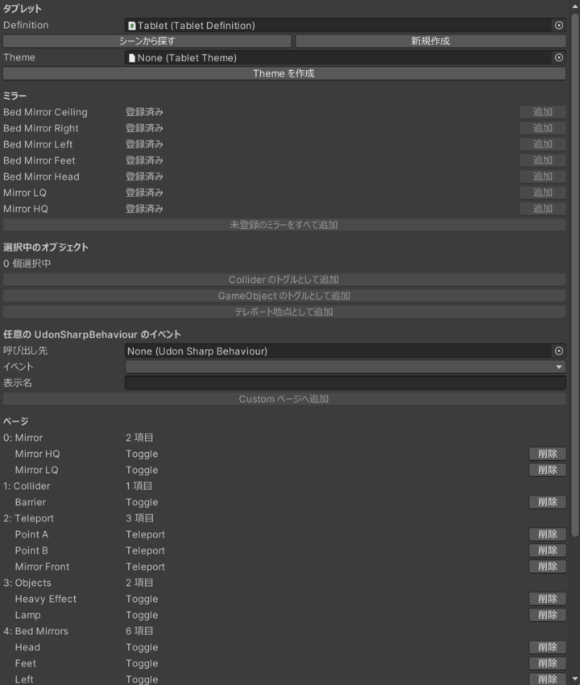

1. `GameObject > SabaProps > Tablet` で配置します。
2. `Tools > SabaProps > Tablet > Setup Window` を開き、Definition を指定します。
3. ミラーは一覧から追加します。Collider、GameObject、Teleport は Hierarchy で対象を選んで登録します。
4. 任意の UdonSharpBehaviour は呼び出し先とイベントを選択します。
5. Build で本体と操作部を生成します。

ページは Build で生成されます。項目の詳細は Tablet Definition の Inspector で編集します。

## 4. Tablet Definition の設定

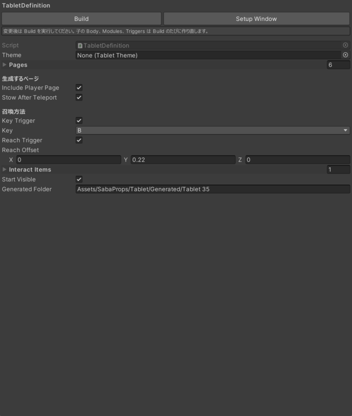

| 設定 | 内容 |
| --- | --- |
| Theme | 外観のプリセットまたは編集用コピー |
| Pages | ページ名と操作項目 |
| Include Player Page | プレイヤー選択ページを生成 |
| Stow After Teleport | 移動後に収納 |
| Key Trigger / Key | Desktop のキー入力 |
| Reach Trigger / Reach Offset | VR の取り出し位置 |
| Interact Items | 召喚・収納するワールド内アイテム |
| Start Visible | 開始時に本体を表示 |
| Generated Folder | 生成メッシュ・マテリアルの保存先 |

Pages の各項目では、Label、Kind、Objects / Colliders / Behaviours、Start On、Global、
Exclusive Group、Destination、Target / Event Name などを設定します。
Slider の Minimum / Maximum / Initial Value、Custom Placement の中心とサイズもここで指定します。
変更後に Build してください。子の Body / Modules / Triggers に直接加えた変更は再生成で失われます。

## 5. テーマの選択と編集

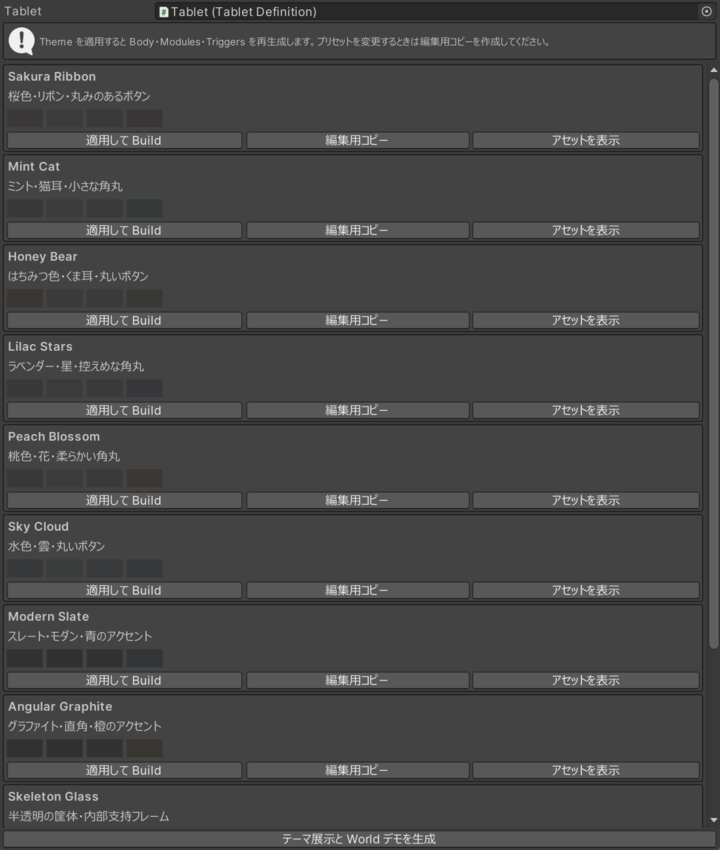

`Tools > SabaProps > Tablet > Theme Presets` で対象 Tablet を指定し、`適用して Build` を押します。
Play Mode を終了してから操作してください。`編集用コピー` は Assets 配下に複製し、
パッケージのプリセットを保持したまま独自の外観を作成します。

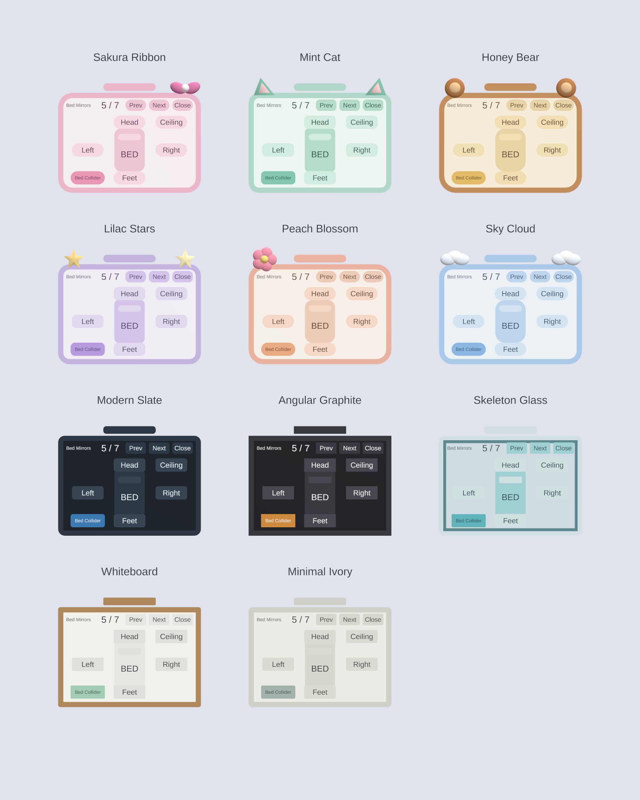

| Theme | 配色・形状 |
| --- | --- |
| Sakura Ribbon | 桜色、リボン、丸みのあるボタン |
| Mint Cat | ミント、猫耳、小さな角丸 |
| Honey Bear | はちみつ色、くま耳、丸いボタン |
| Lilac Stars | ラベンダー、星、控えめな角丸 |
| Peach Blossom | 桃色、花、柔らかい角丸 |
| Sky Cloud | 水色、雲、丸いボタン |
| Modern Slate | スレート、青のアクセント、小さな角丸 |
| Angular Graphite | グラファイト、橙のアクセント、本体・ボタン・取っ手が直角 |
| Skeleton Glass | 半透明の筐体と画面、内部の支持フレーム |
| Whiteboard | 白い盤面、木色の縁、インク色の文字 |
| Minimal Ivory | アイボリー、装飾のないシンプルな形状 |

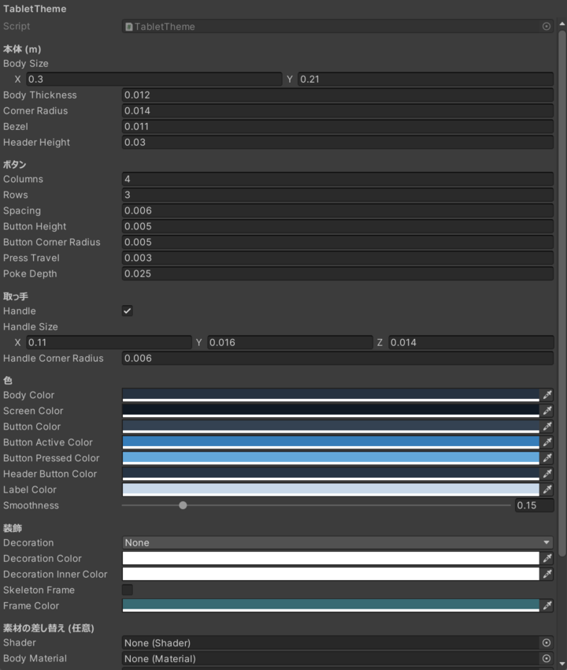

| 設定 | 内容 |
| --- | --- |
| Body Size / Thickness / Corner Radius | 本体の寸法、厚み、角の半径 |
| Bezel / Header Height | 縁の幅、ヘッダーの高さ |
| Columns / Rows / Spacing | 通常のボタン配置 |
| Button Height / Corner Radius / Press Travel / Poke Depth | キャップと押下判定の寸法 |
| Handle / Size / Corner Radius | 取っ手。角丸が負なら高さの半分、0 なら直角 |
| 色・Smoothness | 通常、ON、押下中、ヘッダー、文字、表面の滑らかさ |
| Decoration / Skeleton Frame | 立体装飾または内部支持フレーム |
| Shader / Materials / Meshes | 任意の素材と形状への差し替え |
| Font | 3D TextMeshPro のフォント |

本体寸法と操作機能は共通で、Theme は Build 時にメッシュと素材へ変換されます。
装飾と内部フレームに Collider はありません。
Skeleton Glass は透明描画のため背景や透明物体との重なりで見え方が変わりますが、文字と操作面は不透明です。
既定フォントには日本語が含まれないため、日本語のラベルには対応するフォントアセットを指定してください。
