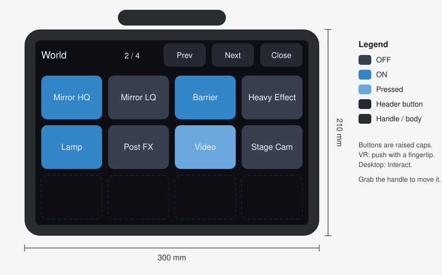

# SabaProps Tablet

キー入力、頭上からの取り出し、ワールド内アイテムの Interact で呼び出す、タブレット型の Udon UI です。World Space Canvas と UI レーザーを使わず、立体の本体と押し込める物理ボタンで操作します。

- 召喚方法は 3 種類: キー入力 (Desktop)、頭上に手を伸ばして Grab (VR)、ワールド内アイテムの Interact
- ボタンは VR では指先で押し込み、Desktop では Interact で押します
- ミラー、コライダー、エフェクト、ライト、ポストエフェクトの Volume などの ON/OFF
- 登録した地点、または選択したプレイヤーの後方へのテレポート
- ベッドの 5 面のミラーとベッド Collider の切替サンプル
- 明るさ、色相、Glow の物理スライダーと PostEffect の ON/OFF
- 任意の UdonSharpBehaviour のイベント呼び出し。既存ギミックの独自 UI もタブレットから操作できます
- ミラーやコライダーを登録する Setup Window と、外観を差し替える Theme アセット

既定の Theme の寸法で描いた正面の模式図です。上部のヘッダーにページ名とページ送り・収納のボタンがあり、その下に 4 列 3 行のボタンが並びます。青いボタンは ON の状態です。Unity で生成した実物の画面ではありません。

---

## 導入

VCC でこのパッケージを追加すると、依存する VRChat Worlds SDK も一緒に解決されます。TextMeshPro の既定フォントを使うため、未導入のプロジェクトでは `Window > TextMeshPro > Import TMP Essential Resources` を実行してください。

## 使い方

### サンプルシーン

`Tools > SabaProps > Tablet > Create Sample Scene` で、ミラー 2 枚、Collider の壁、パーティクル、ライト、テレポート地点と、それらを操作するタブレットを含むシーンを生成します。保存先は `Assets/SabaProps/Tablet/Samples/TabletDemo.unity` です。生成し直すと同名のシーンを上書きします。

動作は VRChat の Build & Test で確認してください。ClientSim は Desktop として動作するため、指先による押下と頭上からの取り出しは確認できません。キー入力と Interact による操作は ClientSim でも確認できます。

### 既存のワールドに置く

1. `GameObject > SabaProps > Tablet` でタブレットを配置します
2. `Tools > SabaProps > Tablet > Setup Window` を開きます
3. ミラーの一覧から `追加` を押すか、Collider やテレポート地点にするオブジェクトを Hierarchy で選択して、対応するボタンを押します
4. `Build` を押します

項目の表示名、アイコン、初期状態、同期の有無などは、配置した `Tablet` の Inspector (`Tablet Definition`) で編集します。変更後は `Build` を押してください。

Build は `Tablet` の子の `Body`、`Modules`、`Triggers` を毎回作り直します。これらの子に手作業で加えた変更は失われます。生成したメッシュとマテリアルは `Assets/SabaProps/Tablet/Generated/` に保存します。

## 召喚方法

| 方法 | 設定 | 動作 |
| --- | --- | --- |
| キー入力 | `Key Trigger`、`Key` (既定は B) | キーを押すと頭の前へ出し、もう一度押すと収納します |
| 頭上から取り出す | `Reach Trigger`、`Reach Offset` | 頭上の位置で Grab すると、その手の前へ出します。表示中に同じ操作をすると収納します |
| アイテムの Interact | `Interact Items` | 登録したオブジェクトを Interact すると出し入れします。Collider が必要です |

`Reach Offset` は頭の水平方向の向きを基準にした位置です。見上げたり見下ろしたりしても位置は動きません。耳の横や背中側に変える場合はこの値を変更します。生成された `Triggers/Reach` の `Require Grab` を無効にすると、Grab の代わりに手を `Dwell Seconds` 秒置き続けると発火します。

表示中のタブレットは、上部の取っ手を掴んで動かせます。利用者が本体から 4 m 以上離れると自動で収納します。

## ボタンの操作

VR では人差し指の先端のボーンでボタンを押します。ボタン前方の判定領域に正面から指を入れ、キャップの近くまで押し込むと 1 回押したことになります。指を引き戻すまで再び押されることはなく、横や裏から入った指では押されません。押下時はキャップが沈み、コントローラーが短く振動します。

Desktop と、VR で指が届かない場合は、ボタンを Interact して押します。

## 項目の種類

| 種類 | 動作 | 主な用途 |
| --- | --- | --- |
| `Toggle` | GameObject、Collider、Behaviour を ON/OFF します。`Inverted Objects` は逆に切り替えます | ミラー、コライダー、ポストエフェクトの Volume、パーティクル、ライト、動画プレイヤーの画面 |
| `Slider` | `Minimum` ～ `Maximum` の float 値を呼び出し先の `tabletValue` に書き、指定イベントを呼びます | 明るさ、色相、Glow、任意の連続値 |
| `Teleport` | `Destination` の位置と向きへ移動します | 会場内の移動 |
| `CustomEvent` | `Target` の `Event Name` を呼びます | 既存ギミックの操作 |
| `PageLink` | 別のページを開きます | 目次ページ |

`Include Player Page` を有効にすると、プレイヤーを選んでその後方へ移動するページを追加します。

後方を優先し、後方斜め、左右、前方斜め、前方の順に空いた場所を探します。
床の傾斜は 45 度以下、対象から上に 0.5 m、下に 1.5 m の範囲で確認します。
半径 0.3 m、高さ 1.8 m 以上の身体の空間と、対象との間の壁を確認し、
候補がない場合は移動せず `No safe position` を表示します。
判定は非 Trigger の Collider に依存します。生成後の `TabletTeleport` の
`Player Collision Mask` で対象レイヤーを指定できます。

### 排他と同期

`Exclusive Group` に同じ名前を入れた Toggle は、1 つを ON にすると他が OFF になります。Setup Window から追加したミラーは `Mirror` グループに入ります。

`Global` を有効にした Toggle は、押した人が所有権を取って状態を全員に同期し、後から入った人にも反映します。無効の Toggle と、テレポート、ページ、タブレットの表示はすべて各プレイヤーのローカルです。他のプレイヤーのタブレットは見えません。

### 既存の UI を操作する

`CustomEvent` は、引数のない public メソッドを持つ任意の UdonSharpBehaviour を呼び出し先にできます。Setup Window の `任意の UdonSharpBehaviour のイベント` で呼び出し先を選ぶと、呼べるイベントの一覧が出ます。

呼び出し先に `public int tabletArgument;` を用意し、項目の `Use Argument` を有効にすると、呼び出しの直前に `Argument` の値が書き込まれます。1 つのイベントで複数の対象を扱う場合に使います。

実装例として、SabaProps Stage Cam の操作パネルをタブレットから操作するサンプルを同梱しています。Package Manager で本パッケージを選択し、`Samples > Stage Cam Integration > Import` で取り込んでください。`io.github.sabas0ba.sabaprops.stagecam` が必要です。取り込み後、`Tools > SabaProps > Tablet > Samples > Add Stage Cam Page` でシーンのタブレットに `Stage Cam` ページを追加します。

- カメラとプレイヤーの選択、追従の開始と停止、自動カメラワークの切り替えは、`StageCamControlPanel` のイベントをボタンから直接呼びます
- 映像のプレビューと追従対象の表示は、`TabletBuilder.Built` で生成後のページに加えています。独自の表示を加える拡張も同じ方法で書けます

`StageCamControlPanel` は選択中のカメラとプレイヤーを保持するため、シーンに必要です。設置型パネルを見せたくない場合は、パネルの GameObject は有効のまま `Canvas` コンポーネントを無効にしてください。

## 外観の変更

外観は `Tablet Theme` アセットで決まります。`Assets > Create > SabaProps > Tablet Theme` で作成し、`Tablet Definition` の `Theme` に指定して Build し直すと反映されます。

| 分類 | 項目 |
| --- | --- |
| 本体 | 大きさ、厚み、角の半径、ベゼル幅、ヘッダーの高さ、取っ手 |
| ボタン | 列数と行数、間隔、キャップの厚みと角の半径、押し込み量、押下判定の奥行き |
| 色 | 本体、画面、ボタン (通常、ON、押下中)、ヘッダーのボタン、文字 |
| 素材の差し替え | シェーダー、各マテリアル、本体とボタンのメッシュ |
| 文字 | TextMeshPro のフォントアセット |

1 ページのボタン数は列数 × 行数です。項目が多いページは Build 時に `Mirror (1/2)` のように分割します。既定のフォントは日本語を含みません。日本語の表示名を使う場合は、日本語を含むフォントアセットを `Font` に指定してください。

## 構成

| コンポーネント | 役割 |
| --- | --- |
| `TabletController` | 召喚と収納、ページ切り替え、指先による押下の判定 |
| `TabletButton` | 物理ボタン。押されると呼び出し先のイベントを送ります |
| `TabletSlider` | 指のドラッグ／Interact／増減ボタンで float 値を送り、指定イベントを呼びます |
| `TabletPostEffects` | Animator の明るさ・色相・Glow と Volume の有効状態をローカルで調整します |
| `TabletToggle` | ON/OFF の切り替え。ローカルまたは全員で同期 |
| `TabletTeleport` | 地点とプレイヤーへのテレポート |
| `TabletKeyTrigger` / `TabletReachTrigger` / `TabletInteractTrigger` | 召喚方法 |
| `TabletDefinition` | Editor 専用の構成データ。アップロード時に取り除かれます |

設計の判断は [設計](Documentation~/design.md) にまとめています。

## ベッドミラーと PostEffect のサンプル

`Tools > SabaProps > Tablet > Create Sample Scene` は次のページも生成します。

### Bed Mirrors

ベッドの平面図を中央に置き、頭側を上、足側を下、左右をそれぞれ同じ側に配置します。
天井は `Ceiling` ボタンで切り替えます。床のミラーは生成しません。
5 面は個別に切り替えられ、初期状態ではすべて OFF です。
`Bed Collider` はベッドと枕の Collider だけを切り替え、メッシュの表示は保持します。
各スイッチはローカルです。同時に有効にするミラーが増えるほど描画負荷も増えます。

### Post Effects

| 操作 | 範囲／動作 |
| --- | --- |
| `Effects ON / OFF` | 調整用の全 PostProcessVolume を有効／無効にします |
| `Brightness (EV)` | −2 ～ +2 EV。初期値 0。負の値で暗くします |
| `Hue (degrees)` | −180 ～ +180 度。初期値 0 |
| `Glow` | Bloom Volume の weight 0 ～ 1。初期値 0。最大時の Bloom intensity は 8 |

VR では指をスライダーの前面から入れ、横に動かします。指を離すと調整を終了します。
Desktop ではトラック上の位置を狙って Interact、または両端の `−`／`＋` で範囲の 5% ずつ調整します。
値と ON/OFF は利用者ごとで、ページを閉じても保持します。

SDK の依存に含まれる Unity Post Processing を使います。Reference Camera に
PostProcessLayer を付け、その設定がプレイヤーカメラへ引き継がれる構成です。
調整用 Volume と Animator は別の `Tablet Post Effects` に置きます。
Volume は User Layer 22 を使用します。既存ワールドへ移す場合は、その用途との重複と
カメラの `Volume Layer`、既存 Volume の優先度を確認してください。
Udon から Post Processing の型へ直接アクセスせず、Animator の float パラメーターで
Volume の weight を動かします。低側・中立・高側の 3 点を使い、中立では両側の weight が 0 になります。

### 配置の変更

各項目の `Custom Placement` を有効にすると、`Normalized Center` と `Normalized Size` で
ページ内の配置を指定できます。ボタン領域の中央が (0, 0)、外周が ±0.5 です。
`Bed Diagram` を有効にしたページにはベッドの平面図を追加します。
変更後は Tablet の `Build` を実行してください。

## 制限

- 指先による押下は、アバターの人差し指のボーン (`LeftIndexDistal` / `RightIndexDistal`) を使います。指のボーンを持たないアバターでは Interact で操作してください
- TextMeshPro の既定フォントは日本語を含みません
- タブレットの表示は各プレイヤーのローカルです。他のプレイヤーのタブレットは見えません

## 検証

| 層 | 内容 |
| --- | --- |
| `.github/verify/verify.sh` | Runtime、Authoring、Editor、Stage Cam サンプルを実物の VRChat SDK アセンブリに対してコンパイルします。召喚位置、押下の状態遷移、ページ送り、取り出し位置、プレイヤー選択、ボタンの配置、角丸メッシュの形状を Unity なしで実行して検査します |
| `.github/verify/vrchat/` | UdonSharp のコンパイル、サンプルシーンの生成、ボタンの呼び出し先がエクスポートされたイベントであること、Toggle の排他を Unity の EditMode テストで検査します |

VR での指先の押下、Grab による取り出し、Global な Toggle の同期は自動では検査できません。VRChat の実機で確認してください。

## ライセンス

MIT。[LICENSE.md](LICENSE.md) を参照してください。
