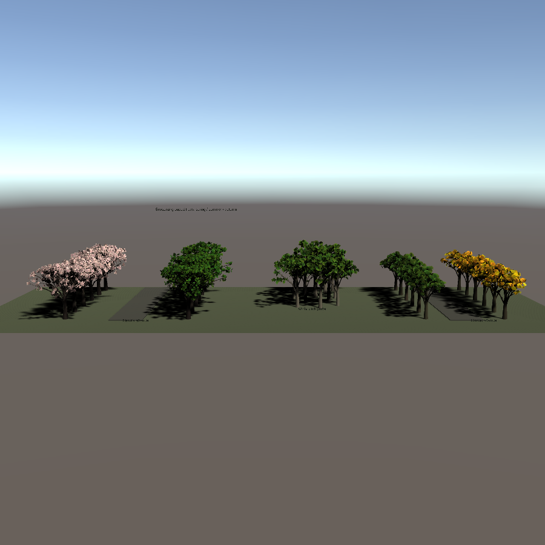
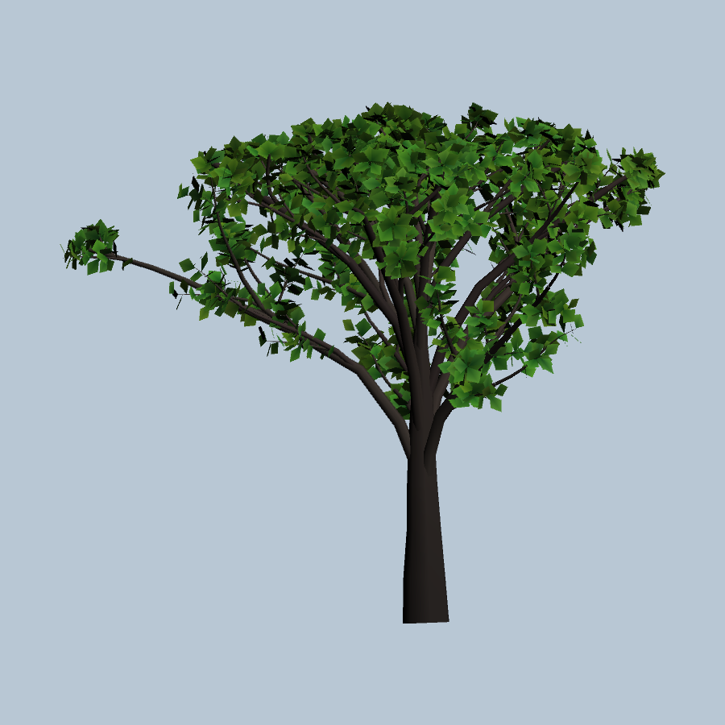
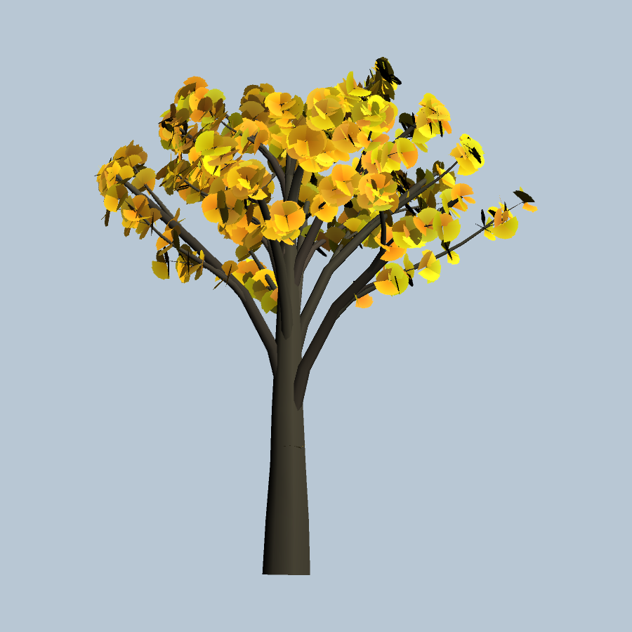
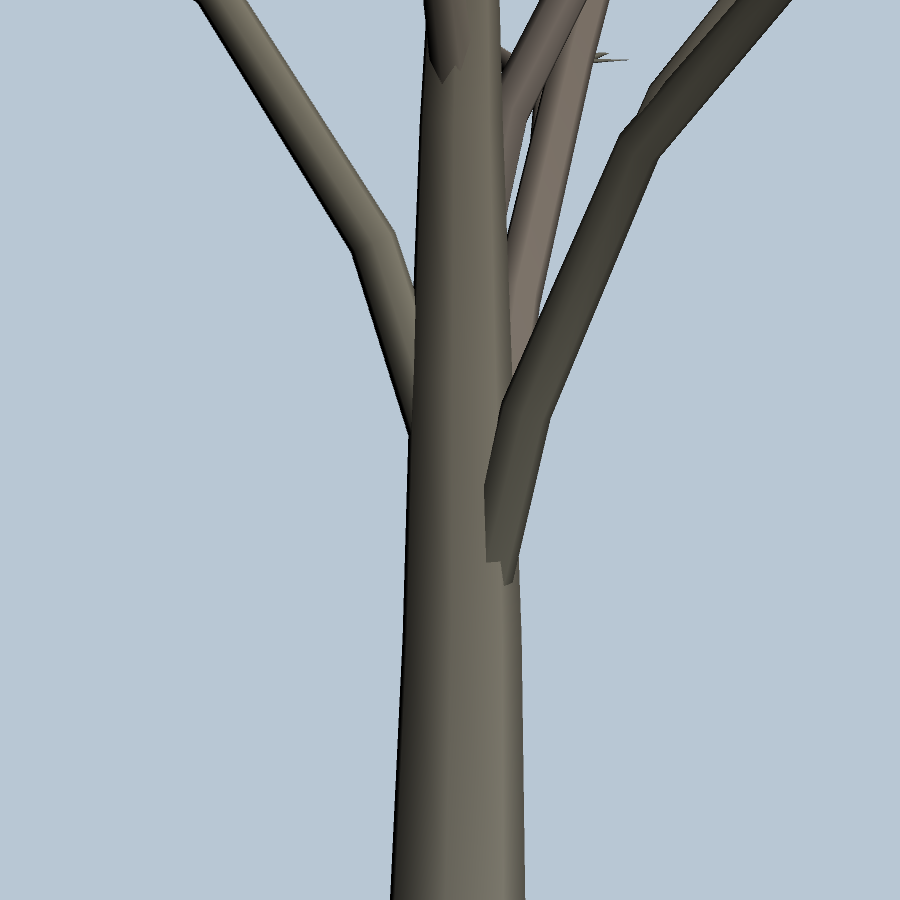

# 樹木の調整・確認ガイド

このガイドは Unity 2022.3.22f1 の Trees Demo と、同じ生成器で作成した単木を使用します。
画像は Unity で実際に描画したものです。生成AIによる補正や見栄えの加工は行っていません。
Inspector の表記を検索できるよう、パラメータ名は英語で併記しています。
配置ウィンドウは日本語が既定で、上部の言語切替から英語に変更できます。

## 最初の操作

1. Package Manager の `SabaProps Trees > Samples > Trees Demo > Import` でサンプルを取り込みます。
2. `SeasonalTreesDemo.unity` を開き、調整の基準にする樹種・季節を選びます。
3. サンプルを保持したい場合は、編集する `TreeSpecies` アセットを複製します。
4. `Window > SabaProps > Placement` で単木を配置するか、Species Inspector の `Create LOD Group in Scene` を使用します。
5. Species の値を変更し、`Rebuild LOD Meshes` で反映します。まず単木を確認し、その後に群生・LODを確認します。

Species を共有する木には、再生成した共有メッシュの変更がまとめて反映されます。
個体ごとに形状を変える場合は Species を分けて Seed を変えます。その分、共有できるメッシュも増えます。
`Apply Botanical Preset` は現在の調整値をプリセット値へ置き換える操作です。
メッシュのアセット書き出しは Undo の対象外です。保存前後の比較にはバージョン管理を使用してください。

Tree Field の生成後の自動再生成、Palette のスタンプ範囲、Surface Growth の操作は
[配置・編集 UI 操作ガイド](../../io.github.sabas0ba.sabaprops.foliage/Documentation~/placement-workflow.md)にまとめています。

## サンプルの読み方

左から桜の春・夏、シラカバ、イチョウの夏・秋です。季節比較シーンでは異なる樹種・季節色の
区画が混ざらないよう、全LODのRenderer境界と余白を使って配置しています。同種・同季節の
区画内では群生を維持しています。通常の混交林や Tree Field 全般に、この分離が自動適用されるわけではありません。

デモの個体差は主に回転とスケールです。同じSpeciesの木は同じ形状のメッシュを共有します。
画像に本数が多いことだけでは軽量性の証明になりません。負荷確認には `ForestLoadDemo.unity` の
群を順番に有効化し、64 / 128 / 192本を同じカメラ・描画設定で比較してください。
本ガイドはフレーム時間やFPSの性能保証を行うものではありません。

## 樹冠の調整

樹冠は単純な球や円錐へ頂点を投影するのではなく、枝の成長方向を維持して成長量を制限します。
主幹の先端より上にも成長空間を設け、上端にはSeedに応じた滑らかな高低差を付けています。
高低差の振幅は高さ制約に対して最大で樹冠高の約7%です。独立した調整UIはなく、最終寸法の7%保証でもありません。

| パラメータ | 範囲 | 作用・調整時の注意 |
|---|---|---|
| `Mesh Seed` | 整数 | 枝・葉と上端の高低差の再現可能な個体差。比較中は固定します |
| `Crown Shape` | Rounded / Vase / Layered / Pyramidal / OpenIrregular | 枝長と高さ制約の基準形状。剪定済みの完全な幾何形状を保証するものではありません |
| `Crown Envelope Strength` | 0–1 | 0は自由成長、1は外形制約を適用。下げると枝の伸長を許容します |
| `Crown Width Scale` | 0.5–1.5 | 外形判定用の基準半径。大きいほど横に成長する余地が増えます |
| `Crown Radial Scale` | 0.5–2 | 一次枝の付け根を基準に枝中心線・葉の位置を水平拡大。実在種presetは1.5。幹、枝の太さ、葉自体の大きさは拡大しません |
| `Crown Volume Scale` | 0.5–2 | 自由成長形状の外接箱体積を基準にした等方サイズ補正。葉密度や実占有体積ではありません |
| `Primary Branch Departure` | 0–0.6 | 出始めを幹の接線からBranch Angleの方向へ寄せる割合。実在種presetは0.25 |
| `Apical Dominance` | 0–1 | 主幹優勢と側枝の長さ・向きの配分。形状を見ながら調整します |

`Crown Width Scale` は成長制約の半径、`Crown Radial Scale` は生成する枝の水平到達距離です。
両者を同時に変更すると原因を追いにくくなるため、一方ずつ変更してください。
`Crown Volume Scale` の補正は半径拡大前の形状から求めます。半径を広げた分を打ち消す自動縮小は行いません。
最終的な体積を旧サンプルの±20%に固定する仕様ではありません。

### 調整の順序

1. Seedを固定し、`Crown Shape` と `Crown Envelope Strength` で伸び方を選びます。
2. 横幅が不足する場合は `Crown Radial Scale` を少しずつ上げます。
3. 出始めが直立しすぎる場合は `Primary Branch Departure` と `Branch Angle` を調整します。
4. 葉を増やす前に、枝のみの状態でも樹冠内部に枝が分布しているか確認します。
5. 正面だけでなく側面・真上から確認し、最後に群生とLODを確認します。

## 枝と葉の量・分布

広葉樹の側枝は主枝の途中にも配置し、房状の葉は細枝の先端だけに集中しないよう分布させています。
太い主枝に葉を直接貼り付けるのではなく、細枝と葉柄を介して配置します。

| パラメータ | 範囲 | 作用・負荷との関係 |
|---|---|---|
| `Trunk Length` / `Trunk Radius` | 0.2以上 / 0.01以上 | 基本の幹の長さと半径。樹冠補正後の最終実寸とは区別します |
| `Trunk Branch Start` | 0.15–0.8 | 主枝を付け始める幹上の比率。下げると低い位置から分枝します |
| `Branch Angle` / `Branch Angle Jitter` | 5–85° / 0–35° | 分枝角と揺らぎ。最終角度には主幹優勢や水平拡大も影響します |
| `Length Decay` / `Radius Decay` | 0.35–0.85 / 0.25–0.8 | 子枝の長さ・太さの減衰。接続先の親枝による太さ上限も適用されます |
| `Crown Density` | 0.5–1.5 | 再帰深度を変えずに主枝層の数を増減します |
| `Max Depth` / `Branch Count` | 1–6 / 1–6 | 分枝階層と分枝数。組合せによって生成量が大きく増えます |
| `Max Branches` | 16–1024 | 枝生成の予算上限。葉の枚数や総三角形数の上限ではありません |
| `Branch Arrangement` / `Whorl Size` | 枝序 / 2–6 | 螺旋・対生・輪生・不規則な分岐。Whorl Sizeは輪生時に使用します |
| `Crookedness` / `Branch Length Variance` | 0–0.5 / 0–0.5 | 枝の曲がりと長さの個体差 |
| `Azimuth Jitter` | 0–45° | 分岐の方位の揺らぎ |
| `Branch Droop` / `Tip Upturn` | 0–0.8 / 0–0.8 | 細い末端枝の下垂と先端の上向き。構造枝を傘状に下へ曲げる設定ではありません |
| `Leaf Shape` / `Leaf Arrangement` | 葉形 / 葉序 | 葉の形状と付き方。葉形によって1枚当たりの頂点数が異なります |
| `Leaves Per Tip` | 1–24 | 葉を付ける枝ごとの葉候補数の基準。木全体の枚数ではありません |
| `Foliage Depth` | 1–4 | 末端から何階層の枝まで葉を付けるか。増やすと内側にも葉が増えます |
| `Leaf Length` / `Leaf Width` | 0.01以上 / 0.005以上 | 葉の寸法。拡大しすぎると房の重なりや低LODでの過密が目立ちます |
| `Radial Segments` / `Segments Per Branch` | 3–12 / 1–8 | 枝の断面と長手方向の分割数。増やすと形状は滑らかになりますが頂点数も増えます |

## 樹皮色と風

`Bark Root Color` と `Bark Tip Color` は、幹・枝・端面・葉柄で共通の高さに基づく補間に使用します。
枝の分岐段数で色を切り替えないため、付け根から突然別の樹皮色になることを防ぎます。
Tip Colorはすべての枝先に必ず到達する色ではなく、補間の端点です。面の向きや影による明暗差は残ります。
`Leaf Base Color` と `Leaf Tip Color` は葉の色を調整します。

`Wind Enabled` はSpecies単位の有効化、`Wind Response`（0–2）は共有Materialの風に対する倍率です。
`Branch Stiffness` / `Leaf Stiffness`（0–1）は枝・葉に焼き込む風応答チャンネルです。
これらの変更後はメッシュを再生成します。Materialの風向・速度・強度とは別の設定です。
本ガイドの単木・接合部画像は風を止めています。継ぎ目の確認は停止時と風を有効にした時の両方で行ってください。

## LODと確認チェックリスト

LOD0/1/2は枝中心線と葉候補を共有します。低LODでは細枝の筒形状と葉の数を減らし、残す葉を
LOD1で1.5倍、LOD2で2.25倍に拡大します。切替時の見た目が完全に同一になる保証はありません。

`Lod1 Depth Reduction` / `Lod2 Depth Reduction` は簡略化の強さです。再帰生成の中心線を
別の木に置き換える設定ではありません。`Lod0 Screen Height` / `Lod1 Screen Height` /
`Lod2 Screen Height` は距離そのものではなく画面上の相対サイズに対する切替閾値です。

- 単木を選択し、幹の根元にくびれがないか、枝の付け根で樹皮色が飛んでいないか確認する
- 真上と横から、樹冠内部の空白、上端の揃いすぎ、枝先だけへの葉の集中を確認する
- LODを個別に表示して輪郭を比較した後、カメラを動かして切替の見え方を確認する
- 異なる色の枝が見えたら、隣接木を非表示にして単木内部の問題か重なりかを切り分ける
- `ForestLoadDemo` で本数を段階的に増やし、同条件のProfiler・描画統計を記録する
- Worldビルド前にauthoring Componentを手動削除しない。生成済みRendererとLODGroupは残し、Componentは自動除外される

## 画像の再生成

検証用Unityプロジェクトで `SabaProps.Trees.CITests.TreeCrownReview.Capture` を実行すると、
季節全景、単木、真上、枝のみ、接合部の画像を `CrownReview` に出力します。
描画が必要なため `-nographics` は使用しません。サンプル再生成とシーン切替を伴うため、
編集中のプロジェクトではなく専用の検証プロジェクトで実行してください。
生成手順と確認項目はリポジトリの `.github/verify/tree-review.md` に記載しています。
