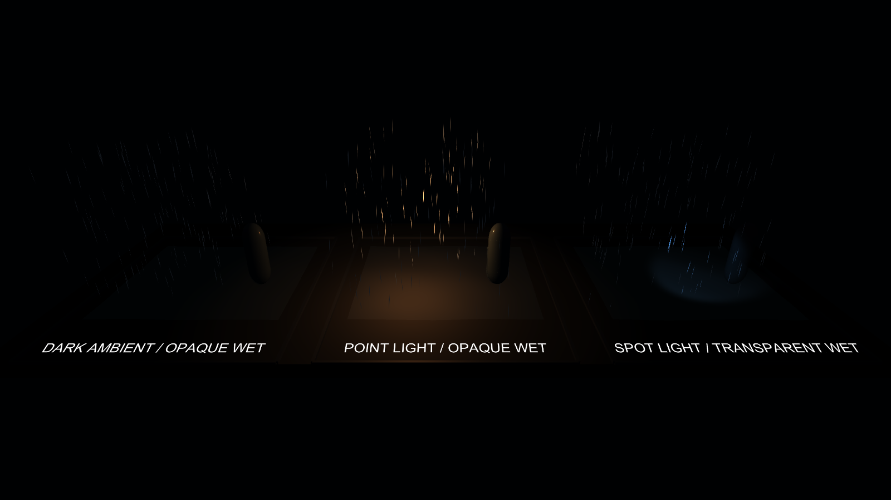

# Water 要素別リファレンス

画像はUnity 2022.3.22f1でPackageのSample Sceneを実際に描画したものです。

## 水面

| 要素 | 用途 | 主要パラメータ |
| --- | --- | --- |
| Puddle | 小規模な水たまり | `Radial Rings`、`Surface Offset`、`Reflection Strength` |
| River | 河川と水路 | `Width`、`Subdivisions`、`UV Meters Per Tile` |
| Lake | 池と湖 | `Wave Scale`、`Shallow Edge Width`、`Tide Height` |
| Ocean | 広域水面 | `Wave Scale`、`Reflection Strength`、`Foam Strength` |

LiteはReflection Probeと浅瀬近似、StandardはGrabPassによる屈折とScene Depthによる水深色を追加します。[配置・調整手順](authoring.md#水たまり)

## 雨

| 要素 | 主要パラメータ |
| --- | --- |
| Rain | `Rate over Time`、`Shape Scale`、`Velocity over Lifetime` |
| Collision Splash | `Start Size`、`Lifetime`、`Length Scale` |
| Collision Ripple | `Start Size`、`Lifetime`、対象Layer |

衝突対象と描画範囲を限定すると負荷を抑えられます。[雨の調整手順](authoring.md#雨)

## 霧と雲

| 要素 | 用途 | 主要パラメータ |
| --- | --- | --- |
| Ground Fog | 地表付近の霧 | Particle Size、Alpha、範囲 |
| Cloud Layer | 上空の雲層 | 高さ、移動速度、Alpha |
| Fog Volume | 局所的な濃霧 | Volume Size、Density、Local Light |

High品質のFog Volumeは小範囲に限定します。[霧・雲の調整手順](authoring.md#霧雲)

## 水中

| 要素 | 主要パラメータ |
| --- | --- |
| Underwater Volume | `Volume Distortion`、色、霧密度 |
| Caustics | Scale、Speed、Intensity |
| Light Shaft | Length、Alpha、方向 |
| Underwater Surface | `Boundary Refraction Distortion`、境界方向 |

Volume上面を水面高へ合わせ、境界Meshの法線とBoundary設定を一致させます。[水中の調整手順](authoring.md#水中)

## 濡れた表面

| 要素 | 用途 | 主要パラメータ |
| --- | --- | --- |
| Wet Surface | Material自体を濡れ表現へ変更 | `Droplet Head Normal`、`Trail Persistence`、`Opacity` |
| Droplet Projector | 受け側Materialを変更せず投影 | `Droplet Density`、`Fall Speed`、`Projection Edge Fade` |
| Splash | 局所的な白水 | Lifetime、Start Size、Velocity |
| Ripple | 雨や接触による波紋 | Strength、Scale、Lifetime |

透明面以外は不透明版Wet Surfaceを優先し、Projectorは投影範囲を狭くします。[濡れた表面の調整手順](authoring.md#濡れた表面)
