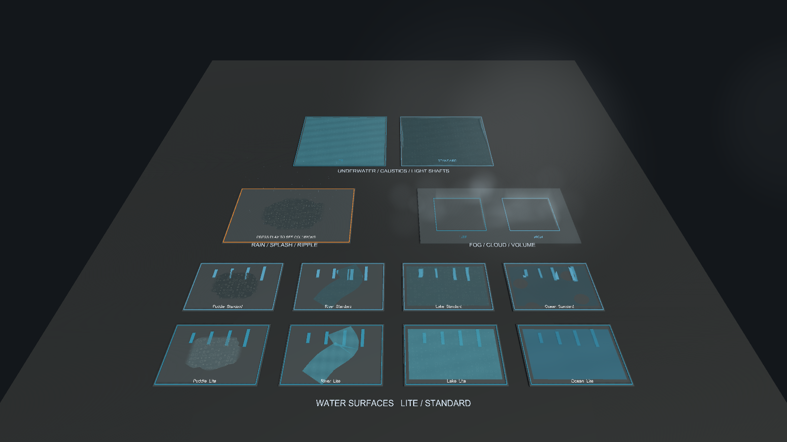
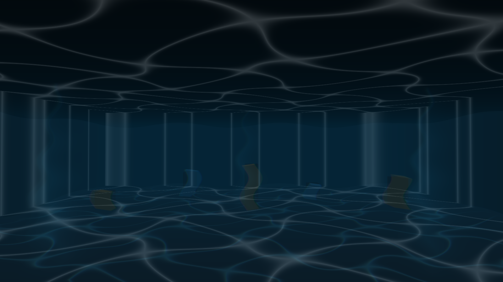

# Water Feature Gallery

`Water Feature Gallery`は、packageの全機能を1つのSceneで比較するためのユーザー向けサンプルです。
各展示は独立したrootに分かれ、`[Copy Ready]`と付いたobjectを対象Sceneへコピーして利用できます。

## Import

1. Unity Package Managerで`SabaProps Water`を選択します。
2. `Samples`タブから`Water Feature Gallery`をimportします。
3. `Assets/Samples/SabaProps Water/0.1.0/Water Feature Gallery/WaterFeatureGallery.unity`を開きます。
4. Play Modeへ入り、Particle SystemとShader animationを確認します。

Package Managerを使用しない場合は、`Tools > SabaProps > Water > Create Feature Gallery`を実行します。
この場合は`Assets/SabaProps/Water/Samples/WaterFeatureGallery`へ同等のSceneとassetが生成されます。

## Scene構成

| Section | 内容 | コピー単位 |
| --- | --- | --- |
| `1 Water Surfaces` | Puddle、River、Lake、OceanのLite／Standard比較 | 各`[Copy Ready]`root |
| `2 Rain and Ripples` | World collision、Splash sub-emitter、Ripple sub-emitter、疑似水面波紋 | `Rain Rig [Copy Ready]` |
| `3 Fog and Clouds` | Particle fog、Cloud Layer、Fog Volume Lite／High | 各`[Copy Ready]`root |
| `4 Underwater` | 水面、volume、歪み、コースティクス、light shaft | 各Underwater Pool root |

River展示には`WaterPath`と保存済みMeshの両方が含まれます。control pointを編集した後に`Rebuild Mesh`を実行できます。
その他の展示は標準Unity component、Material、保存済みMeshだけで構成されています。

## 撮影用Camera

- `Documentation Camera - Overview`: 全Sectionの俯瞰画像
- `Documentation Camera - Underwater Standard`: Standard水中volume内部

Overview Cameraが`MainCamera`です。水中Cameraを確認する場合はOverviewを無効化し、水中Cameraを有効化します。
画角を変更せずに撮影すると、更新前後の比較画像を同じ構図で作成できます。

## 利用時の注意

- 雨、霧、雲はPlay Modeで確認します。
- Rain Collisionの対象を実Worldへコピーした後は、`Collides With`を必要なLayerだけに限定します。
- Standard waterとStandard underwaterはGrabPassを使用するPC向け設定です。
- Sample内のMaterialやProfileはSample専用です。共通設定として使用する場合はproject内の管理folderへ移動してください。
