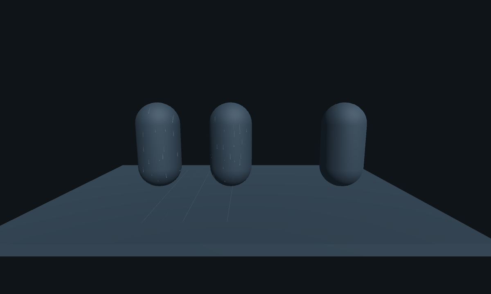

# Water Feature Gallery

サンプルには次の3 Sceneが含まれます。

- `WaterFeatureGallery.unity`: 全機能とコピー可能な構成例
- `WaterDropletProjectorGallery.unity`: 通常Materialへの水滴投影。左側2体が範囲内、右側1体が範囲外です。ProjectorのEnabledで比較できます。
- `WaterLightingGallery.unity`: 暗い環境光、Point Light、Spot Lightでの水面・雨・Wet Surface比較

Projectorは非対応Shaderへの投影、濡れ状態の保持、直接光の追加パスには対応しません。
VRChat実機の両眼・鏡・個別アバターShaderでの表示と負荷は別途確認してください。

Wet Surfaceには不透明版と半透明版があります。`Droplet Head Normal`と`Droplet Trail Normal`は別々に調整できます。水面Foamは`Foam Color`に加え、`Foam Pattern Scale / Speed / Warp`で模様を編集できます。

`WaterFeatureGallery.unity`を開き、Play Modeで雨、波紋、霧、雲を確認します。

- `1 Water Surfaces`: Reflection Probe付きPuddle、小径spray・落水付きRiver、局所砕波sprayを持つOceanのLite／Standard比較
- `2 Rain and Ripples`: 雨滴collision、splash、ripple
- `3 Fog and Clouds`: Lite、濃霧、着色霧、Point Light、Particle fog、cloud
- `4 Underwater`: 弱いvolume歪み、上面／inactiveの8方向境界屈折、コースティクス、light shaft
- `5 Wet Surfaces and VRChat`: Dry／Wet／質量差・長い残留軌跡・小滴散乱色付きDroplets比較、Spot Light、VRCWorld／Spawn

Hierarchyで`[Copy Ready]`と付いたrootは、対象Sceneへそのままコピーできます。
Worlds SDK導入projectでは`Tools > SabaProps > Water > Configure VRChat World Descriptor`で
`VRCSceneDescriptor`を追加できます。
操作と性能上の注意はpackageの`Documentation~/sample-gallery.md`を参照してください。
